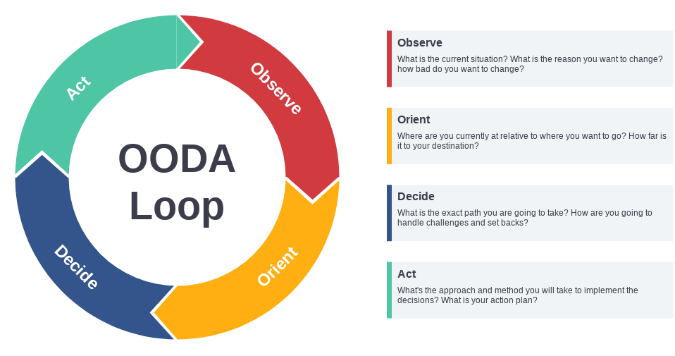
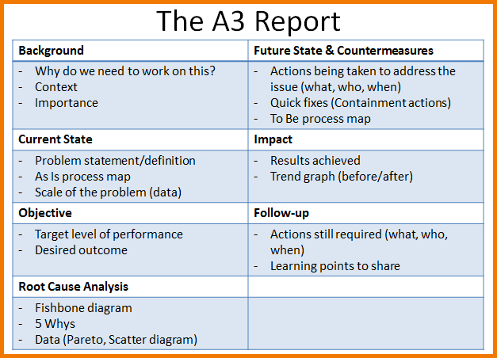
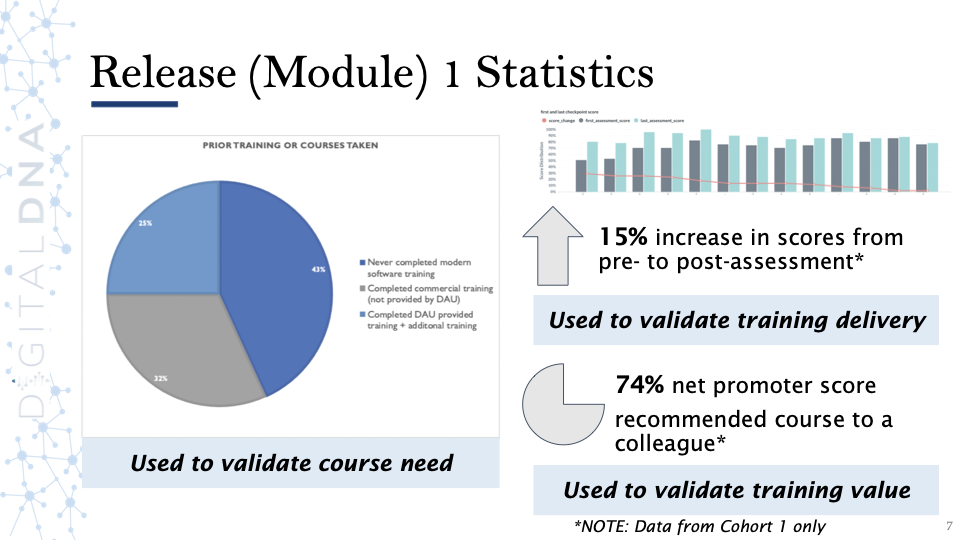

# Strategic View: Implementing a Software-Intensive Acquisition is a Team Effort

## Learning Objectives

By the end of this lesson you will be able to:

* Understand your potential for impact, both as an individual and with network support
* Apply feedback loops to multiple processes and practices

## The Path to Success: You Are Already On It

In life and in your work, it’s important to pause and reflect - reciting affirmations, checking off a to-do list, even getting a head start are all ways to help with motivation and sustaining your energy to keep going. Hopefully, this course helps keep you motivated from a few standpoints.

First, we would like to extend our congratulations - you’re over halfway through Digital DNA! At this point, you have completed two Modules of Digital DNA, covering the foundations of modern software practices and process--Agile, Lean, Design Thinking, DevSecOps and more. Here is where you got a good head start - you have covered the **foundations** of these concepts - but technology is constantly evolving, and there is always more to learn.

### !callout-info
## Did you know?
Self-control and self-motivation are depleting resources? **Proof: How hard is it to stick to a diet that requires you to give up sweets or grains (bread and pasta).** It’s okay you are not alone - this is normal. We pause and congratulate you and emphasize you are more than halfway there - to help your motivation and remind you you’re not alone!
### !end-callout

Now we would like to address individual impact or contributions. We recognize that you all have different backgrounds and ranks, and certain lessons will be more applicable to your role and/or day to day responsibilities. But remember, **we can all drive change and impact:**

>“If you think you are too small to make a difference, try sleeping with a mosquito”
>
>- The Dalai Lama
>
> &nbsp;

What if your checklist includes expanding your network and connections? Remember, you already have a team supporting you, including your Program Office. But you also have your functional community, and the network you are meeting through Digital DNA virtual events. Additional opportunities to connect through communities of practice (CoP) like the DoD Acquisition Innovators CoP are also a consideration. We are in an infinite cycle that achieves innovation, excellence, and agility through collaboration: 

  
 Source: [Agility Is An Exercise](https://www.gapingvoid.com/blog/2017/01/23/agility-is-an-exercise/)  

But as with every institution this large and varied, myths exist about our roles and capabilities. The next section looks at some myths within acquisitions, and provides some mythbusters. 

### !challenge

* type: checkbox
* id: a4dee6ca-972d-11eb-a8b3-0242ac130003
* title: Reasons Change is Difficult
<!-- * points: [1] (optional, the number of points for scoring as a checkpoint) -->
<!-- * topics: [python, pandas] (optional the topics for analyzing points) -->

##### !question

Throughout the course we emphasize the need to be empathetic and understanding to users, within your organization and through engagements with stakeholders. Which common misconceptions and correlating root causes that may be causing pushback?

##### !end-question

##### !options

* What looks like resistance may really be a lack of clarity or understanding 
* What looks laziness or unwillingness may be exhaustion or overly tasked 
* What looks like a people problem may be a situation problem (i.e. the environment is not supportive to enabling change) 
* People can’t change; so why try

##### !end-options

##### !answer

* What looks like resistance may really be a lack of clarity or understanding 
* What looks laziness or unwillingness may be exhaustion or overly tasked 
* What looks like a people problem may be a situation problem (i.e. the environment is not supportive to enabling change) 

##### !end-answer

##### !explanation

This question is based on concepts outlined in [Switch: How to Change Things When Change is Hard](https://www.amazon.com/Switch-Change-Things-When-Hard/dp/0385528752) which emphasizes our initial assumptions of why change is hard or why we encounter pushback is often due to one of the three above correct answers. 

##### !end-explanation

<!-- other optional sections -->
<!-- !hint - !end-hint (markdown, hidden, students click to view) -->
<!-- !rubric - !end-rubric (markdown, instructors can see while scoring a checkpoint) -->
<!-- !explanation - !end-explanation (markdown, students can see after answering correctly) -->

### !end-challenge

## Debunking Myths: The Acquisition Operating Model

Let’s start by addressing the elephant in the room: **Starting from the same understanding or assumptions is critical.** Even if we do not successfully convince you of the next two points, _this is the perspective the lessons are being taught from_. The points below address myths that are commonly held about acquisitions and its role(s).

### 1. Acquisition Reform is Not a New Idea

There is room for improvement within all Defense Acquisition System (DAS) processes, which are defined as the following: 

  
 Source: [ ACQNotes: Acquisition Process Overview.](https://acqnotes.com/acqnote/acquisitions/acquisition-process-overview)  

The Center of Military History published a paper in 2011 called [Defense Acquisition Reform, 1960–2009: An Elusive Goal](https://history.army.mil/html/books/051/51-3-1/CMH_Pub_51-3-1.pdf). From the title alone, it is clear that acquisitions reform, much like software development, is in a state of continuous improvement, and that **this idea has been around for 60+ years.**

The National Defense Authorization Act (NDAA) Title VIII is Acquisition Policy, Acquisition Management and Related Matters. Every year through this section Congress directs the Department to improve through pilots, policy updates, or specific focus on programs. Again emphasizing the state of continual improvement. If you are interested look at [FY 2021 NDAA](https://www.congress.gov/bill/116th-congress/house-bill/6395/text) Title VIII Sections to understand the current emphasis. 

Later in this lesson and throughout Release 3, we will provide strategies to establish feedback loops. These strategies structure your processes, acquisition strategy, and contracting approach, while striving to identify the intent, goal or result while validating via data and metrics. 

### 2. Improving Current Processes: A Better Starting Point Than Eliminating Everything and Trying To Create All-New
We assume that some of you may not agree with this statement. Thus, we are going to defend the statement in two ways:

1. Don’t throw the baby out with the bathwater.

“...is an idiomatic expression for an avoidable error in which something good is eliminated when trying to get rid of something bad, or in other words, rejecting the favorable along with the unfavorable.”
Source: “Don't Throw the Baby out with the Bathwater.” Wikipedia, Wikimedia Foundation, 9 Jan. 2021.

The point being although as stated in our first myth debunking, we agree there is room for improvement but starting with the current processes and optimizing is less risky. Additionally, we may inadvertently throw out something valuable in the process if we throw everything out.

2. Go with a Brownfield approach

As we discussed in Module 102, Greenfield and Brownfield approaches both have individual positives, but we recommend a Brownfield approach for a few reasons:
* It is less risky, 
* Allows the ability to navigate dependencies, 
* Provides a clear goal, and 
* May even take less time. 

Hopefully we have convinced you that the best starting point is to optimize and tailor current processes to support our goals with Acquisition Reform. This will continue to allow us to keep pace in an ever changing technological and adversarial market because “...today, every domain is contested—air, land, sea, space, and cyberspace.”  
Source: [Summary of the 2018 National Defense Strategy.](https://dod.defense.gov/Portals/1/Documents/pubs/2018-National-Defense-Strategy-Summary.pdf)

### !challenge

* type: paragraph
* id: 346a5f9e-972f-11eb-a8b3-0242ac130003
* title: Ways to Improve Awareness
<!-- * points: [1] (optional, the number of points for scoring as a checkpoint) -->
<!-- * topics: [python, pandas] (optional the topics for analyzing points) -->

##### !question

How do you or does your organization ensure awareness of updates to policy, on-going pilots, or new guidance--i.e. National Defense Strategy? Please briefly describe the current state and if you have recommendations on how it can be improved. 

##### !end-question

##### !placeholder

##### !end-placeholder

<!-- other optional sections -->
<!-- !hint - !end-hint (markdown, hidden, students click to view) -->
<!-- !rubric - !end-rubric (markdown, instructors can see while scoring a checkpoint) -->
<!-- !explanation - !end-explanation (markdown, students can see after answering correctly) -->

### !end-challenge

## Level Setting: The Starting Point For You

We recognize that many of you are at different stages of digital transformation, and are incorporating modern software practices and processes to varying degrees. The programs you support may have already established a software pipeline and environments that enable software delivery as required by your users. Others may be just beginning this journey, deciding on an appropriate acquisition strategy or awarding their first contract.

Similarly, we recognize the skill-sets currently supporting your team vary. Not all of us have access to full stack engineers, Cloud architects, developers, etc. that support your DevSecOps effort.

Throughout Module 103, we provide overarching strategies and some tactical applications. Regardless of whether we are discussing a larger strategy, or a more detailed tactical approach, you will see a consistent theme for defining a feedback loop: 

* **Intent / Goal**
* **Approach / Strategy**
* **Established Inputs (Feedback):**
  * **Who**: Stakeholders/users
  * **What**: Data/Metrics
  * **When**: Cycle Time
  * **How**: Interviews/Surveys
* **Improvements and Learning Incorporated**

Other ways you may have seen this defined is: 

  
 Source: [Online OODA Loop Template](https://online.visual-paradigm.com/diagrams/features/ooda-loop-template/)  

  
 Source: [How Smart Meeting Practices Help You Build-Measure-Learn](https://medium.com/insights-from-meeteor/how-smart-meeting-practices-help-you-build-measure-learn-509dfc3f6c60)  

  
 Source: [Pinterest](https://www.pinterest.com/pin/349662358563170431/)  

We believe applying this approach, regardless of exact implementation, will allow acquisitions professionals to be able to incorporate continuous learning and support improved communications. From acquisition strategies and individual and portfolio contracts, to product development, all can potentially benefit from implementing a greater level of feedback.

### !callout-info
## Key Takeaway
Remember that these frameworks are all options to support how to incorporate tests and learning into your role and function. Utilize these as a future resource and try them to support activities throughout your organization. 
### !end-callout

## An Application Study: Digital DNA
Below we use our own course to provide an example of how this might look to you and your own strategies.

<table>
<tr>
    <th>Intent / Goal</th>
    <td>Develop and deliver a training tailored to acquisitions professionals that explores the foundations of modern software practices. Provide support for new knowledge applications within the context of Defense Acquisition System, and support the creation of multi-disciplinary teams. Instill methods of execution for acquisition and contracting strategies that support the speed and change of software-intensive systems.</td>
</tr>
<tr>
    <th>Approach</th>
    <td>Build an easily-integrated, remote training that is asynchronous and synchronous,that is mindful of current roles and responsibilities.</td>
</tr>
<tr>
    <th>Established Inputs</th>
    <td>
<strong>Cycle Time:</strong> After completion of each module 
<strong>Who:</strong> Students 
<strong>How:</strong> Surveys, Interviews, and Data from Learn Platform  
 
<strong>Cycle Time:</strong> A few months after full curriculum is completed 
<strong>Who:</strong> Students and Supervisors 
<strong>How:</strong> Surveys, Interviews, and Data from Learn Platform 
 
<strong>Cycle Time:</strong> 6 months after course completion 
<strong>Who:</strong> Students and Supervisors 
<strong>How:</strong> Surveys and Interviews
</td>
</tr>
</table>

Below is a graphic of how we have communicated data and intent of data to leadership: 

## Striking a Balance: Tools and Strategies
We want to focus on providing a way to apply this knowledge in a scenario most of you encounter. What tools can we use to support the desired state?

We define the desired state (within the context of a PMO) as: **The ability to effectively make decisions in a timely manner, with a balanced representation of roles (or functions) at each decision point, and supporting data and information transparent/accessible.**

Methods for achieving this can vary. The context of your program--the mission, the operating environment, the users, existing and emerging contracts, or your current team can all vary. But we do believe in focusing first on your current environment. 

### !challenge

* type: checkbox
* id: a4b2ab80-972f-11eb-a8b3-0242ac130003
* title: Implementation
<!-- * points: [1] (optional, the number of points for scoring as a checkpoint) -->
<!-- * topics: [python, pandas] (optional the topics for analyzing points) -->

##### !question

When implementing the practices above and establishing feedback loops which characteristics should be considered and incorporated?

##### !end-question

##### !options

* Ensure data is transparent and accessible 
* Incorporate a balance of perspectives and multiple roles (functions) 
* Be timely with decisions with flexibility and change assumed 
* Incorporate continuous learning for individuals, team and program strategy and implementation 
* Empathy extends to all individuals and communities  

##### !end-options

##### !answer

* Ensure data is transparent and accessible 
* Incorporate a balance of perspectives and multiple roles (functions) 
* Be timely with decisions with flexibility and change assumed 
* Incorporate continuous learning for individuals, team and program strategy and implementation 
* Empathy extends to all individuals and communities  

##### !end-answer

<!-- other optional sections -->
<!-- !hint - !end-hint (markdown, hidden, students click to view) -->
<!-- !rubric - !end-rubric (markdown, instructors can see while scoring a checkpoint) -->
<!-- !explanation - !end-explanation (markdown, students can see after answering correctly) -->

### !end-challenge

## Resources
* **Articles:**
   *  [How Smart Meeting Practices Help You Build-Measure-Learn](https://medium.com/insights-from-meeteor/how-smart-meeting-practices-help-you-build-measure-learn-509dfc3f6c60), 2015.
   *  [Toyota’s Secret: The A3 Report](https://sloanreview.mit.edu/article/toyotas-secret-the-a3-report/), 2009.
* **Book:** Heath, Chip and Dan Heath. [Switch: How to Change Things When Change is Hard](https://www.amazon.com/Switch-Change-Things-When-Hard/dp/0385528752), 2010. 
* **DoD Publication:** 
   * Fox, Ronald. Defense Acquisition Reform, 1960-2009 An Elusive Goal . Center of Military History, United States Army, 2011, https://history.army.mil/html/books/051/51-3-1/CMH_Pub_51-3-1.pdf
   * [FY 2021 National Defense Authorization Act (NDAA)](https://www.congress.gov/bill/116th-congress/house-bill/6395/text)
* **Tools:** [Online OODA Loop Template](https://online.visual-paradigm.com/diagrams/features/ooda-loop-template/)
