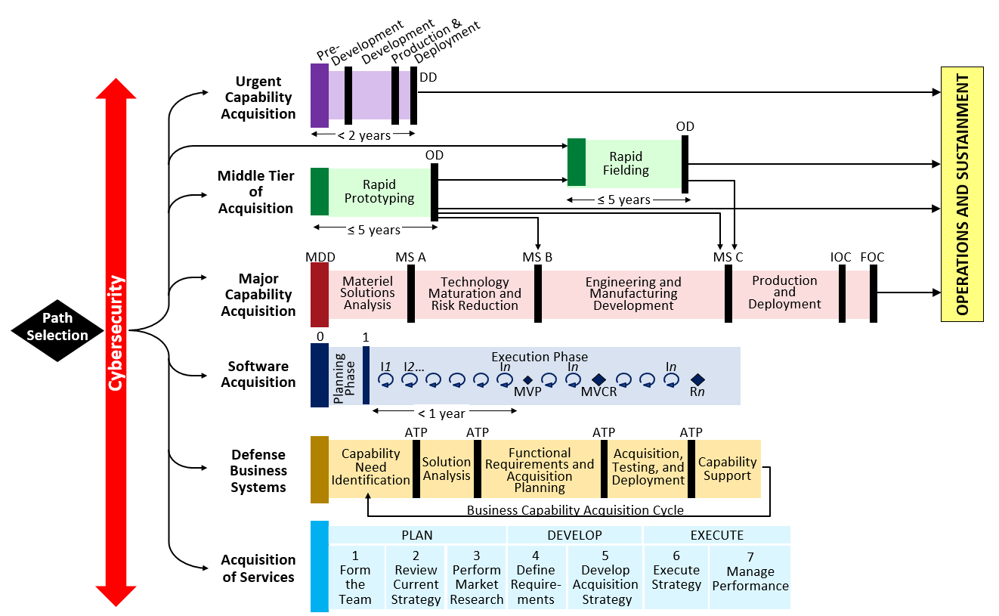

# Policy Modernization: Defense Acquisition

## Learning Objectives

By the end of this lesson you will be able to:

* Understand the intent of Adaptive Acquisition Framework (AAF).
* Describe why the AAF differs from previous acquisition policy.
* Understand how the Defense Acquisition System is transforming.

## Introduction
Before diving into the material we would like to extend our congratulations - you’re over halfway through Digital DNA! At this point, you have completed **two Modules** of Digital DNA, covering the foundations of modern software practices and process--Agile, Lean, Design Thinking, DevSecOps and more. You have a good head start since the **foundations** of these concepts have been covered - but technology is constantly evolving, and never forget, **there is always more to learn.** 

It is paramount to supporting valuable capability delivery that “your teams should be cross-functional and have a fundamental understanding of agile, lean, human-centered design, and open innovation. It's important to think of this learning as foundational and continuous. Technology changes fast and your team will have to learn to keep pace with it to maintain the market expertise necessary to make smart digital acquisition decisions.” 
 Source: [18F Digital Acquisition Playbook](https://github.com/18F/digital-acquisition-playbook/blob/18f-pages/_pages/process/ignition.md)  

<!-- >>>>>>>>>>>>>>>>>>>>>> BEGIN CHALLENGE >>>>>>>>>>>>>>>>>>>>>> -->
<!-- Replace everything in square brackets [] and remove brackets  →

### !challenge

* type: multiple-choice
* id: 9041df3c-e3c8-11eb-ba80-0242ac130004
* title: !Acquisition Framework  
<!-- * points: [1] (optional, the number of points for scoring as a checkpoint) -->
<!-- * topics: [python, pandas] (optional the topics for analyzing points) -->

##### !question

Does the Department have a specific way (policy) to enable procurement of Software Intensive Programs?

##### !end-question

##### !options

* True
* False

##### !end-options

##### !answer

* True

##### !end-answer

### !explanation-incorrect:
Try again, the Software Pathway is the most recent of the six (6) Pathways to be released; however, it’s not the only pathway that can be used to procure Software Intensive Programs. You’ll learn more about this as we continue. 
### !end-explanation

### !explanation-correct:
Correct! The Software Pathway is the most recent of the six (6) Pathways to be released; however, it’s not the only pathway that can be used to procure Software Intensive Programs. You’ll learn more about this as we continue. 
### !end-explanation

<!-- other optional sections -->
<!-- !hint - !end-hint (markdown, hidden, students click to view) -->
<!-- !rubric - !end-rubric (markdown, instructors can see while scoring a checkpoint) -->
<!-- !explanation - !end-explanation (markdown, students can see after answering correctly) -->

### !end-challenge
<!-- ======================= END CHALLENGE ======================= -->

## Acquisition Policy Modernization

Throughout Modules 101 and 102 we showed a timeline showing the evolution of modern software practices and highlighting how the concepts build off one another, incorporating both learning and new technology. Similarly, Defense Acquisition processes have been improving. 

Software isn’t the only thing being modernized across the Department today. Did you know the DoDI 5000.02 was completely overhauled in 2020? It’s no longer titled  “Operation of the Defense Acquisition System.” Now it’s named [“Operation of the Adaptive Acquisition Framework,”](https://www.esd.whs.mil/Portals/54/Documents/DD/issuances/dodi/500002p.pdf?ver=2020-01-23-144114-093) and includes [six (6) acquisition pathways.](https://aaf.dau.edu/)

Why was 5000.02 overhauled? The goal is no longer to **tailor-*out***, but to **tailor-*in***. By creating easily-adaptable pathways that can be combined or used individually there is added potential to support a more timely  acquisitions process and enable valuable capability delivery. 

### !callout-info
## IMPORTANT: 
The Adaptive Acquisition Framework (AAF) and **all acquisition pathways** are **living documents**, intended to be updated regularly based on feedback from programs implementing them. 
### !end-callout

Sound familiar? As the acquisition professional, **you are a critical piece of the framework** that ensures change by supporting necessary feedback. Whether it’s the AAF itself or other policies that are in conflict, let us know how we can support you! 

  
Source: [https://www.dau.edu/News/The-Paths-Become-Clearer--DoD-Acquisition-Policy,-AAF-Release-Occurring](https://www.dau.edu/News/The-Paths-Become-Clearer--DoD-Acquisition-Policy,-AAF-Release-Occurring)

Before we continue discussing the AAF and its implications, we need to introduce some foundational acquisition concepts and content for you. Don’t worry: there’s Agile humor just around the corner.  

## Quick Background: Defense Acquisition  

For those less familiar, the Defense Acquisition System (DAS) is the management process for **all DoD acquisition programs**. [DoD Directive  5000.01, The Defense Acquisition System](https://www.esd.whs.mil/Portals/54/Documents/DD/issuances/dodd/500001p.pdf?ver=2020-09-09-160307-310) provides the overarching management principles and mandatory policies. 

The DAS provides the framework and processes for developing, acquiring, fielding and sustaining capabilities to meet the intent of the current [National Defense Strategy (NDS)](https://www.defense.gov/Explore/Spotlight/National-Defense-Strategy/). 

The AAF enables the vision to deliver effective, suitable, survivable, sustainable, and affordable solutions to the end user in a timely manner. To achieve those solutions, broad authority has been granted to Milestone Decision Authorities (MDAs), Decision Authorities (DAs), and Program Managers (PMs) to:
* Plan and manage their programs in a manner consistent with sound business practices.
* Develop Strategies and employ leading practices that match the characteristics of the capability being acquired.

### !callout-success
## Key Takeaway
The AAF is the overarching policy and describes the acquisition pathways currently available for your program to utilize. To relate to concepts from 101 and 102, these pathways are part of a larger strategy and roadmap and will likely not change as frequently as a contracting strategy, we will discuss in greater detail later.
### !end-callout

<!-- >>>>>>>>>>>>>>>>>>>>>> BEGIN CHALLENGE >>>>>>>>>>>>>>>>>>>>>> -->
<!-- Replace everything in square brackets [] and remove brackets  →

### !challenge

* type: multiple-choice
* id: 27d81414-e3ca-11eb-ba80-0242ac130004
* title: Pathways
<!-- * points: [1] (optional, the number of points for scoring as a checkpoint) -->
<!-- * topics: [python, pandas] (optional the topics for analyzing points) -->

##### !question

Which of the following is true about the AAF pathways?

##### !end-question

##### !options

* The pathways support DoD’s one-size-fits-all approach.
* Each pathway has its own guiding policy that, in combination with functional policy, lays out the tailorable framework for the pathway.
* The specific phases, activities, and artifacts required for each pathway are set and program managers may not tailor.
* A program must select and follow only one pathway.

##### !end-options

##### !answer

* Each pathway has its own guiding policy that, in combination with functional policy, lays out the tailorable framework for the pathway.

##### !end-answer

### !explanation: The pathways support DoD’s one-size-fits-all approach.
Do we really want a one-size-fits-all approach? Try again!   
### !end-explanation

### !explanation: The specific phases, activities, and artifacts required for each pathway are set and program managers may not tailor.
If the pathways were not tailorable, would this encourage true agility?  Try again!  
### !end-explanation

### !explanation: A program must select and follow only one pathway.
Would it encourage agility if you had to stay on the pathway you started on and without being able to switch between them as your team and stakeholders learn and grow?  Try again!
### !end-explanation

<!-- other optional sections -->
<!-- !hint - !end-hint (markdown, hidden, students click to view) -->
<!-- !rubric - !end-rubric (markdown, instructors can see while scoring a checkpoint) -->
<!-- !explanation - !end-explanation (markdown, students can see after answering correctly) -->

### !end-challenge
<!-- ======================= END CHALLENGE ======================= -->

## The Adaptive Acquisition Framework 

One of the most transformational actions executed by our policy teams was modernizing the DoD 5000 series and introducing the AAF. Previously, the DoD took a “one-size-fits-all” approach with option to ‘tailor-out’, with predefined processes that offered only limited flexibility, and a laundry list of statutory and regulatory documentation and review processes. 

### !callout-secondary
## Fun Fact: 
A [GAO Study from 2015](https://www.gao.gov/assets/gao-15-192.pdf) showed that a few program officials for MDAPs found it faster to adhere to all required documents because the process to request ‘tailor out’ was lengthier than complying. *For reference, the average time spent to generate required documentation across 56 programs was over 2 years to prepare documentation for a Milestone Decision.*
### !end-callout

This rewrite enables agility and embraces that **there is more than one way**. Breaking apart what was formerly the DoDI 5000.02, the newly-created AAF pathways are guided by their own policy as well as separate correlating  policies, applicable to each individually. As a result, the DoD now emphasizes delegation and ensures decision-making occurs at lower levels by tailoring program oversight and treating each capability acquisition as unique. 

Source: [Adaptive Acquisition Framework Diagram](https://aaf.dau.edu/)

### !callout-info
## Video: 6 min 42 sec
Take a moment to listen to one of our Senior Leaders Ms. Stacy Cummings who is currently Performing the Duties of Undersecretary of Defense, as she discusses what drove the importance of the policy modernization and why the AAF is so important to Software Intensive Programs: [Switching to an adaptive acquisition framework](https://govmatters.tv/switching-to-an-adaptive-acquisition-framework/) 
### !end-callout

<!-- >>>>>>>>>>>>>>>>>>>>>> BEGIN CHALLENGE >>>>>>>>>>>>>>>>>>>>>> -->
<!-- Replace everything in square brackets [] and remove brackets  →

### !challenge

* type: checkbox
* id: e075e23e-e3cb-11eb-ba80-0242ac130004
* title: Transformation of 5000
<!-- * points: [1] (optional, the number of points for scoring as a checkpoint) -->
<!-- * topics: [python, pandas] (optional the topics for analyzing points) -->

##### !question

Why is the rewrite of the DoDI 5000 series transformational for the DoD? *Select all that apply.*

##### !end-question

##### !options

* It provides multiple acquisition pathways designed to be combined and tailored to develop acquisition strategies, and employs processes that align with the capability being acquired.
* It recognizes that the previous “one-size-fits-all” approach was inadequate.
* It embraces the concept of a single process to simplify DoD acquisitions.
* It embraces that there is more than one way.

##### !end-options

##### !answer

* It provides multiple acquisition pathways designed to be combined and tailored to develop acquisition strategies, and employs processes that align with the capability being acquired.
* It recognizes that the previous “one-size-fits-all” approach was inadequate.
* It embraces that there is more than one way.

##### !end-answer

#### !explanation: It embraces the concept of a single process to simplify DoD acquisitions.
Try again, this answer is not correct.
#### !end-explanation

#### !explanation-not: It provides multiple acquisition pathways designed to be combined and tailored to develop acquisition strategies, and employs processes that align with the capability being acquired.
Correct, but there are additional reasons. You should have at least two (2) other correct answers. 
#### !end-explanation

#### !explanation-not: It recognizes that the previous “one-size-fits-all” approach was inadequate.
Correct, but there are additional reasons. You should have at least two (2) other correct answers. 
#### !end-explanation

#### !explanation-not: It embraces that there is more than one way.
Correct, but there are additional reasons. You should have at least two (2) other correct answers. 
#### !end-explanation

<!-- other optional sections -->
<!-- !hint - !end-hint (markdown, hidden, students click to view) -->
<!-- !rubric - !end-rubric (markdown, instructors can see while scoring a checkpoint) -->
<!-- !explanation - !end-explanation (markdown, students can see after answering correctly) -->

### !end-challenge
<!-- ======================= END CHALLENGE ======================= -->

Before diving into the pathways and providing ways each can be leveraged to support software-intensive systems we want to again expand the picture and discuss some common misconceptions associated with defense acquisition. 

## Addressing Common Misconceptions

**Starting from the same understanding or assumptions is critical.** Even if we do not successfully convince you of the next three points, *this is the perspective the lessons are being taught from.* The points below address myths that are commonly held about acquisitions and its role(s).

### 1. Acquisition Reform is *Not* a New Idea

There is room for improvement within all Defense Acquisition System (DAS) processes, defined as: 

  
 Source: [ ACQNotes: Acquisition Process Overview.](https://acqnotes.com/acqnote/acquisitions/acquisition-process-overview)  

In 2011, the Center of Military History published [Defense Acquisition Reform, 1960–2009: An Elusive Goal](https://history.army.mil/html/books/051/51-3-1/CMH_Pub_51-3-1.pdf). From the title alone, it is clear that acquisitions reform, much like software development, is in a state of continuous improvement. **This idea has been around for 60+ years.** 

### !callout-secondary
## Key Takeaway: Insight from Congress a Key Stakeholder 
Every year, within the National Defense Authorization Act (NDAA), Congress directs the Department with a focus on acquisition through: *Title VIII is Acquisition Policy, Acquisition Management and Related Matters.* This identifies pilots, policy updates, or specific programs and provides critical insight to a key stakeholder’s focus. Again emphasizing the state of continual improvement. If you are interested, look at [FY 2021 NDAA](https://www.congress.gov/bill/116th-congress/house-bill/6395/text) Title VIII Sections. 
### !end-callout

Throughout Module 103, we will provide strategies to establish feedback loops with users, leadership, and stakeholders. These strategies structure your processes, acquisition strategy, and contracting approach, while striving to identify the intent, goal or result while validating via data and metrics. 

### 2. Improving Current Processes *is* a Better Starting Point
We assume that some of you may not agree with this statement. Have you ever heard the saying:

1. Don’t throw the baby out with the bathwater.

“...is an idiomatic expression for an avoidable error in which something good is eliminated when trying to get rid of something bad, or in other words, rejecting the favorable along with the unfavorable.”
Source: “Don't Throw the Baby out with the Bathwater.” Wikipedia, Wikimedia Foundation, 9 Jan. 2021.

Similar to the Brownfield approach we covered in Module 102, iterating and improving is: 
* It is less risky, 
* Allows the ability to navigate dependencies, 
* Provides a clear goal, and 
* May even take less time. 

### 3. Start with the overarching policy 
We also recommend spending some time to go back to the **policy**, policy does not change frequently *(at least annual cycles, if not longer).* Therefore policy tends to be broad, allowing for flexibility and adaptation to support the vast range of capabilities that the DoD develops and deploys. **Policy trumps guidance**. A key tool is referring to policy or statute first, it ***may*** already have the flexibility required by your program. 

### !callout-success
## Key Takeaway:
Don’t forget to review original policy, not just guidance. 
### !end-callout

We start with the above to provide context and the perspective from which we are teaching the material. As emphasized in both Module 101 and 102 the importance of a **common understanding and lexicon** across the entire team, this is not only important for technical concepts but acquisition concepts as well. This theme carries throughout the rest of the course.

### !challenge

* type: checkbox
* id: 7eb17d7c-e3cd-11eb-ba80-0242ac130004
* title: Reasons Change is Difficult
<!-- * points: [1] (optional, the number of points for scoring as a checkpoint) -->
<!-- * topics: [python, pandas] (optional the topics for analyzing points) -->

##### !question

Throughout the course we emphasize the need to be empathetic and understanding to users, within your organization and through engagements with stakeholders. Which common misconceptions and correlating root causes that may be causing pushback?

##### !end-question

##### !options

* What looks like resistance may really be a lack of clarity or understanding 
* What looks laziness or unwillingness may be exhaustion or overly tasked 
* What looks like a people problem may be a situation problem (i.e. the environment is not supportive to enabling change) 
* People can’t change; so why try

##### !end-options

##### !answer

* What looks like resistance may really be a lack of clarity or understanding 
* What looks laziness or unwillingness may be exhaustion or overly tasked 
* What looks like a people problem may be a situation problem (i.e. the environment is not supportive to enabling change) 

##### !end-answer

#### !explanation: People can’t change; so why try
This answer is not correct, try again!  We believe everyone has the ability to change.  
#### !end-explanation

#### !explanation-not: What looks like resistance may really be a lack of clarity or understanding
Correct, but there are additional causes. You should have at least two (2) other correct answers. 
This question is based on concepts outlined in [Switch: How to Change Things When Change is Hard](https://www.amazon.com/Switch-Change-Things-When-Hard/dp/0385528752) which emphasizes our initial assumptions of why change is hard or why we encounter pushback is often due to one of the three above correct answers. 
#### !end-explanation

#### !explanation-not: What looks laziness or unwillingness may be exhaustion or overly tasked 
Correct, but there are additional causes. You should have at least two (2) other correct answers. 
This question is based on concepts outlined in [Switch: How to Change Things When Change is Hard](https://www.amazon.com/Switch-Change-Things-When-Hard/dp/0385528752) which emphasizes our initial assumptions of why change is hard or why we encounter pushback is often due to one of the three above correct answers. 
#### !end-explanation

#### !explanation-not: What looks like a people problem may be a situation problem (i.e. the environment is not supportive to enabling change) 
Correct, but there are additional causes. You should have at least two (2) other correct answers. 
This question is based on concepts outlined in [Switch: How to Change Things When Change is Hard](https://www.amazon.com/Switch-Change-Things-When-Hard/dp/0385528752) which emphasizes our initial assumptions of why change is hard or why we encounter pushback is often due to one of the three above correct answers. 
#### !end-explanation

<!-- other optional sections -->
<!-- !hint - !end-hint (markdown, hidden, students click to view) -->
<!-- !rubric - !end-rubric (markdown, instructors can see while scoring a checkpoint) -->
<!-- !explanation - !end-explanation (markdown, students can see after answering correctly) -->

### !end-challenge

<!-- >>>>>>>>>>>>>>>>>>>>>> BEGIN CHALLENGE >>>>>>>>>>>>>>>>>>>>>> -->
<!-- Replace everything in square brackets [] and remove brackets  →

### !challenge

* type: paragraph
* id: 24e88eba-e3ce-11eb-ba80-0242ac130004
* title: !Roadblock Insight
<!-- * points: [1] (optional, the number of points for scoring as a checkpoint) -->
<!-- * topics: [python, pandas] (optional the topics for analyzing points) -->

##### !question

What policy, guidance, process or behaviors do you believe is constraining for you or your team's ability to be responsive to changing technology and/or user needs?

##### !end-question

##### !placeholder

This is an opportunity for us to learn from you and to better understand  the needs of the workforce, please be as descriptive as you can.  

##### !end-placeholder

### !end-challenge

<!-- ======================= END CHALLENGE ======================= -->

### !callout-success
## Key Takeaways
* Utilizing feedback and incorporating learning initiated the development and fielding of the Adaptive Acquisition Framework (AAF) with six pathways can be utilized independently or in combination to support your unique mission and capability. AAF is available for your program, but existing approved acquisition strategies can be utilized as well. 
* Acquisition Reform is not a new idea--changing a large enterprise like the DoD is difficult and must be supported and implemented by many. There is room for improvement but that does not mean throwing out the entire system, a less riskier starting point is iterating and improving the current process. 
* Concepts that are critical to DevSecOps implementation are equally applicable in an acquisition context--specifically the critical **foundation of common understanding and lexicon** of the entire process to deliver capability--this extends to DoD processes. 
### !end-callout

## Resources
* **Book:** Heath, Chip and Dan Heath. [Switch: How to Change Things When Change is Hard](https://www.amazon.com/Switch-Change-Things-When-Hard/dp/0385528752), 2010. 
* **DoD Publications/Resources:** 
   * [Adaptive Acquisition Framework](https://aaf.dau.edu/) 
   * [DoD Directive  5000.01, The Defense Acquisition System](https://www.esd.whs.mil/Portals/54/Documents/DD/issuances/dodd/500001p.pdf?ver=2020-09-09-160307-310)
   * Fox, Ronald. Defense Acquisition Reform, 1960-2009 An Elusive Goal . Center of Military History, United States Army, 2011, https://history.army.mil/html/books/051/51-3-1/CMH_Pub_51-3-1.pdf
   * [FY 2021 National Defense Authorization Act (NDAA)](https://www.congress.gov/bill/116th-congress/house-bill/6395/text)
   * [GAO: Acquisition Reform DoD Should Streamline Its Decision-Making Process for Weapon Systems](https://www.gao.gov/assets/gao-15-192.pdf), 2015.
* **Video:** [Switching to an adaptive acquisition framework](https://govmatters.tv/switching-to-an-adaptive-acquisition-framework/)
* **Website:** [18F Digital Acquisition Playbook](https://github.com/18F/digital-acquisition-playbook/blob/18f-pages/_pages/process/ignition.md)
