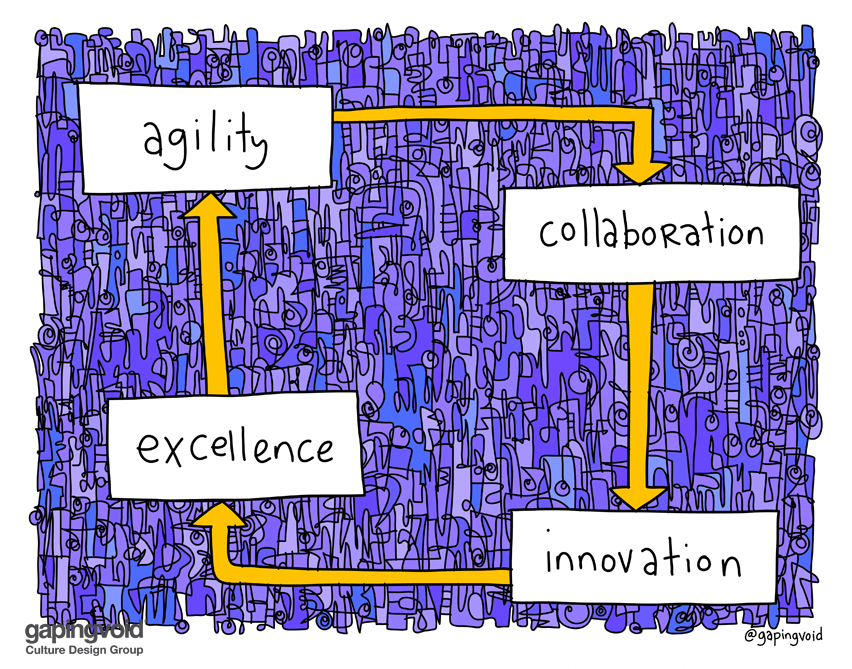
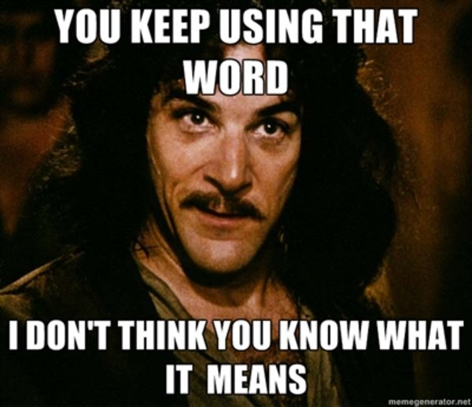

# The Team

## Learning Objectives

By the end of this lesson you will be able to:

* Understand the value of the multidisciplinary teams and utilizing organizations outside the Program Management Office (PMO) 
* Identify gaps in skills on the team and a plan to address them
* Understand how technical foundations across your team supports collaboration

## Introduction

**It's about the team.** As we opened with Module 101, we are going to emphasize again the importance and value of the **entire** team. 

  
 Source: [Agility Is An Exercise](https://www.gapingvoid.com/blog/2017/01/23/agility-is-an-exercise/)  

To continuously deliver valuable capability to the user we must leverage a team that crosses multiple functions, roles, and geographic locations. **Collaboration is at the core.**

## Why Build Cross-Functional Teams?
For those familiar with acquisition the term Integrated Product Team (IPT) may come to mind. While the concepts are similar, sometimes it is worthwhile to redefine or use a different term to help instill the desired behavior and outcome. For this course, when referring to the diverse and evolving skills needed for your team we will use cross-functional teams.

Want more proof: 
> “all acquisitions are hard work, but with the right team gathered, it becomes so much easier. Using cross-functional teams will help. A cross-functional team is one that has all of the skills necessary to deliver a small unit of completed value. Cross-functional teams will help your agency make decisions quicker, deliver work sooner and with fewer defects, improve communication flow on projects, and promote knowledge sharing.”  
> 
>  Source: Scott Adams, [18F Digital Acquisition Playbook](https://github.com/18F/digital-acquisition-playbook/blob/18f-pages/_pages/process/ignition.md)  

## Understanding New Roles/Functions  
Have you ever felt that there are so many new roles, titles, and/or positions when discussing software? Don’t worry, you are not alone. 

 Source: [Dilbert](https://dilbert.com/strip/2017-02-06) 

Unlike Dilbert, you probably will _not_ need a scrumbag. But, more than likely you will need different skill sets on your team to support and enable your software-intensive program. 

### !callout-warning
## Don’t Forget!
* Individuals can serve in multiple roles depending on their skillset
* Don’t forget you can augment your core team with industry or support from other groups and organizations internal to the Department 
### !end-callout

## Defining the Larger Ecosystem

A few disclaimers (hopefully familiar) when we provide definitions:
* As with previous modules definitions can vary and be tailored, we define them for this course and encourage you and your team to use the following as a starting point to ensure a common understanding and lexicon. 
* The following **is not an all inclusive list,** it’s a starting point. 

Remember, we want to avoid this scenario: 

### End Users
End users utilize software-intensive capability, developed to meet the business or mission need.

A relationship and feedback loop with your end users is critical to ensure you are developing and delivering valuable capability. Do not forget, our responsibility as members within the DAS is to ensure that we are supporting the mission--software allows us to be more responsive and to truly see the value and impact we can have! We will discuss strategies in more detail later in 103. 

### !callout-success
## Quick Rabbit Hole
   
  
Why do we _differentiate_ between **end-users** and **stakeholders**?   

Both end-users and stakeholders influence your acquisition, ***but they are not one and the same.***   

**Biggest difference:** end-users utilize the capability, they are the direct recipient. Stakeholders influence and impact your program, either positively or negatively, typically they do not directly utilize the capability. Rather, stakeholders usually impact requirements, funding, ability to operate, etc. 
### !end-callout  

### Stakeholders
A **stakeholder** is a person, group, or organization with an interest, concern or influence. 

For acquisition teams, common stakeholders include:
* Requirements Owners 
* [Service Programming Support:](https://myclass.dau.edu/bbcswebdav/institution/Courses/Deployed/ISA/ISA201/Archives/Student%20materials%20prior%20to%20June%202017/03%20-%20Cost%20Estimating/References/PPBE%20Review%20%28ReadAhead%29/Resources/TeachingNote-Resource%20Allocation%20Process.pdf) who support and defend your program funding and billets
   * Air Force: Program Element Monitors (PEMs), 
   * Army: Department of the Army Systems Coordinators (DASCs)
   * Navy: Requirements Officers 
* Leadership/Decision Authority or Functional Leads
* Oversight and Governance (Congress, OSD, Service Headquarters, etc.) 

Stakeholders may be referred to as influencers, governance, or advocates.

### Requirements Owners (Stakeholder) 
**Requirement owners** support the documentation of specific capability needs, and provide context within the larger DoD capability ecosystem. We specifically define because
* They can include representatives from the user community, i.e. user representatives, if access to end users is not feasible.  
* Typically evaluate whether or not a requirement is met.
* Greatly influence and impact funding.

### !callout-success
## Key Takeaway
End users, requirements owners, and the larger stakeholder community can greatly impact your program--positively and negatively. As a member of the program, you must ensure that purposeful communication occurs frequently to ensure awareness and establish advocacy. **Sometimes the most effective way to communicate your message is if someone else does it for you.** 
### !end-callout

### Software Practitioners
This may be a new term for you, we defined this term in the final report to Congress for FY20 NDAA Sec. 862--*one of the many inspirations for this course.* 

We intentionally did not refer to this group as the “technical team”. We believe there are technical aspects of the user community **and** acquisition teams, and using the term “technical team” unfairly undermines that skillsets of all groups. 

This is an umbrella term for referencing all teams, roles and functions that support software capability delivery. This includes individual product (application) teams, and the teams required to support operations--tech stack, deployment pipelines, security, and data. 

### Acquisition Team
The acquisition team are individuals responsible for: 
* Managing funding
* Executing & administering acquisition strategies and contracts
* Managing performance of contractors, and 
* Communicating to leadership and stakeholders within the **Defense Acquisition System (DAS).**

These groups, composed of multiple roles and skill sets, come together to make decisions impacting the mission capability. Often these groups are **not** co-located, and have different chains of command, and can be internal or external to the program office. Not every decision elevates involvement from all groups, but it is important that these groups work together to not only initially deliver but continually deliver capability.

### !callout-secondary
## Beyond Org Charts
Most of your organizational charts will not include all of these groups; but to successfully deliver valuable capability to end users, your program must have established feedback loops with each. Even if you do not directly engage with all three areas, ensure that there are members within your organization that do.
### !end-callout

## What Roles Are Needed?
So the questions you may be asking yourself may be,

**“How do I determine what skills I need on my team?”**

**“What are some of the roles?”**

**“How do they align to the groups that were identified above?”**

Let’s go back to the three groups we defined:

### User Community
_Recall that the user community encompasses a spectrum, from end-users to requirements owners._

Here are two examples of user communities:

|Software Capability|User Community|
|---|---|
|Civilian Travel Pay System|**End users**: All civilian members that travel and need to be reimbursed **Requirements Owner:** Joint business system community that defines capability and required interfaces|
|Planning for Aircraft In-Flight Refueling Missions|**End Users**: All military members and contractors that plan and execute refueling missions **Requirements Owner**: Joint mission community that defines capability and required interfaces|

### !callout-info
## BOTTOM LINE:
The views and positions of your end-users **and** the larger user community **must be considered** in organizational decisions. 
### !end-callout

### Software Practitioners
We subdivide this group by responsibilities: product (application) teams and infrastructure teams. Further subdividing this group is a useful starting point for discussing how to contract, and who you need to contract versus hire. Depending on the responsibilities of your organization, you may utilize organic resources, or manage (contract) for services that these teams provide. 

#### Product (Application) Team
A product (application) team is responsible for delivering specific software application capabilities that are available via a mobile device, a computer, or an internet browser.

**Remember**: Delivering a software system will likely use
A combination of products developed by the Government, **or**
Commercially available products and/or open-source products, **or**
Commercially available and open-source products tailored for Government use.

The composition of civilian, military, and contractors across your product and application teams **will vary depending on if you are using Government- or contractor-led software development.** 

### !callout-info
## Government-led or Contract-led Software Development
We will discuss this at length throughout the module. For now, keep in mind there is a distinction--which will lead to different approaches to managing **and** contracting. This is another reason why there is not a ‘one-size-fits-all’ approach, your context and team matters!
### !end-callout  

Below are example roles that are commonly associated with product (application) teams. _Remember_ these can be customized and changed on an as-needed basis for specific missions. 

|Title|Role|
|---|---|
|Product Owner|Product Owners manage the Agile process, and are ultimately responsible for the success of the product. Responsible for prioritizing development of features and functionality, defining acceptance criteria for features, and providing demonstrations/reviews to stakeholders. Sometimes dual-hatted as the Product Manager.|
|Product Manager|Product Managers are responsible for working closely with the user community to ensure that requirements reflect the needs and priorities of the user community, and align to mission objectives. Sometimes dual-hatted as the Product Owner.|
|Software Developers - Back End|Back End Software Developers/Engineers develop the functionality behind the scenes to support data capture, data transfer, and/or other back-end functionality.|
|Software Developers - Front End|Front End Software Developers/Engineers individually and/or as a team develop front-end functionality and interfaces to support the organization’s vision (design and write code).|
|User Experience Designers|User Experience Designers design the way a user will interact with the product, how it will look, and how it will work; working with front-end developers, they then make sure the product logically flows and visually communicates.|

#### Infrastructure Team
Another team within the software practitioner role is the infrastructure team.

We’ve noted a few times in this lesson that your organization may use different titles or terms when defining your organizational structure. The term infrastructure team has significant variances across DoD teams. Other common terms you may see used to name this team are: Enterprise, IT Operations, Operations, or Platform. For the purposes of this course, we will be referring to this team as the Infrastructure team. 

### !callout-success
## Takeaway:
Regardless of the terms you use, defining terms and recognizing the potential variability of those terms is _extremely_ important.
### !end-callout

Your infrastructure team supports the ability for products (in this case applications) to be available in operations. Thus, your infrastructure team provides:
* Tech stack management, and environment maintenance as discussed in Module 1 (development, test/staging, and operations)
* Continuous delivery via software delivery pipelines that connect environments (as required by users)
* Security protocols and processes
* Network and connectivity support
* Underlying data architecture support
* Additional technical work such as data science, deployment engineering, etc. 

Below are example roles that are commonly associated with infrastructure teams. You may recognize the duplication of some roles that we mentioned on product teams, this is intentional. Again, these can be customized and change as needed for your specific mission. 

|Title|Role|
|---|---|
|Data Scientist|Data Scientists access data, perform statistical analysis, then visualize and communicate results.|
|Deployment Engineers|Deployment Engineers are responsible for automating the process to move between different technical environments from development and testing, to production environments.|
|End Users|End Users convey operational concepts and requirements/needs, participate in continuous testing activities, and provide feedback on developed capabilities; the ones who ultimately interact with and use the product.|
|Enterprise Architect|Enterprise Architects create architectures and designs in an iterative manner, ensuring that designs evolve in a controlled way over the course of releases.|
|Independent Testers|Independent Testers validate the capabilities produced against the end users’ top-priority needs, the design specifications, and standards. They also test enterprise or product-level systems against security standards.|
|Platform Engineer|Platform Engineers document the overall platform design and help analyze the impact of new requirements|
|Product Manager|Product Managers are responsible for working closely with the user community to ensure that requirements reflect the needs and priorities of the user community, and align to mission objectives. Sometimes dual-hatted as the Product Owner.|
|Security Engineer|Security Engineers develop data and technology systems to prevent cybersecurity breaches, ensuring the safe and secure delivery and use of products developed by the organization including data protection, security, and privacy.|
|Software Developers - Back End|Software Developers/Engineers develop the functionality behind the scenes to support data capture, data transfer, and/or other back-end functionality|
|Software Developers - Front End|Software Developers/Engineers individually and/or as a team develop front-end functionality and interfaces to support the organization’s vision (design and write code)|
|Test Engineer|Test Engineers test various components and features in order to identify and fix technical issues. They work with product teams to define acceptance criteria for features, which should be integrated throughout the development process. Best practice is that developers are dual-hatted as testers.|
|User Experience Designers|User Experience Designers design the way a user will interact with the product, how it will look, and how it will work. They work with front-end developers to ensure the product logically flows and visually communicates.|

### !challenge

* type: checkbox
* id: b76542f4-9736-11eb-a8b3-0242ac130003
* title: !Roles
<!-- * points: [1] (optional, the number of points for scoring as a checkpoint) -->
<!-- * topics: [python, pandas] (optional the topics for analyzing points) -->

##### !question

What roles are you utilizing or planning to utilize on your software-intensive program? Select all roles that you are **currently** supporting your software-intensive effort. 

##### !end-question

##### !options

* Product Owner
* Product Manager
* Software Developers - Back End
* Software Developers - Front End
* User Experience Designers  
* Data Scientists
* Data Engineers
* Deployment Engineers
* End Users
* Enterprise Architect
* Independent Testers
* Platform Engineer
* Security Engineer
* Test Engineer
* N/A - currently not utilizing any of the roles listed

##### !end-options

##### !answer

* *

##### !end-answer

<!-- other optional sections -->
<!-- !hint - !end-hint (markdown, hidden, students click to view) -->
<!-- !rubric - !end-rubric (markdown, instructors can see while scoring a checkpoint) -->
<!-- !explanation - !end-explanation (markdown, students can see after answering correctly) -->

### !end-challenge

#### Summary: Software Practitioners 
You may see a lot of variation on how product (application) and infrastructure teams are built, and as technology changes, common roles may also change. We hope this list helps to serve as a starting point.  

What your specific teams will look like depends on the unique requirements of your organization, and will vary depending on decisions your organization makes, such as: 
* Will you use an existing commercial platform, Government platform, or build something internally? Or, will you use a combination of the three?
* Will you use Government-led development, or contractor-led development? _Note: We will explain more throughout this module._
* Will your data scientists be best suited at the infrastructure level, or will they be embedded within specific product teams? This is also a preview question for things to be considering when incorporating AI. 
* Do you require full-time designers for each product team, or can teams share resources? 

These questions are a sampling of the topics that you should consider when structuring your team. 

### Acquisition Team 
Now let’s discuss the acquisition team. These are the roles that, at a minimum, must be filled: 
|Title|Role|
|---|---|
|Contracting Officer|Contracting Officers are required to award and administer contracts. They are authorized to bind the Government contractually, direct contractor action, and designate & authorize CORs.|
|Contracting Officer’s Representative (COR)|CORs must be a Government employee. They perform functions specifically delegated to them by the contracting officer for the particular contract. They must be knowledgeable and skilled in Agile software development, and may also serve as the Product Owner.  The COR **does not** have authority to make changes to the contract or authorize new work; however, the COR is critical in ensuring the vendor executes the technical work in compliance with the contract.|
|Cost Estimator|Responsible for analytics necessary to create cost estimates for specific projects and overall programs. Analyzes and estimates how much something costs.|
|Engineering|Engineering is still part of the software acquisition team, but as we outlined previously, they support software practitioner roles. This can (and we highly recommend should) be someone dual-hatted and working as a software practitioner (for example, on a  product/application or platform team).  _Why? The speed of technology change and integration and improvement of practices we want our engineers to be able to do as well as manage_|
|Financial Manager|Financial Managers advise the acquisition team on all matters pertaining to budgeting, finance, and accounting. They are responsible for the management of financial operations, and for providing advice on effective use and redistribution of resources within fund limitations. Tracks and manages the overall program budgets.|
|Program Manager|Program Managers are responsible for the overall acquisition strategy, and communication with Government stakeholders, contractors, and end-users. They nominate Contracting Officer Representatives (CORs, and track the overall performance of the program. In some programs the Program Manager will also double as the Product Owner.|
|Test & Evaluation|Test and Evaluation personnel are responsible for methodology and processes related to testing and evaluation across the organization for all aspects of software development. Their responsibilities within the organization will differ depending on the test methodology implemented- automated testing will reduce (but not replace) this role. Most software practitioner teams will cover test & evaluation needs, but this role may still exist in the acquisition team.|

Regardless of whether your acquisition will utilize Government- or contractor-led development, it is important that your team is equipped with the right members to support not only a successful contract award, but also properly equipped to manage administration and development activities after contract award. Then the heavy lifting begins! **Contract award is not the finish line- it’s the starting point** (it gives you a head start to deliver valuable capability). 

### !callout-danger

## Contracting Officer Representative (COR)
The role of the COR should not be underestimated. Because their overall responsibility is to monitor the performance of a contractor, they must be knowledgeable and skilled in Agile software development. The Quality Assurance Surveillance Plan (QASP) will detail how service contracts for software development should be surveilled and the COR’s role in that process is integral to overall program success.  
***NOTE: We will expand further on the role COR and QASP further in the course.***
### !end-callout

## Recap
Your organization structure **does not** need to exactly mirror what was presented in this lesson, nor do the same team names or titles need to be used. Another resource is [18F’s Digital Acquisition Playbook.](https://github.com/18F/digital-acquisition-playbook/blob/18f-pages/_pages/process/ignition.md)

The most important takeaway here is this: multiple viewpoints, from the software practitioner, user community, and acquisition perspectives must be taken into account and balanced during the decision making process. The construct of your team should enable fast (valuable) flow of mission or business capability. 

### !challenge

* type: multiple-choice
* id: 3dfb07c2-696a-4d92-8a31-af7dd78f815b
* title: Scenario on Team Roles
<!-- * points: [1] (optional, the number of points for scoring as a checkpoint) -->
<!-- * topics: [python, pandas] (optional the topics for analyzing points) -->

##### !question

You are a Contract Specialist assigned to a new small Government agency. Upon your arrival, you are introduced to your new program office team. The team will be developing software to facilitate training for a new military capability. You find the team is involved and actively seeking ways to eliminate unnecessary steps while still retaining useful content. As the Contract Specialist, which of the following best represents how you would start to work with the team to ensure their success?

##### !end-question

##### !options

* Meet with the team to understand the required capability, functionality, and/or performance that will meet their needs.
* Talk with the team about a solution that will solve the perceived problems encountered in the current training software today.
* Ask the team for their Statement of Work document so you can review and issue a solicitation to satisfy their requirements.
* Talk with the team about who will be on the evaluation team to review the highly complex proposals.

##### !end-options

##### !answer

* Meet with the team to understand the required capability, functionality, and/or performance that will meet their needs.

##### !end-answer

<!-- other optional sections -->
<!-- !hint - !end-hint (markdown, hidden, students click to view) -->
<!-- !rubric - !end-rubric (markdown, instructors can see while scoring a checkpoint) -->
<!-- !explanation - !end-explanation (markdown, students can see after answering correctly) -->

### !end-challenge

### !callout-success
## KEY TAKEAWAYS: The Team
* **Communication and feedback are essential.** Spending time establishing purposeful, frequent communication and feedback loops is time never wasted. It takes a team beyond a program office to continually deliver valuable capability.
* **Context Matters.** Specific roles and positions will vary throughout the lifecycle of the program and as you support different programs. Ensuring a common understanding and lexicon across your team enables effective decision-making.
* **Leverage expertise across the ecosystem.** Individuals can serve in multiple roles depending on their skill set, **and** you can augment your team with support from other groups/organizations internal to the Department or with industry.
### !end-callout

<!-- >>>>>>>>>>>>>>>>>>>>>> BEGIN CHALLENGE >>>>>>>>>>>>>>>>>>>>>> -->
<!-- Replace everything in square brackets [] and remove brackets -->

### !challenge

* type: paragraph
* id: 4f934c1b-601f-4b7d-a9de-0fd401b7dcef
* title: !Opt. Lesson Feedback: The Team 
<!-- * points: [1] (optional, the number of points for scoring as a checkpoint) -->
<!-- * topics: [python, pandas] (optional the topics for analyzing points) -->

##### !question

Do you have any specific feedback, positive or constructive, regarding the content of this lesson? 

##### !end-question

##### !placeholder
Remember, this is optional - this is a way for you to provide input while working through the lesson content. 

If you do not have any input feel free to write N/A in the text box. 
##### !end-placeholder

### !end-challenge

<!-- ======================= END CHALLENGE ======================= -->

## Resources:
* **Websites:** 
   * [18F’s Digital Acquisition Playbook](https://github.com/18F/digital-acquisition-playbook/blob/18f-pages/_pages/process/ignition.md)
   * [DAU: Service Programming Support](https://myclass.dau.edu/bbcswebdav/institution/Courses/Deployed/ISA/ISA201/Archives/Student%20materials%20prior%20to%20June%202017/03%20-%20Cost%20Estimating/References/PPBE%20Review%20%28ReadAhead%29/Resources/TeachingNote-Resource%20Allocation%20Process.pdf)

## Bonus Section: Questions To Help Cultivate A Balance of Perspectives
We have intentionally avoided or sparingly used ‘culture’ because we have been banged over the head about it - we understand, culture matters. But culture isn’t a starting point, it’s a result of your actions. It's important to realize that culture isn’t something that just happens organically. Rather, it's cultivated and sustained intentionally.

We have just defined three communities or groups, then stressed the importance of multidisciplinary viewpoints. But how do you achieve that in your daily work? You may be thinking, “Everyone can’t be in every meeting or a part of every decision.”

To be clear, that is not what we are advocating.

Here are some thought-provoking questions we have adapted from 18F, USDS, and Skylight Digital. These will hopefully help you determine what steps you and your team should take: 

* **Does your team have regular check-ins?**
  * Remember, this applies to your direct team as well as support teams. For example, let’s say you are part of the Acquisitions team - do you regularly check in with the other functions and roles? When was the last time you engaged with the user community and software practitioners?
  * **Note**: frequency of check-ins will likely be different; higher for direct team and less frequent with other supportive teams
* **Do all members of your team have what they need to be successful?**
  * Secondary questions could be:
    * Is there support or input from other team members?
    * Are there any easy ways to communicate across a team?
    * What technology or tools are in use?
    * Is the team staffed appropriately?
* **Do all team members have a common understanding of and definitions for processes and terms?**
  * **Note**: We define all team members as members across the user community, software practitioners and acquisition team.
  * Secondary questions could be:
    * **The goal is, no matter what combination of team members you insert (software practitioners/user community/acquisition teams) in [group x] and [group y] the answer to the question should be yes!**  Does the [group x] understand what the [group y] are saying and doing?
    * Can all team members easily communicate and show the work they are performing and how it fits in larger goals and workflows?

**Remember:

These are just some of the questions you can ask. You can see more suggestions here: [Skylight Digital: Leading and Managing a Digital Team](https://skylight.digital/work/toolkits/digital-talent-management/leading-and-managing-a-digital-team/)

### !challenge

* type: multiple-choice
* id: 88d86d5e-fc96-46eb-9059-81aca3cb5889
* title: Collaborative Culture
<!-- * points: [1] (optional, the number of points for scoring as a checkpoint) -->
<!-- * topics: [python, pandas] (optional the topics for analyzing points) -->

##### !question

The questions above are helpful to you (and your team) in understanding what characteristics are necessary to cultivate an environment that is Agile - collaborative - innovative - excellent (i.e. the elusive culture we desire).

##### !end-question

##### !options

* True
* False

##### !end-options

##### !answer

* *

##### !end-answer

<!-- other optional sections -->
<!-- !hint - !end-hint (markdown, hidden, students click to view) -->
<!-- !rubric - !end-rubric (markdown, instructors can see while scoring a checkpoint) -->
<!-- !explanation - !end-explanation (markdown, students can see after answering correctly) -->

### !end-challenge

### !challenge

* type: paragraph
* id: a5c8fca4-d17d-494f-a8a7-e0636d2b685e
* title: !Your Questions
<!-- * points: [1] (optional, the number of points for scoring as a checkpoint) -->
<!-- * topics: [python, pandas] (optional the topics for analyzing points) -->

##### !question

Are there any questions (maximum two) that you think we did not address that you believe are necessary based on your experiences to support cultivating a balance of perspectives. Please follow a question format in the perspective of you as a team member or your team.

##### !end-question

<!-- other optional sections -->
<!-- !hint - !end-hint (markdown, hidden, students click to view) -->
<!-- !rubric - !end-rubric (markdown, instructors can see while scoring a checkpoint) -->
<!-- !explanation - !end-explanation (markdown, students can see after answering correctly) -->

### !end-challenge

