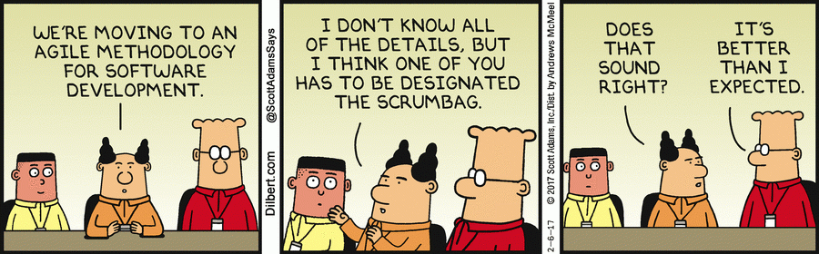
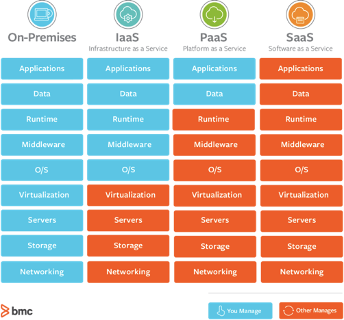

# Tactical View: Implementing a Software-Intensive Acquisition is a Team Effort

## Learning Objectives

By the end of this lesson you will be able to:

* Identify the roles and responsibilities for modern DoD software development
* Define how the acquisition team works amongst the rest of the organization to enable successful software development processes and solution outcomes

## Team Roles & Responsibilities

A key feature of DevSecOps is an emphasis on incorporating multiple roles and functions. Recall that DevOps is the merging of two discrete but similar communities: software development, and IT operations. As we discussed balanced teams in Release 1, another way to think of this concept is that as decisions are made, the balance of perspectives is considered before making an informed decision. This approach can be applied to a line of effort, a portfolio, a program, and beyond.

Before we continue, let’s review a few terms that will be used throughout this lesson. While there are alternative ways to define the following terms, in this lesson and through Release 3 and 4 they are defined as follows:

**USER COMMUNITY**: A user community is comprised of both **_end-users_** and **_requirements owners_**.

**_End-users_** utilize software-intensive capability, developed to meet the business or mission need.

**_Requirement owners_** support the documentation of specific capability needs, and provide context within the larger DoD capability ecosystem; they can also include representatives from the user community if access to end users is not feasible.

### !callout-secondary
## Note
Some processes are unique to individual agencies or to support joint requirements/capabilities.
### !end-callout

**SOFTWARE PRACTITIONER(S)**: This is an umbrella term for referencing all teams, roles and functions that support software capability delivery. This includes individual product (application) teams, and the teams required to support operations--tech stack, deployment pipelines, security, and data.

### !callout-info
## Note
We intentionally did not refer to this group as the “technical team”. We believe there are technical aspects of the user community and acquisition teams, and using the term “technical team” unfairly undermines that skillsets of all groups.
### !end-callout

**_ACQUISITION TEAM_**: The acquisition team are individuals responsible for
* Managing funding
* Executing & administering acquisition strategies and contracts
* Managing performance of contractors, and
* Communicating to leadership and stakeholders within the **Defense Acquisition System** (DAS). 

### !callout-warning

## Keep in Mind
Your organizational structure **does not need** to mirror what is presented in this lesson, nor do the same team names need to be used. The most important takeaway is that multiple viewpoints and perspectives (Technical, User, and Acquisition) must be taken into account and balanced during an organization’s decision-making process.

### !end-callout

Now that we have a common understanding of these terms, let’s start with how balanced approaches and/or teams can be applied to a Government team. The view from an organizational level looks something like this:

These three groups - **software practitioners**, the **user community**, and **acquisitions teams** - come together to make decisions impacting the mission capability. Often these groups are not co-located, and have different chains of command. Not every decision elevates to involvement from all three groups, but it is important that these groups work together to not only initially deliver but continually deliver capability.

Most of your organizational charts will not include all of these groups; it is important to have established feedback loops (refer back to the previous lesson for tips). Even if you do not directly engage with all three areas, there are members within your organization that do.

### !callout-danger

## Think on this:
The Venn Diagrams presented in this lesson **should not** be interpreted as 100% of these functions are conducted “in-house”, or solely by Government civilians or military members.

Rather, even if your organization relies on another organization (or contractor) to fulfill one of these areas, that **does not** negate the need to take that area into consideration while making organizational decisions.

### !end-callout

## Example Organization Roles & Responsibilities: Cloud Provider, IaaS
Roles and responsibilities will vary depending on a variety of factors. For example, a requirements owner (**user community**) defines the requirement of utilizing a redundant infrastructure in a secure environment. Then, a program (**acquisition team**) competes and awards a cloud provider contract to support a portion of a tech stack (**software practitioners/infrastructure team**), specifically Amazon Web Services (AWS). To successfully deploy mission applications, _they will need someone on their team_ (**software practitioner**) who understands the current capabilities of the platform in their operating environment--that is, what publicly available services are available for use in their program, due to the requirements of their secure operating environment. If that is not well understood, the software development team could leverage services in the _development environment_ that would not be available in the _operating environment_, resulting in non-functional (broken) code as part of their delivery.

That being said, although someone needs to understand the capabilities and updates that are queued for AWS, software practitioners are not responsible for the development and deployment of platform services - that is the responsibility of the cloud provider (in this case Amazon).

Here’s an analogy to provide some context: In our homes, we are not responsible for ensuring electricity is available - the utility provider is, as the entity that supports the accessibility of the service. We as their consumers are responsible for obtaining the service for ourselves, and usage, i.e. turning on and off lights. You could decide to change electrical providers for lower rates or to switch to clean energy, but you do not take on full responsibility for service itself.

Recall the following graphic: 

Having others manage a capability does not negate the need for awareness. It may limit customization, or restrict service options to a specific vendor or group of vendors. But all of the above are viable strategies--the approach will be unique to your mission and your team's skill set. 

### !callout-success
## TAKEAWAY:

Remember, one of the benefits of leveraging a Cloud provider is minimizing the amount you manage at the onset. If contracts are structured to address data, IP, and what vendor specific services are leveraged, you retain the flexibility to change your decision in the future.

An industry example of a successful company that chooses to maintain their service with a vendor-managed solution is Netflix, who continues to use AWS. Alternately, Dropbox ultimately chose to build out their own tech stack after successful product market fit.

Similar to the industry example, if your organization works with contractors, they must take the technical areas contractors work within into consideration when making organizational decisions.
### !end-callout

## What Roles Are Needed?
So the questions you may be asking yourself may be,

**“How do I determine what skills I need on my team?”**

**“What are some of the roles?”**

**“How do they align to the groups that were identified above?”**

We reference various role titles and their definitions throughout this section. While this may be frustrating and confusing, don’t read this module as the only way to reference the skills or naming conventions of a specific role. It’s important to define roles for yourselves, work across your team for understanding and clarity, and get feedback from industry. 

Let’s go back to the three groups we defined:

### User Community
_Recall that the user community encompasses a spectrum, from end-users to requirements owners. End-users utilize the software-intensive capability developed, and requirements owners support documentation of specific capability needs and provide context within the larger DoD capability ecosystem. They can also include representatives from the user community if access to end-users is not feasible._

Here are two examples of user communities:

|Software Capability|User Community|
|---|---|
|Civilian Travel Pay System|**End users**: All civilian members that travel and need to be reimbursed **Requirements Owner:** Joint business system community that defines capability and required interfaces|
|Planning for Aircraft In-Flight Refueling Missions|**End Users**: All military members and contractors that plan and execute refueling missions **Requirements Owner**: Joint mission community that defines capability and required interfaces|

Many of you inhabit acquisition roles, and have established connections to your requirements community. We are intentionally making a distinction between requirements communities and end-users - both matter, and both require the ideas discussed in Release 1 and 2, like user-centered design and user interviews.

We start here, because without established feedback and regular engagement with the user community, delivering valuable capability by software practitioners and the acquisition team would be pure luck.

**BOTTOM LINE**:  The views and positions of your end-users **and** the larger user community **must be considered** in organizational decisions. 

### Software Practitioners
Within the role of software practitioner, two groups emerge that further define its responsibilities: product (application) teams, and infrastructure teams. Further subdividing this group is a useful starting point for discussing how to contract, and who you need to contract versus hire. Depending on the responsibilities of your organization, you may utilize organic resources, or manage (contract) for services that these teams provide.

#### Product (Application) Team
A product (application) team is responsible for delivering specific software application capabilities that are available via a mobile device, a computer, or an internet browser.

**Remember**: Delivering a software system will likely use
A combination of products developed by the Government, **or**
Commercially available products and/or open-source products, **or**
Commercially available and open-source products tailored for Government use.

The composition of civilian, military, and contractors across your product and application teams will vary depending on if you are using Government- or contractor-led software development. Below are example roles that are commonly associated with product (application) teams.

**Remember**: These can be customized and change on an as-needed basis for specific missions. 

|Title|Role|
|---|---|
|Product Owner|Product Owners manage the Agile process, and are ultimately responsible for the success of the product. Responsible for prioritizing development of features and functionality, defining acceptance criteria for features, and providing demonstrations/reviews to stakeholders. Sometimes dual-hatted as the Product Manager.|
|Product Manager|Product Managers are responsible for working closely with the user community to ensure that requirements reflect the needs and priorities of the user community, and align to mission objectives. Sometimes dual-hatted as the Product Owner.|
|Software Developers - Back End|Back End Software Developers/Engineers develop the functionality behind the scenes to support data capture, data transfer, and/or other back-end functionality.|
|Software Developers - Front End|Front End Software Developers/Engineers individually and/or as a team develop front-end functionality and interfaces to support the organization’s vision (design and write code).|
|User Experience Designers|User Experience Designers design the way a user will interact with the product, how it will look, and how it will work; working with front-end developers, they then make sure the product logically flows and visually communicates.|

#### Infrastructure Team
Another team within the software practitioner role is the infrastructure team.

We’ve noted a few times in this lesson that your organization may use different titles or terms when defining your organizational structure. The term infrastructure team has significant variances across DoD teams. Other common terms you may see used to name this team are: Enterprise, IT Operations, Operations, or Platform. For the purposes of this lesson, we will be referring to this team as the Infrastructure team. 

### !callout-success
## TAKEAWAY:

Regardless of the terms you use, defining terms and recognizing the potential variability of those terms is _extremely_ important.

### !end-callout

Your infrastructure team supports the ability for products (in this case applications) to be available in operations. Thus, your infrastructure team provides:
* Tech stack management, and environment maintenance as discussed in Release 1 (development, test/staging, and operations)
* Continuous delivery via software delivery pipelines that connect environments (as required by users)
* Security protocols and processes
* Network and connectivity support
* Underlying data architecture support
* Additional technical work such as data science, deployment engineering, etc. 

Below are example roles that are commonly associated with infrastructure teams. You may recognize the duplication of some roles that we mentioned on product teams, this is intentional. Again, these can be customized and change as needed for your specific mission. 

|Title|Role|
|---|---|
|Data Scientist|Data Scientists access data, perform statistical analysis, then visualize and communicate results.|
|Deployment Engineers|Deployment Engineers are responsible for automating the process to move between different technical environments from development and testing, to production environments.|
|End Users|End Users convey operational concepts and requirements/needs, participate in continuous testing activities, and provide feedback on developed capabilities; the ones who ultimately interact with and use the product.|
|Enterprise Architect|Enterprise Architects create architectures and designs in an iterative manner, ensuring that designs evolve in a controlled way over the course of releases.|
|Independent Testers|Independent Testers validate the capabilities produced against the end users’ top-priority needs, the design specifications, and standards. They also test enterprise or product-level systems against security standards.|
|Platform Engineer|Platform Engineers document the overall platform design and help analyze the impact of new requirements|
|Product Manager|Product Managers are responsible for working closely with the user community to ensure that requirements reflect the needs and priorities of the user community, and align to mission objectives. Sometimes dual-hatted as the Product Owner.|
|Security Engineer|Security Engineers develop data and technology systems to prevent cybersecurity breaches, ensuring the safe and secure delivery and use of products developed by the organization including data protection, security, and privacy.|
|Software Developers - Back End|Software Developers/Engineers develop the functionality behind the scenes to support data capture, data transfer, and/or other back-end functionality|
|Software Developers - Front End|Software Developers/Engineers individually and/or as a team develop front-end functionality and interfaces to support the organization’s vision (design and write code)|
|Test Engineer|Test Engineers test various components and features in order to identify and fix technical issues. They work with product teams to define acceptance criteria for features, which should be integrated throughout the development process. Best practice is that developers are dual-hatted as testers.|
|User Experience Designers|User Experience Designers design the way a user will interact with the product, how it will look, and how it will work. They work with front-end developers to ensure the product logically flows and visually communicates.|

### !challenge

* type: paragraph
* id: 5c545693-536c-48e6-aafb-6c872439102c
* title: Roles
<!-- * points: [1] (optional, the number of points for scoring as a checkpoint) -->
<!-- * topics: [python, pandas] (optional the topics for analyzing points) -->

##### !question

What roles are you utilizing or planning to utilize on your software-intensive program?

##### !end-question

##### !placeholder

They can be roles referenced above or others not listed.

##### !end-placeholder

<!-- other optional sections -->
<!-- !hint - !end-hint (markdown, hidden, students click to view) -->
<!-- !rubric - !end-rubric (markdown, instructors can see while scoring a checkpoint) -->
<!-- !explanation - !end-explanation (markdown, students can see after answering correctly) -->

### !end-challenge

### Software Practitioners Summary
You may see a lot of variation on how product (application) and infrastructure teams are built, and as technology changes, common roles may also change. We hope this list helps to serve as a starting point.

What your specific teams will look like depends on the unique requirements of your organization, and will vary depending on decisions your organization makes, such as:
* Will you use an existing commercial platform, Government platform, or build something internally? Or, will you use a combination of the three?
* Will you use Government-led development, or contractor-led development? **Note**: Don’t worry, we will explain more in the next lesson if you are unfamiliar with the difference!
* Will your data scientists be best suited at the infrastructure level, or will they be embedded within specific product teams? This is also a preview question for things to be considering when incorporating AI.
* Do you require full-time designers for each product team, or can teams share resources?

These questions are a sampling of the topics that you should consider when structuring your team. 

## Acquisition Team
Now let’s get back to the team you are all most familiar with, the acquisition team. These are the roles that, at a minimum, must be filled: 

|Title|Role|
|---|---|
|Contracting Officer|Contracting Officers are required to award and administer contracts. They are authorized to bind the Government contractually, direct contractor action, and designate & authorize CORs.|
|Contracting Officer’s Representative (COR)|CORs must be a Government employee. They perform functions specifically delegated to them by the contracting officer for the particular contract. They must be knowledgeable and skilled in Agile software development, and may also serve as the Product Owner. The COR does not have authority to make changes to the contract or authorize new work; however, the COR is critical in ensuring the vendor executes the technical work in compliance with the contract.|
|Cost Estimator|Responsible for analytics necessary to create cost estimates for specific projects and overall programs. Analyzes and estimates how much something costs.|
|Engineering|Engineering is still part of the software acquisition team, but as we outlined previously, they support software practitioner roles. This can (and we highly recommend should) be someone dual-hatted and working as a software practitioner (for example, on a  product/application or platform team). _Why? The speed of technology change and integration and improvement of practices we want our engineers to be able to do as well as manage_|
|Financial Manager|Financial Managers advise the acquisition team on all matters pertaining to budgeting, finance, and accounting. They are responsible for the management of financial operations, and for providing advice on effective use and redistribution of resources within fund limitations. Tracks and manages the overall program budgets.|
|Program Manager|Program Managers are responsible for the overall acquisition strategy, and communication with Government stakeholders, contractors, and end-users. They nominate Contracting Officer Representatives (CORs, and track the overall performance of the program. In some programs the Program Manager will also double as the Product Owner.|
|Test & Evaluation|Test and Evaluation personnel are responsible for methodology and processes related to testing and evaluation across the organization for all aspects of software development. Their responsibilities within the organization will differ depending on the test methodology implemented- automated testing will reduce (but not replace) this role. Most software practitioner teams will cover test & evaluation needs, but this role may still exist in the acquisition team.|

Regardless of whether your acquisition will be to enable Government- or contractor-led development, it is important that your team is equipped with the right members to support not only a successful contract award, but also properly equipped to manage administration and development activities after contract award. Then the heavy lifting begins! Contract award is not the finish line- it’s the starting point (it gives you a head start to deliver valuable capability). 

### !challenge

* type: multiple-choice
* id: 1641429e-6256-44be-85aa-4b3ca5fab092
* title: Balance
<!-- * points: [1] (optional, the number of points for scoring as a checkpoint) -->
<!-- * topics: [python, pandas] (optional the topics for analyzing points) -->

##### !question

We defined three groups that we believe help to facilitate valuable software delivery through a balance of perspectives approach: user community, software practitioners, and acquisition team. Do you believe that this is the right balance?

##### !end-question

##### !options

* Yes
* No

##### !end-options

##### !answer

* *

##### !end-answer

<!-- other optional sections -->
<!-- !hint - !end-hint (markdown, hidden, students click to view) -->
<!-- !rubric - !end-rubric (markdown, instructors can see while scoring a checkpoint) -->
<!-- !explanation - !end-explanation (markdown, students can see after answering correctly) -->

### !end-challenge

### !challenge

* type: paragraph
* id: ba213344-57b4-4a75-af00-449407a58bc5
* title: Perspective
<!-- * points: [1] (optional, the number of points for scoring as a checkpoint) -->
<!-- * topics: [python, pandas] (optional the topics for analyzing points) -->

##### !question

Please provide an example of how you incorporate input and perspective from communities outside your immediate program office.

##### !end-question

##### !placeholder

##### !end-placeholder

<!-- other optional sections -->
<!-- !hint - !end-hint (markdown, hidden, students click to view) -->
<!-- !rubric - !end-rubric (markdown, instructors can see while scoring a checkpoint) -->
<!-- !explanation - !end-explanation (markdown, students can see after answering correctly) -->

### !end-challenge

### !callout-danger

## COR
The role of the COR should not be underestimated. Because their overall responsibility is to monitor the performance of a contractor, they must be knowledgeable and skilled in Agile software development. The Quality Assurance Surveillance Plan (QASP) will detail how service contracts for software development should be surveilled and the COR’s role in that process is integral to overall program success.
**NOTE: We will expand further on the role COR and QASP further in the course.**

### !end-callout

## Recap
Your organization structure **does not** need to exactly mirror what was presented in this lesson, nor do the same team names or titles need to be used.

The most important takeaway here is this: multiple viewpoints, from the software practitioner, user community, and acquisition perspectives must be taken into account and balanced during the decision making process. 

### !challenge

* type: multiple-choice
* id: 3dfb07c2-696a-4d92-8a31-af7dd78f815b
* title: Scenario on Team Roles
<!-- * points: [1] (optional, the number of points for scoring as a checkpoint) -->
<!-- * topics: [python, pandas] (optional the topics for analyzing points) -->

##### !question

You are a Contract Specialist assigned to a new small Government agency. Upon your arrival, you are introduced to your new program office team. The team will be developing software to facilitate training for a new military capability. You find the team is involved and actively seeking ways to eliminate unnecessary steps while still retaining useful content. As the Contract Specialist, which of the following best represents how you would start to work with the team to ensure their success?

##### !end-question

##### !options

* Meet with the team to understand the required capability, functionality, and/or performance that will meet their needs.
* Talk with the team about a solution that will solve the perceived problems encountered in the current training software today.
* Ask the team for their Statement of Work document so you can review and issue a solicitation to satisfy their requirements.
* Talk with the team about who will be on the evaluation team to review the highly complex proposals.

##### !end-options

##### !answer

* Meet with the team to understand the required capability, functionality, and/or performance that will meet their needs.

##### !end-answer

<!-- other optional sections -->
<!-- !hint - !end-hint (markdown, hidden, students click to view) -->
<!-- !rubric - !end-rubric (markdown, instructors can see while scoring a checkpoint) -->
<!-- !explanation - !end-explanation (markdown, students can see after answering correctly) -->

### !end-challenge

## Bonus Section: Questions To Help Cultivate A Balance of Perspectives
We have intentionally avoided or sparingly used ‘culture’ because we have been banged over the head about it - we understand, culture matters. But culture isn’t a starting point, it’s a result of your actions. It's important to realize that culture isn’t something that just happens organically. Rather, it's cultivated and sustained intentionally.

We have just defined three communities or groups, then stressed the importance of multidisciplinary viewpoints. But how do you achieve that in your daily work? You may be thinking, “Everyone can’t be in every meeting or a part of every decision.”

To be clear, that is not what we are advocating.

Here are some thought-provoking questions we have adapted from 18F, USDS, and Skylight Digital. These will hopefully help you determine what steps you and your team should take: 

* **Does your team have regular check-ins?**
  * Remember, this applies to your direct team as well as support teams. For example, let’s say you are part of the Acquisitions team - do you regularly check in with the other functions and roles? When was the last time you engaged with the user community and software practitioners?
  * **Note**: frequency of check-ins will likely be different; higher for direct team and less frequent with other supportive teams
* **Do all members of your team have what they need to be successful?**
  * Secondary questions could be:
    * Is there support or input from other team members?
    * Are there any easy ways to communicate across a team?
    * What technology or tools are in use?
    * Is the team staffed appropriately?
* **Do all team members have a common understanding of and definitions for processes and terms?**
  * **Note**: We define all team members as members across the user community, software practitioners and acquisition team.
  * Secondary questions could be:
    * **The goal is, no matter what combination of team members you insert (software practitioners/user community/acquisition teams) in [group x] and [group y] the answer to the question should be yes!**  Does the [group x] understand what the [group y] are saying and doing?
    * Can all team members easily communicate and show the work they are performing and how it fits in larger goals and workflows?

**Remember:

These are just some of the questions you can ask. You can see more suggestions here: [Skylight Digital: Leading and Managing a Digital Team](https://skylight.digital/work/toolkits/digital-talent-management/leading-and-managing-a-digital-team/)

### !challenge

* type: multiple-choice
* id: 88d86d5e-fc96-46eb-9059-81aca3cb5889
* title: Collaborative Culture
<!-- * points: [1] (optional, the number of points for scoring as a checkpoint) -->
<!-- * topics: [python, pandas] (optional the topics for analyzing points) -->

##### !question

The questions above are helpful to you (and your team) in understanding what characteristics are necessary to cultivate an environment that is Agile - collaborative - innovative - excellent (i.e. the elusive culture we desire).

##### !end-question

##### !options

* True
* False

##### !end-options

##### !answer

* *

##### !end-answer

<!-- other optional sections -->
<!-- !hint - !end-hint (markdown, hidden, students click to view) -->
<!-- !rubric - !end-rubric (markdown, instructors can see while scoring a checkpoint) -->
<!-- !explanation - !end-explanation (markdown, students can see after answering correctly) -->

### !end-challenge

### !challenge

* type: paragraph
* id: a5c8fca4-d17d-494f-a8a7-e0636d2b685e
* title: Your Questions
<!-- * points: [1] (optional, the number of points for scoring as a checkpoint) -->
<!-- * topics: [python, pandas] (optional the topics for analyzing points) -->

##### !question

Are there any questions (maximum two) that you think we did not address that you believe are necessary based on your experiences to support cultivating a balance of perspectives. Please follow a question format in the perspective of you as a team member or your team.

##### !end-question

##### !placeholder

##### !end-placeholder

<!-- other optional sections -->
<!-- !hint - !end-hint (markdown, hidden, students click to view) -->
<!-- !rubric - !end-rubric (markdown, instructors can see while scoring a checkpoint) -->
<!-- !explanation - !end-explanation (markdown, students can see after answering correctly) -->

### !end-challenge
