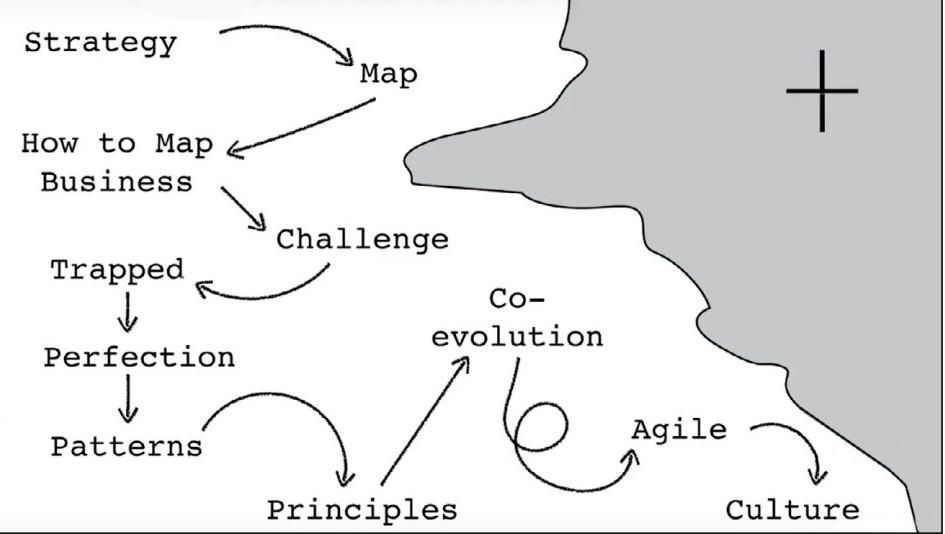

# Stakeholders and Feedback Loops

## Learning Objectives

By the end of this lesson you will be able to:

* Understand how various stakeholders can impact processes at a higher level
* Understand feedback loops and their importance in Government acquisitions
* Describe a broken feedback loop, and ways to avoid or repair it

## Introduction
Even though Agile and DevSecOps have been prevalent in industry for 10+ years, the DoD is still working to integrate - to the Department, many of these concepts are new. As you read in the first lesson of this module, it  was not until **2020** that we updated our Acquisition Policy Documents [(DoDi 5000.02)](https://www.esd.whs.mil/Portals/54/Documents/DD/issuances/dodi/500002p.pdf) to incorporate a Software Acquisition Pathway.
* That doesn’t mean we have not been developing and procuring software-intensive systems in the meantime. 
* **Nor** does it mean you _must_ use the Software Acquisition Pathway for your software-intensive program (more to come on that later). 

What it means is that **we** as the acquisition team as well as our stakeholders are navigating these changes together. Leading and navigating these waters with empathy, communication and engagement are critical, now more than ever. 

Together we can and will succeed! 

### !callout-info
## Takeaway
It may be new to the DoD - but clear support via leadership and policy exists for  incorporating modern software approaches in the DoD.  
### !end-callout

 Source: [Crossing the River by Feeling the Stones presented by Simon Wardley at 2020 All Day DevOps
](https://www.alldaydevops.com/)   

## How to Navigate Stakeholders

Sometimes it's easier to put things in the context of what **not** to do. Using that approach, let’s explore some pitfalls to avoid.

### 1. Avoid The Familiarity Trap
> “When you are engaged at the tactical level, you grasp your own reality so clearly it’s tempting to assume that everyone above you sees it in the same light. Wrong. When you’re the senior commander in a deployed force, time spent sharing your appreciation of the situation on the ground with your seniors is like time spent on reconnaissance: it’s seldom wasted.”
>
> -Gen James Mattis
>
> &nbsp;

Hopefully even for those of you who have never been deployed, you can still understand the pitfall to avoid here. When a concept, contract, program, or approach is your focus, you might assume that your focus is clear. That everyone sees the value, and understands the “why” as clearly as you do.

Simply stated: Nope.

Take the advice from Gen. Mattis to heart - **time spent discussing with senior leaders and stakeholders is seldom wasted.** 

What is needed is a vision that guides everyone involved in making the product a success (also known as stakeholders). Without that support, the most inspiring and action provoking vision **will likely fail**. It cannot be the true north for the team if everyone has not agreed to move towards it. 

Without a shared vision, people follow their own goals making it much harder to achieve product success. The best way to have agreement on a vision **is to create it together with the stakeholders.** Together they should all agree on: 
* What is the problem 
* Why we are solving it (or why now)
* What will happen when it is solved (What does success look like)
This is most likely one of the toughest parts of the project development. Stakeholders may have different visions initially, however, consensus will come as they search for common ground and combine their goals until there is a single vision on which everyone agrees.

Note: In the above we did not mention “solutioning”, rather focusing on the intended outcome by developing a shared vision of the mission or business capability to be delivered should not be seen as an opportunity to solutionize or anticipate solutions.  Focus on creating a shared vision that your team can collectively communicate.  

### 2. Don’t Under Communicate your Message

> “We often under communicate our ideas...typically by a factor of ten.”

 Source: Grant, Adam M., and Sheryl Sandberg. Originals: How Non-Conformists Change the World. WH Allen, 2017. 

Use this to your advantage both ways:
* Keep communicating your strategy, goal, and intent with your acquisition and contracting approach. 
* Experiment with different communication styles and find out what arguments resonate. In doing so, you will achieve familiarity: the more familiar, the more we like. 

### !callout-secondary
## Analogy: 
Have you ever hated a song when you first heard it on the radio (or on Spotify), but it kept playing over and over, and now you know every word and walk around singing it? 
### !end-callout

> “The more often we encounter something, the more we like it.”

 Source: Grant, Adam M., and Sheryl Sandberg. Originals: How Non-Conformists Change the World. WH Allen, 2017. 

If we want to establish better outcomes we need to communicate, communicate, communicate. This is an opportunity for each of us in our roles to be the change that you wish to see and do it consistently.  

### 3. Don’t Talk At Your Stakeholders
We are all inundated with information all day long. We receive emails, support meetings, policy updates, and more. To put it into perspective, what would be more engaging for you? Listening to someone talk for 30 minutes straight, or an active discussion that you participate in?

Death by PowerPoint is real. Don’t contribute.

### 4. Persuasion Isn’t Only Emphasizing Strengths
Briefings are often structured to outline the strengths of an approach, with risks featured last in the slide deck (or conversation). **Beware**: rampant confidence is often perceived as a red flag. As outlined in [_Originals_](https://www.adamgrant.net/book/originals/) by Adam Grant, overconfidence often leads to skeptical responses, and with people looking for issues with strategy and/or approach.

One of the most effective and disarming strategies is to start with weaknesses (or risks). This shows that you recognize these potential issues, and that awareness will help foster confidence in the engagement. 

### !callout-info
## [18F Product Guide: Discover the Current State](https://product-guide.18f.gov/discover/)
With representation from **both** the acquisition team and requirements owners, the following are ways to get a better understanding of the users…
* Define the key users and consumers of the current process
* Walk a mile in their shoes: empathize with their context of day-to-day activities, objectives, and goals
* Describe the key steps and activities in their current process and identify pain points
* Demonstrate how users interact and depend on each other/other systems to achieve success
* Organize individual users into groups where appropriate

**Most of all, understand the mission those users serve.**
### !end-callout

### !challenge

* type: checkbox
* id: 35c87c8e-973b-11eb-a8b3-0242ac130003
* title: Communicating with Stakeholders
<!-- * points: [1] (optional, the number of points for scoring as a checkpoint) -->
<!-- * topics: [python, pandas] (optional the topics for analyzing points) -->

##### !question

What pitfalls should you avoid when communicating with stakeholders? Select all that apply. 

##### !end-question

##### !options

* Only emphasizing strengths
* Under-communicating your message
* The familiarity trap
* Talking at your stakeholders

##### !end-options

##### !answer

* Only emphasizing strengths
* Under-communicating your message
* The familiarity trap
* Talking at your stakeholders

##### !end-answer

#### !explanation-correct:
Only emphasizing strengths; as discussed in the lesson our risks and our failures should become part of our story and we encourage teams to place these upfront in the discussion. 

Under-communicating your message; communicate your message three times more than you think you need to and you will be 1/3rd of the way to communicating as much as you should be!

The familiarity trap; each of us can become so close to the situation, the program and the problem that we mentally fill in the gaps without externally expressing important aspects of our program (acquisitions) or the problems we seek to solve (requirement owners).  Make sure you are sharing the proper message up, down, sideways!

Talking at your stakeholders; each of us have a high cognitive load, talking at one another, past one another and not applying empathy is indeed a pitfall.
#### !end-explanation

#### !explanation-not:Only emphasizing strengths
Correct, but there are additional things you should consider. Which other pitfalls should you avoid?
#### !end-explanation

#### !explanation-not:Under-communicating your message
Correct, but there are additional things you should consider. Which other pitfalls should you avoid?
#### !end-explanation

#### !explanation-not:The familiarity trap
Correct, but there are additional things you should consider. Which other pitfalls should you avoid?
#### !end-explanation

#### !explanation-not:Talking at your stakeholders
Correct, but there are additional things you should consider. Which other pitfalls should you avoid?
#### !end-explanation

<!-- other optional sections -->
<!-- !hint - !end-hint (markdown, hidden, students click to view) -->
<!-- !rubric - !end-rubric (markdown, instructors can see while scoring a checkpoint) -->
<!-- !explanation - !end-explanation (markdown, students can see after answering correctly) -->

### !end-challenge

Remember this, the very document we sometimes say is an impediment lays out the following vision to us all:

> “The vision of the Federal Acquisition System is to deliver on a timely basis the best value product to the customer or service.”
>
> -The Federal Acquisition Regulation (FAR), 1.I-I
>
> &nbsp;

We have mentioned the DIB SWAP report several times, one of the recommendations they provided acquisition and requirements teams is as follows:

“Shift from a list of requirements for software to a list of desired features and required interfaces/characteristics to avoid requirements creep or overly ambitious requirements.”

The very nature of this recommendation creates the need for Acquisitions and Requirements to continuously communicate and create positive patterns of behavior that serve the mission needs irrespective of our roles or biases. The below quote explains why:

> Users don’t care about your internal structures
>
> -Mike Bracken, UK Digital Service
>
> &nbsp;

The process you construct as part of your efforts vision as discussed above, should take into account feedback loops.  These feedback loops should help us:
* Fail fast to learn fast
* Understand the constraints of the users journey and what front/back stage items impede them from being successful (see Service Design)
* Create a full circle transparent cycle between all members on the team
* Reduce hand-offs and blame
* Reduce the number of features built into systems that are never used
* Reduce the overall risk in developing the system receiving near real-time feedback from the users and requirement owners. 

This isn’t about doing agile or being agile for agilesake.  This is about improving the mission and business outcomes we serve and creating transparent feedback loops are a large part of accomplishing that.

## Feedback Loops 
In earlier lessons, we discussed the Build, Measure, Learn cycle. Let’s look at it now in the context of Agile acquisition. While originally popularized in Silicon Valley and used by Agile teams, acquisition (and partnered requirements)  teams can employ the communication practices to improve and build sustainable business practices. A feedback loop is where your outputs become your inputs, as illustrated here: 

|

Applying this to an acquisition life-cycle could look something like this: 
* **Build:** Create your acquisition strategy, conduct a competition, and award a contract
* **Measure:** Collect data on contractor performance, meet with Software Practitioner teammates for their observations
* **Learn:** Analyze all feedback to identify areas for improvement 
* **Build:** Take identified areas for improvement and implement improvements to next acquisition strategy 
* ...and so on. (It’s a cycle, it continues!) 

Unfortunately, the acquisition process can be lengthy. At best, it is several weeks; at worst, several years. Supporting software initiatives is typically measured in months, but that is only to reach a contract award. The first product delivery is beyond that timeline. 

### !callout-success
## Key Takeaway: 
Understanding the cycle time of feedback loops is critical across the entire team - acquisitions, software practitioners, stakeholders, etc. There are often **mismatches**. For example, look at the following two feedback loops:
* Software development - delivery to operations - input from users
  * **Feedback cycle time: days or weeks**
* Contract development - contract award - input from software practitioners/user
  * **Feedback cycle time: months**
### !end-callout

Think of it this way. Because our feedback cycle time is longer, it is critical that we are well-positioned to respond as the acquisition team. To achieve this, we emphasize modular contracting heavily, which is one of the best tools in the acquisitions team toolbelt. The goal is to be as responsive as possible,  and to reduce dependency (a.k.a. risk) -- more to come on that later. 

So, how can you identify if something is wrong with your feedback loop? 

Here are some overall common themes found in **broken** feedback loops:
* Complex,opaque feedback mechanisms, leading to critical issues.
* Lack of clarity, i.e. use of overly technical language, and unclear issue resolution creating confusion.
* Lack of data and clear reporting mechanisms 
* Social barriers, limited interactions, and breakdowns in trust, creating barriers to effective communication
* Default cultural practices. Within a culture that values stoicism and hierarchy, the act of giving and receiving feedback is not intuitive to the design of technologies or workflows to equip warfighters.
* Outdated technologies and siloed systems, making information hard to use.

Here are some things we can do to collectively **improve** the broken feedback loop:
* Enable users to clearly and easily communicate and understand one another.
* Users should use simple language, and receive clear communication from others. Technical language and disciplinary jargon should be replaced with simple graphics, concise language, and easy to engage materials.
* Create visibility into user and mission issues between reporting stages for all parties involved in the process. Users, requirements team, product/development teams and program office.
* Beyond feedback, success is dependent on training and motivating all stakeholders involved to maximize feedback utilization. Overall, we should look at policies and procedures to integrate feedback into all existing workflows.

### !challenge

* type: multiple-choice
* id: 8d6e2474-e3e0-11eb-ba80-0242ac130004
* title: Broken Feedback Cycles
<!-- * points: [1] (optional, the number of points for scoring as a checkpoint) -->
<!-- * topics: [python, pandas] (optional the topics for analyzing points) -->

##### !question

What is **not** a way to improve a broken feedback cycle?  

##### !end-question

##### !options

* Train and motivate all stakeholders involved to maximize utilization of feedback
* Integrate feedback into all existing workflows 
* Replace technical language and jargon with simple, concise language and easy to engage materials 
* Enable team members to clearly and easily communicate and understand one another 
* Value stoicism and hierarchy within your team culture 

##### !end-options

##### !answer

* Value stoicism and hierarchy within your team culture 

##### !end-answer

<!-- other optional sections -->
<!-- !hint - !end-hint (markdown, hidden, students click to view) -->
<!-- !rubric - !end-rubric (markdown, instructors can see while scoring a checkpoint) -->
<!-- !explanation - !end-explanation (markdown, students can see after answering correctly) -->

### !explanation-incorrect:
Incorrect - This would be a way to improve!	
### !end-explanation

### !explanation-correct:
Correct - Stoicism and hierarchy do not improve feedback cycles.
### !end-explanation

### !end-challenge

Just as we seek ways to adapt as software acquisition professionals, other teams must also  evolve. For example, our requirements teams need to consider how their processes may need to change and adapt in response to new technology and transparency.  Feedback Loops will require effort, openness and a new way of communicating:
* Building to a specification with no feedback will not help the team learn and improve
* Be open to letting stakeholders see what’s being built - there’s no benefit in building in secret until it’s “done”.
* Stakeholders can rally and bring in end-users to inform user feedback along the way.

In order to benefit from feedback loops, you have to build processes that encourage, surface, and incorporate valuable feedback. 

<!-- >>>>>>>>>>>>>>>>>>>>>> BEGIN CHALLENGE >>>>>>>>>>>>>>>>>>>>>> -->
<!-- Replace everything in square brackets [] and remove brackets   -->

### !challenge

* type: multiple-choice
* id: 71edb6f0-e3e1-11eb-ba80-0242ac130004
* title: Engaging with Senior Leadership
<!-- * points: [1] (optional, the number of points for scoring as a checkpoint) -->
<!-- * topics: [python, pandas] (optional the topics for analyzing points) -->

##### !question
Which of the following strategies do you believe will best help you continue to educate senior leadership regarding innovative ways to procure modern software?
##### !end-question

##### !options

* Convene multiple events with senior leadership to highlight how innovative procurement methods directly contribute to achieving the organization's mission. 
* Collaborate with your fellow procurement colleagues to create and distribute a white paper highlighting the advantages of new and improved procurement methods.
* Based on common questions from leadership on innovative procurements, prepare a playbook that highlights best practices. 
* During your Acquisition Strategy Plan review (leadership decision point), bring new & innovative strategies to leadership’s attention for the first time. 

##### !end-options

##### !answer

* Convene multiple events with senior leadership to highlight how innovative procurement methods directly contribute to achieving the organization's mission. 

##### !end-answer

#### !explanation-correct:
Correct! Don’t ambush your leaders with “good Ideas” never having introduced them to these aspects beforehand.  	
#### !end-explanation

#### !explanation: Collaborate with your fellow procurement colleagues to create and distribute a white paper highlighting the advantages of new and improved procurement methods.
Try Again. Although this approach may help in overall research and understanding our goal is to educate senior leadership. More than likely a concise briefing or discussion will be better received.
#### !end-explanation

#### !explanation: Based on common questions from leadership on innovative procurements, prepare a playbook that highlights best practices. 
Try again. Playbooks can sometimes be helpful in centralizing answers to frequently asked questions and are usually most useful to the organizations that created them. However, typically they are not successful tools in educating senior leadership. 
#### !end-explanation

#### !explanation: During your Acquisition Strategy Plan review (leadership decision point), bring new & innovative strategies to leadership’s attention for the first time. 
Try again. Remember that innovation typically takes time to understand and foster necessary support and advocacy by senior leadership, that’s why scheduling multiple meetings prior to asking for a decision will have a higher chance of success. 
#### !end-explanation

<!-- other optional sections -->
<!-- !hint - !end-hint (markdown, hidden, students click to view) -->
<!-- !rubric - !end-rubric (markdown, instructors can see while scoring a checkpoint) -->
<!-- !explanation - !end-explanation (markdown, students can see after answering correctly) -->

### !end-challenge
<!-- ======================= END CHALLENGE ======================= -->

### !callout-success
## KEY TAKEAWAYS: Stakeholders and Feedback Loops
* Empathy extends beyond users and should be applied at all levels, including leadership and stakeholders. The DoD is updating policy to better align with the digital landscape, these updates are still relatively new--work with your stakeholders to incorporate!
* Time is seldom wasted when engaging with stakeholders and leadership, the DoD cannot deliver without the support of many. Your program success is often dependent on the advocacy of others outside your organization. 
* Feedback loops should be transparent and consciously established with users, stakeholders, leadership and within your team. Continually revisit the effectiveness of your chosen success metrics to improve and learn and avoid the pitfalls of broken feedback loops.

### !end-callout

## Resources

* **Books:** 
   * Mattis, Jim. Call Sign Chaos: _Learning to Lead_. Random House, 2021.
   * Grant, Adam M., and Sheryl Sandberg. _Originals: How Non-Conformists Change the World_. WH Allen, 2017.
* **DoD Publication:** [2018 National Defense Strategy](https://dod.defense.gov/Portals/1/Documents/pubs/2018-National-Defense-Strategy-Summary.pdf) 
* **Conference:** Crossing the River by Feeling the Stones presented by Simon Wardley at 2020 All Day DevOps; [http://www.alldaydevops.com/](http://www.alldaydevops.com/)

## BONUS SECTION: Additional Strategies and Approaches
**This section is optional.** If you want to go even further, we have included a bonus section. While the below just scratches the surface (more to come in the second half of Modules 103 and 104), here are some practical ways to collaborate between acquisitions, development teams, users and stakeholders:

### Understanding the Discovery Phase
In the Discovery Phase the goal is to gain deeper insight into the context of the problem to be solved, the users needs and to validate the problem/potential solutions (to the greatest extent practicable) in order to avoid costly rework. 

Throughout the Discovery Phase, the project team is trying to understand:
* Where the user and requirements need to get to (desired state, aka the vision)
* What exists today, in terms of systems, tools, processes (current state) 
* What we need to know and understand to get the organization or mission capability to the desired state (gap) 

In agile projects, you may run a dedicated Discovery Phase upfront, and then continue incremental discovery throughout the project to continue iterating and building a product that delivers the best mission or business value to users. Remember, to properly deliver your capability, you may need to interact with other programs, users, stakeholders or development teams.

During your discovery period it's likely you will encounter (and need to be ready for):
* stated needs — these are things users explicitly tell you that they need 
* unstated needs — these are things users take for granted that your capability will need to have 
* created needs — these are things users are forced to do because of policy and the way government works 

### Understanding Experience Mapping
#### Human-Centered Design Tools: Journey Maps 

Journey maps document the journey real users take to complete their tasks as a sequence of actions over a period of time, including interactions with people, processes, and systems. These maps can be used to identify the interactions which cause users most discontent (or "pain points"). They allow us to visualize the emotional state of users and "highlight the flow of the customer experience--from the ups and downs along the way to those critical pain points where our attention and focus are most essential."

 Source: [Flom, Joel. 2011. “The Value of Customer Journey Maps: A UX Designer’s Personal Journey,” UXmatters, Sept 7.](https://www.uxmatters.com/mt/archives/2011/09/the-value-of-customer-journey-maps-a-ux-designers-personal-journey.php)

### Beyond the User’s Journey
#### Human-Centered Design Tools: What is Service Design?
Service design is the activity of planning and organizing people, infrastructure, communication and material components of a capability in order to improve the quality for mission that capability or business product serves. The concept was first coined by bank executives Lynn Shostakc in [1984 in Harvard Business Review.](https://hbr.org/1984/01/designing-services-that-deliver) It was later expanded by researchers at Carnegie Mellon University in the early 2000s to explore how technology can be engineered as a service, [_Understanding Experience in Interactive Systems_](https://kilthub.cmu.edu/articles/journal_contribution/Understanding_Experience_in_Interactive_Systems/6470606/1). One of the earliest industry adopters of service design was Steve Jobs, who used service design to plan apple retail outlets, to optimize production, inventory management, payment systems and enhance customer service quality, [_Steve Jobs_ by Walter Isaacson](https://www.simonandschuster.com/books/Steve-Jobs/Walter-Isaacson/9781501127625).

At the end of the day, remember the solution to a users need may not always be a modification to the software or a new piece of software.  Sometimes the issue may actually be a process or policy change.  This remains unknown unless the proper discovery phase is accomplished to ensure we are solving the user or mission need, the right way.

#### Human-Centered Design Tools: Design Studio
A design studio is a collaborative workshop to brainstorm ideas through sketching and discussion. It is used to create a shared understand and appreciation of design problems confronting the project team. 

### !challenge

* type: multiple-choice
* id: f883d3be-e3e3-11eb-ba80-0242ac130004
* title: More Learning
<!-- * points: [1] (optional, the number of points for scoring as a checkpoint) -->
<!-- * topics: [python, pandas] (optional the topics for analyzing points) -->

##### !question

Would you like to know more about employing Human Centered Design within our acquisition practices?

##### !end-question

##### !options

* Yes
* No

##### !end-options

##### !answer

* *

##### !end-answer

<!-- other optional sections -->
<!-- !hint - !end-hint (markdown, hidden, students click to view) -->
<!-- !rubric - !end-rubric (markdown, instructors can see while scoring a checkpoint) -->
<!-- !explanation - !end-explanation (markdown, students can see after answering correctly) -->

### !end-challenge

Hopefully, we have left you feeling inspired to find new and better ways to collaborate!

<!-- >>>>>>>>>>>>>>>>>>>>>> BEGIN CHALLENGE >>>>>>>>>>>>>>>>>>>>>> -->
<!-- Replace everything in square brackets [] and remove brackets -->

### !challenge

* type: paragraph
* id: 6cf10aeb-e59a-4535-8d34-610eb6ea0c5d
* title: !Opt. Lesson Feedback: Stakeholder Focus
<!-- * points: [1] (optional, the number of points for scoring as a checkpoint) -->
<!-- * topics: [python, pandas] (optional the topics for analyzing points) -->

##### !question

Do you have any specific feedback, positive or constructive, regarding the content of this lesson? 

##### !end-question

##### !placeholder
Remember, this is optional - this is a way for you to provide input while working through the lesson content. 

If you do not have any input feel free to write N/A in the text box. 
##### !end-placeholder

### !end-challenge

<!-- ======================= END CHALLENGE ======================= -->

## Bonus Section Resources:
* **Articles:**
   * Flom, Joel. 2011. [_The Value of Customer Journey Maps: A UX Designer’s Personal Journey,_](https://www.uxmatters.com/mt/archives/2011/09/the-value-of-customer-journey-maps-a-ux-designers-personal-journey.php)UXmatters, 2011 Sept 7.
   * Forlizzi and Battarbee. 2004. [_Understanding experience in interactive systems._](https://kilthub.cmu.edu/articles/journal_contribution/Understanding_Experience_in_Interactive_Systems/6470606/1) Proceedings of the 5th conference on Designing Interactive Systems 1 (1): 261-268. 
   *  Schostack, G. 1984.[_How to Design a Service._](https://hbr.org/1984/01/designing-services-that-deliver ) Harvard Business Review 62 (1): 2. 
* **Book:** Isaacson, W. 2011. [Steve Jobs.](https://www.simonandschuster.com/books/Steve-Jobs/Walter-Isaacson/9781501127625) New York: Simon & Schuster. 
