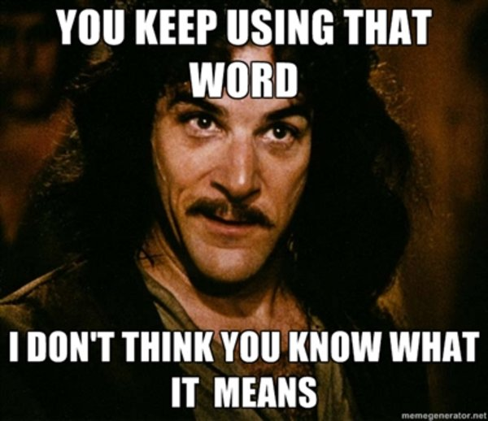

# Stakeholder Focus: Implementing a Software-Intensive Acquisition is a Team Effort

## Learning Objectives

By the end of this lesson you will be able to:

* Identify Stakeholders, Requirements Owners and End Users- and understand the differences between them
* Understand feedback loops and their importance in Government acquisitions

## Overview
In the previous lesson we discussed the user community, and how it's composed of end-users and requirements owners.  Some of you may be more familiar referring to requirements owners as stakeholders. However, there are many stakeholders beyond the requirements community.

The focus of this lesson is to first define who your stakeholders are, and dig into how to navigate the stakeholder landscape.

## Providing a Common Lexicon
Why do we differentiate between **end-users** and **stakeholders**? 

Both end-users and stakeholders influence your acquisition, _but they are not one and the same_:

The **end-user**:
* Utilizes developed software-intensive capability to meet business or mission needs.
* Is typically **not** the person (or organization) that controls the official requirements process.
* Is not the person that controls the funding you need.

The **requirements owner**:
* Support identification and documentation of specific capability needs, and provides context within the larger DoD capability ecosystem.
* Is usually responsible for multiple capabilities, or a business/mission portfolio.
* Can be service-specific (unique), or a joint capability.
* Is usually a separate group or organization from the end-user.
* Often includes members that are **PRIOR** end-users, **NOT** current end-users. This is why they are sometimes referred to as _user representatives_.
* The requirements owner is a stakeholder.

A **stakeholder**:
* Is a person, group, or organization with an interest, concern or influence.
* For acquisition teams, common stakeholders include:
    * Requirements Owners
    * [Service Programming Support:](https://myclass.dau.edu/bbcswebdav/institution/Courses/Deployed/ISA/ISA201/Archives/Student%20materials%20prior%20to%20June%202017/03%20-%20Cost%20Estimating/References/PPBE%20Review%20%28ReadAhead%29/Resources/TeachingNote-Resource%20Allocation%20Process.pdf) who support and defend your program funding and billets
      * Air Force: Program Element Monitors (PEMs), 
      * Army: Department of the Army Systems Coordinators (DASCs)
      * Navy: Requirements Officers 
    * Leadership/Decision Authority or Functional Leads
    * Oversight and Governance (Congress, OSD, Service Headquarters, etc.)
* Stakeholders may be referred to as influencers, governance, or advocates.

In the second lesson, _Tactical View: Implementing a Software-Intensive Acquisition is a Team Effort,_ we referenced the Defense Acquisition System (DAS), which is composed of three processes:
* **Requirements:** Joint Capabilities Integration and Development System (JCIDS),
* **Funding:** Planning Programming Budgeting and Execution (PPBE),
* **Management:** Acquisition

The above groups are typically included in the ‘Requirements Process’. There are many stakeholders and decision points to work through in the entire DAS workflow -- that is, there are multiple steps between capability gaps identified and valuable capability delivered and available to end users.

Our goal is to help give you tools to effectively, efficiently navigate in a timely manner the DAS, providing valuable capability to end users.

### !callout-success

## Takeaway:

We have and will continually emphasize the end state is a valuable capability to end users. Too often within acquisitions, we see end states as a decision, approval of strategy, contract award, etc. This is not the end state, but rather just a process step.

### !end-callout

## A (Hopefully) Relatable Scenario
**Consider the following situation:**

>You’ve spent months putting together an acquisition plan, and throughout the process you have reached out to various stakeholders to receive input and  feedback along the way. A few days before you are scheduled to review your acquisition plan with leadership, a new stakeholder emerges. Their input requires **significant** rework and adjustments to the approach. Additionally, to not blindsight other stakeholders you must socialize the changes to them as well.
>
>Frustrated, you think, “If I had only known to also involve them too from the beginning -- I could have avoided the last minute scramble, and saved myself a lot of time, money and stress.”

We are going to assume that most of you have encountered this situation or a similar situation either directly or with a team you supported. 

## Why is Stakeholder Engagement So Critical on Software Efforts? 

### Teams Deliver
Remember how often we emphasize that nothing occurs without the support of a team? Stakeholders are a critical part of your team, and the larger DoD mission:

"The reemergence of long-term strategic competition, rapid dispersion of technologies, and new concepts of warfare and competition that span the entire spectrum of conflict require a Joint Force structured to match this reality."  
-[2018 National Defense Strategy (NDS)](https://dod.defense.gov/Portals/1/Documents/pubs/2018-National-Defense-Strategy-Summary.pdf) 

### Speed of Technology
Remember from Module 1, _101 Digital Foundations_:

The NDS highlights this imperative above as well. What used to cycle in terms of _decades_ or _years_ is now **months or less**.

Agile theory recognized this in 2000 with publishing of the Agile Manifesto and the TechFAR was published in 2014. Both articulate the criticality of bringing  together the “right” cross-functional team members in order to take on the ever-evolving, rapid pace of software. 

### DoD Acquisition Processes are Changing
Even though these concepts have been prevalent in industry for 20+ years, the DoD is still working to integrate - to the Department, many of these concepts are new. It was not until **2020** that we updated our Acquisition Policy Documents (DoDi 5000.02) to incorporate a Software Acquisition Pathway. But that doesn’t mean we have not been developing and procuring software-intensive systems in the meantime. Nor does it mean you **must** use the Software Acquisition Pathway for your software-intensive program (more to come on that later). What it means is that we as the acquisition team as well as our stakeholders are navigating these changes together. Communication and engagement are critical, now more than ever. Together we can succeed! 

### !callout-success

## Takeaway:

It may be new to the DoD - but clear support via leadership and policy exists for incorporating modern software approaches in the DoD.

### !end-callout

## How to Navigate Stakeholders

Sometimes it's easier to put things in the context of what **not** to do. Using that approach, let’s explore some pitfalls to avoid.

### 1. Avoid The Familiarity Trap
> “When you are engaged at the tactical level, you grasp your own reality so clearly it’s tempting to assume that everyone above you sees it in the same light. Wrong. When you’re the senior commander in a deployed force, time spent sharing your appreciation of the situation on the ground with your seniors is like time spent on reconnaissance: it’s seldom wasted.”
>
> -Gen James Mattis
>
> &nbsp;

Hopefully even for those of you who have never been deployed, you can still understand the pitfall to avoid here. When a concept, contract, program, or approach is your focus, you might assume that your focus is clear. That everyone sees the value, and understands the “why” as clearly as you do.

Simply stated: Nope.

Take the advice from Gen. Mattis to heart - time spent discussing with seniors (stakeholders) is seldom wasted. 

### 2. Don’t Under Communicate your Message

> “We often under communicate our ideas...typically by a factor of ten.”

 Source: Grant, Adam M., and Sheryl Sandberg. Originals: How Non-Conformists Change the World. WH Allen, 2017. 

### 3. Don’t Talk At Your Stakeholders
We are all inundated with information all day long. We receive emails, support meetings, policy updates, and more. To put it into perspective, what would be more engaging for you? Listening to someone talk for 30 minutes straight, or an active discussion that you participate in?

Death by PowerPoint is real. Don’t contribute.

### 4. Persuasion Isn’t Only Emphasizing Strengths
Briefings are often structured to outline the strengths of an approach, with risks featured last in the slide deck (or conversation). **Beware**: rampant confidence is often perceived as a red flag. As outlined in Originals by Adam Grant, overconfidence often leads to skeptical responses, and with people looking for issues with strategy and/or approach.

One of the most effective and disarming strategies is to start with weaknesses (or risks). This shows that you recognize these potential issues, and that awareness will help foster confidence in the engagement. 

### !challenge

* type: checkbox
* id: 35c87c8e-973b-11eb-a8b3-0242ac130003
* title: Communicating with Stakeholders
<!-- * points: [1] (optional, the number of points for scoring as a checkpoint) -->
<!-- * topics: [python, pandas] (optional the topics for analyzing points) -->

##### !question

What pitfalls should you avoid when communicating with stakeholders? Select all that apply. 

##### !end-question

##### !options

* Only emphasizing strengths
* Under-communicating your message
* The familiarity trap
* Talking at your stakeholders

##### !end-options

##### !answer

* Only emphasizing strengths
* Under-communicating your message
* The familiarity trap
* Talking at your stakeholders

##### !end-answer

<!-- other optional sections -->
<!-- !hint - !end-hint (markdown, hidden, students click to view) -->
<!-- !rubric - !end-rubric (markdown, instructors can see while scoring a checkpoint) -->
<!-- !explanation - !end-explanation (markdown, students can see after answering correctly) -->

### !end-challenge

## Expanded Stakeholder Landscape

 So is this really all that different from how I have traditionally engaged my stakeholders? 

 

 YES! 

While the list below is **not all-inclusive**, it does a decent job depicting the range of stakeholders you may need to engage with along your acquisition journey. Hopefully this can serve as a tool for you, and help to instigate discussions and strategies for incorporating stakeholders.

The map below places various stakeholders within specific categories, but it may not always be this clear cut! An individual’s role in the acquisition may extend across more than one category.

_**For example**: While the Head of Contracting Activity (HCA) may fall primarily in the Acquisition Stakeholder category, the HCA may also perform oversight function. Furthermore, depending on the HCA's place and mission in the organization's structure, they could also be an influencer._

_Each role or function not only has different impacts on the acquisition, it also presents different engagement considerations and informational needs. You should adjust your engagement content and strategy to maximize the beneficial effect of that person or entity's role and impact on your acquisition._

While some of this may be similar to your stakeholder interactions on traditional acquisitions, acquisitions for software projects place even greater demands on stakeholder engagement. As we highlighted above, speed of technology, new policies and processes, and imperative outlined in NDS are all factors when considering the total number of stakeholder interactions during a software acquisition project. Aligning key stakeholders with your acquisition plans and strategies is critical.

### !callout-success

## Takeaway:

We reference the National Defense Strategy (NDS) often - we highly recommend you read this document in its entirety. Even if it’s the unclassified, publicly distributed version.
While reading, use this document as a reference for understanding how your capability supports the vision and goals the NDS outlines.

### !end-callout

The following is an explanation of the categories referenced in the graphic above:

**Software Acquisition Partnership** At the center of the stakeholder map are your collaborators and co-creators for the product/service and its contract support – the team responsible for developing the procurement, and making it all work to support delivery.

**Acquisition Stakeholders** The offices and divisions that impact decisions for acquisitions, i.e. go/no go. They are also the contracting operational support essential to prepare for, award, and manage the contract. In today’s digital service projects, these go/no go engagements don't happen just one time.

**Partners/Suppliers/Co-Creators** The supporters of your product or service who are essential to the acquisition lifecycle. They offer insight and support based on their experiences, or share in the co-creation.

**Oversight/Governance** The external organizations whose policies and regulations can impact how you run an acquisition. They ensure compliance with existing law and regulation, but can also be a means of support when implementing a procurement that is not common practice but still within the law, regulation, and policy.

**Advocates/Influencers** Potential senior-level champions who can help build buy-in for the acquisition strategy. They can also offer avenues to accelerate and simplify (e.g., Defense Innovation Unit may provide some means and methods to implement your procurement more easily).

Though all of these stakeholders are important in the acquisition landscape or ecosystem, their interests and concerns for your program will vary widely depending many factors, such as:
* Program Size/Value
* Visibility Across The Service and/or DoD
* Type of Contracting Strategy/Strategies Pursued
* Common Practices In DoD Service
* Action Requested Of stakeholder
* Stage Of Acquisition Lifecycle. 

_**For example**: Imagine your acquisition strategy entails considering a contracting approach that has not been leveraged by your organization,_ i.e., [Procurements for Experimental Purposes - 10 U.S.C. §2373.](https://www.law.cornell.edu/uscode/text/10/2373)

_If your organization is unfamiliar with the statutory authority, its intended purpose, and their mechanisms ensuring government interests are protected, you may need to engage with several entities early in the process. Those entities would be a Senior Procurement Executive, HCA, the contracting organization chain of command, and the Office of General Counsel._

_Your goal in such a meeting should be to educate, inform, and demonstrate your familiarity and knowledge of the strategy. To show your path to success through innovation, not sell your strategy as the sole way to accomplish the task at hand. For a more common contract strategy, such as using an existing Indefinite Delivery/Indefinite Quantity (IDIQ) contract, you may not need to engage them at all, depending on organizational policies and procedures._

_Don’t forget about the pitfalls you want to avoid when communicating that we mentioned!_

### !challenge

* type: multiple-choice
* id: 1e650f6e-8985-46e5-8652-d5371c05869d
* title: Continued Education
<!-- * points: [1] (optional, the number of points for scoring as a checkpoint) -->
<!-- * topics: [python, pandas] (optional the topics for analyzing points) -->

##### !question

Which of the following strategies do you believe will best help you continue to educate senior leadership regarding innovative ways to procure modern software?

##### !end-question

##### !options

* Convene events with senior leadership to highlight how innovative procurement methods directly contribute to achieving the organization's mission.
* Collaborate with your fellow procurement colleagues to create and distribute a white paper highlighting the advantages of new and improved procurement methods.
* Ask senior leadership in your Agency or Component what questions they have about how innovative procurements are completed and prepare responses that highlight best practices.
* During your Acquisition Strategy Plan review, bring new & innovative strategies to leadership’s attention for the first time.

##### !end-options

##### !answer

* Convene events with senior leadership to highlight how innovative procurement methods directly contribute to achieving the organization's mission.

##### !end-answer

<!-- other optional sections -->
<!-- !hint - !end-hint (markdown, hidden, students click to view) -->
<!-- !rubric - !end-rubric (markdown, instructors can see while scoring a checkpoint) -->
<!-- !explanation - !end-explanation (markdown, students can see after answering correctly) -->

### !end-challenge

## Resources

* **Books:** 
   * Mattis, Jim. Call Sign Chaos: _Learning to Lead_. Random House, 2021.
   * Grant, Adam M., and Sheryl Sandberg. _Originals: How Non-Conformists Change the World_. WH Allen, 2017.
* **DoD Publication:** [2018 National Defense Strategy](https://dod.defense.gov/Portals/1/Documents/pubs/2018-National-Defense-Strategy-Summary.pdf) 
