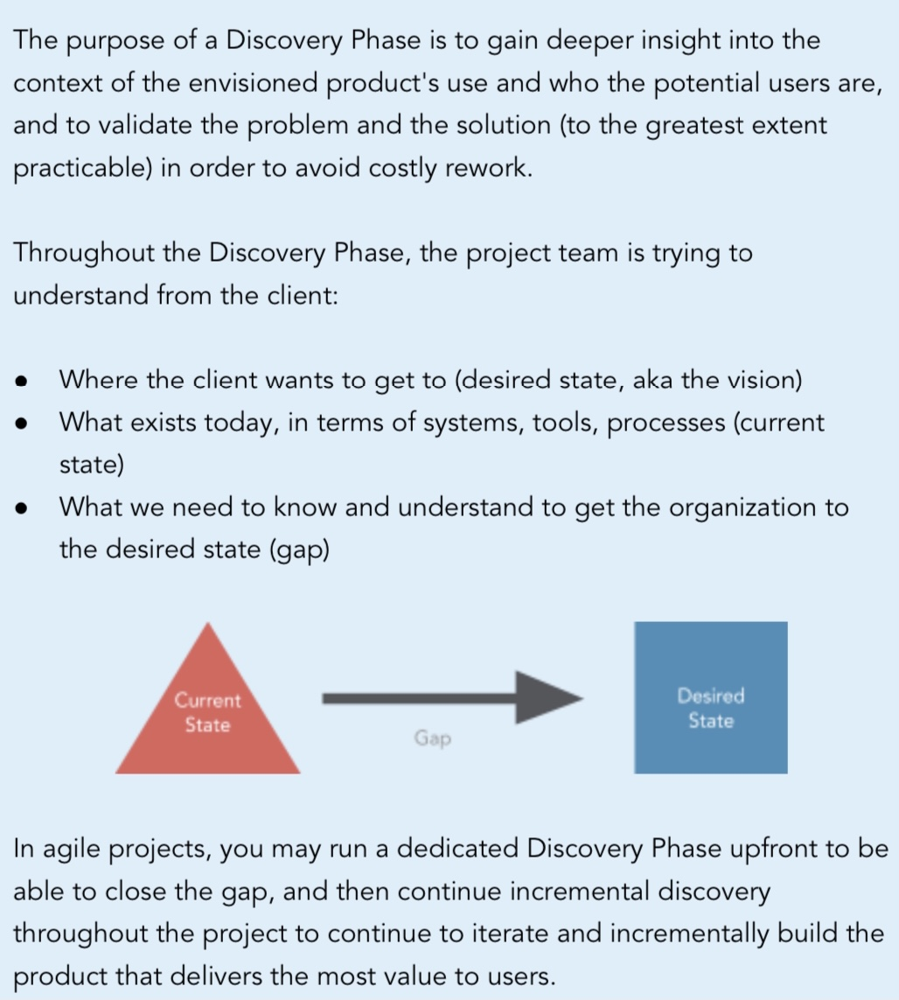
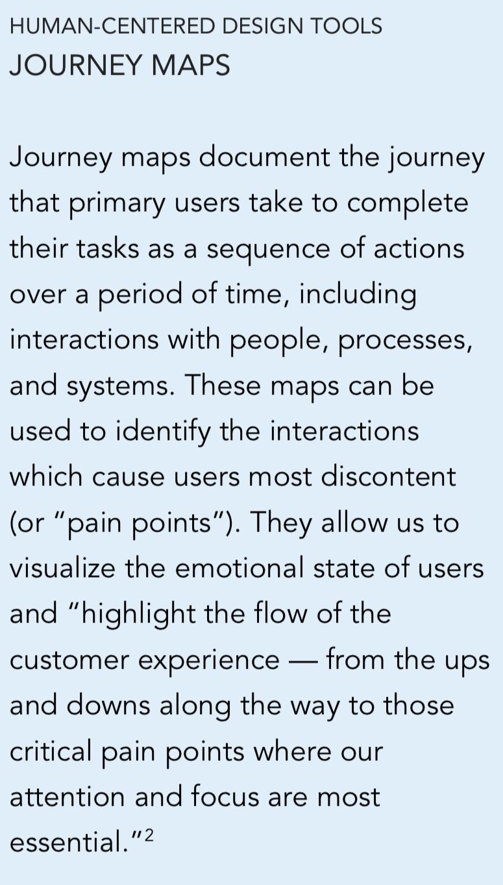
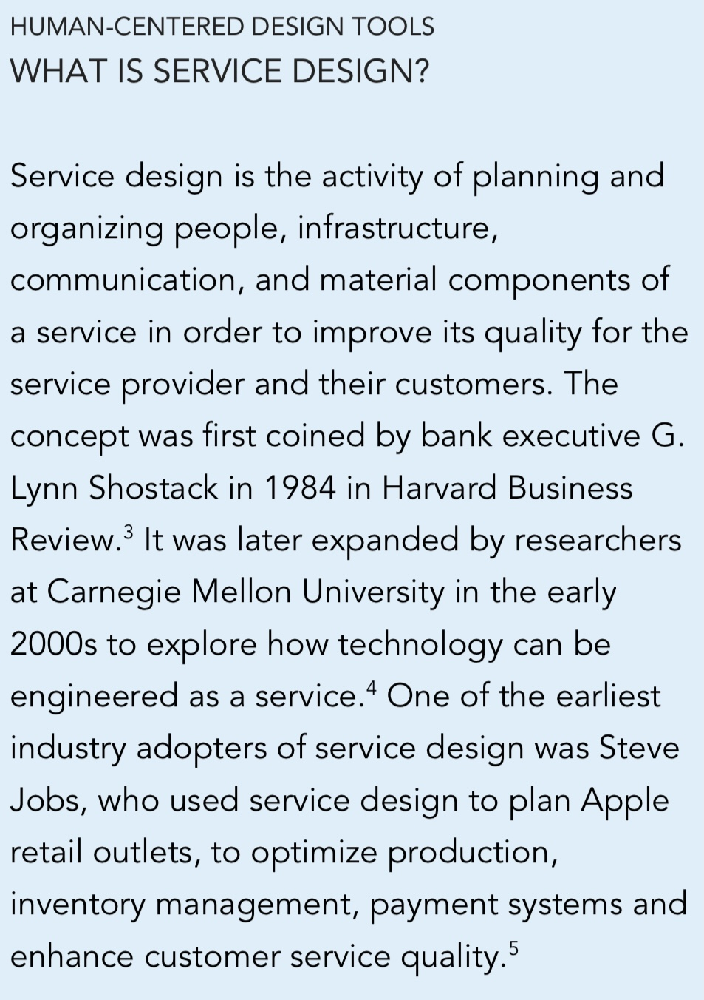
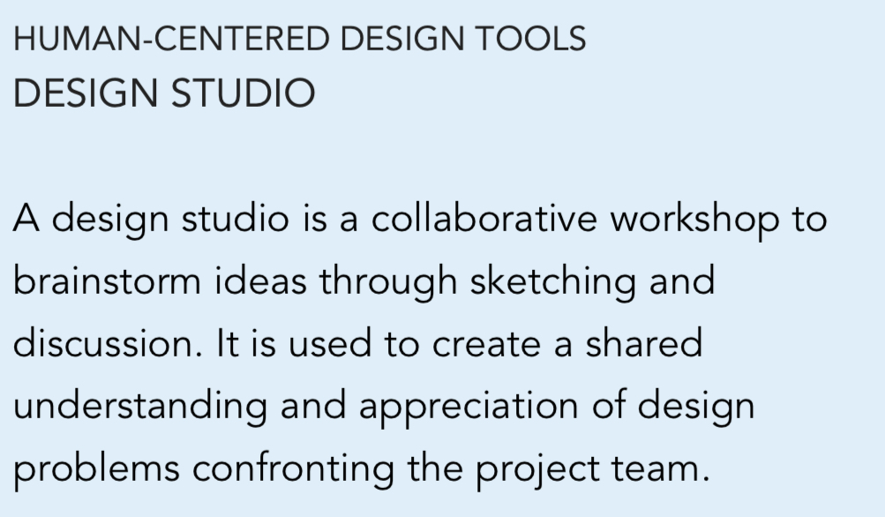

# Stakeholder Focus: Feedback Loops

## Learning Objectives

By the end of this lesson you will be able to:

* Understand how various stakeholders can impact processes at a higher level
* Identify current areas where stakeholders have impacted how teams work
* Describe a broken feedback loop, and ways to avoid or repair it

## Stakeholder Engagement: A Practical Approach 
Depending on your program and its approach to addressing acquisition needs, you may need to revamp your method for keeping your stakeholders up to date. All programs benefit from identifying a process for decisions that require stakeholder involvement during the planning and/or execution period.

### !callout-info

##Note

It’s always easier to ask a stakeholder for approval or concurrence on a program decision if they already have the necessary background knowledge.

### !end-callout

Involvement may look like setting up a quarterly update, or including them on Weekly Wins updates. It may take time to create and forge these relationships on the front end, but you will reap the benefits on the back end by having stakeholder buy-in early on.

You might be thinking by this point, 

“There are a lot of people or organizations to consistently keep in the loop with what I’m up to.” 

<strong>You are right!</strong>

Remember, these people and/or organizations influence other areas of the Defense Acquisition System. Influencers are able to drive changes to DoD and Service-level instructions, policies, and regulations based on feedback received from teams executing programs. Understand the entirety of the system so the system can work for you, not against you. Some recent examples of improvements being made to improve acquisitions for software-intensive programs are: 

## 1.  Pilot for Budget Activity 08 (BA-08) Within Funding Process
BA-08 is a pilot intended to evaluate the effectiveness of having a single budget appropriation for 'Software and Digital Technology' that encompasses development, implementation, fielding and sustainment for programs selected and approved by Congress..

This pilot exists due to feedback from stakeholders that different funding appropriations were artificially delaying and/or otherwise causing issues in years of execution for software-intensive programs. 

## 2.  JCIDS (Requirement Process)
The two newest Adaptive Acquisition Framework (AAF) pathways, Middle Tier Acquisition (MTA) and Software Acquisition, are not subject to JCIDS, though there is ongoing discussion of what makes sense for each of these pathways from a requirements perspective that isn’t full JCIDS. This discussion is informed by program input regarding the specifics of how the JCIDS process severely limits a program’s ability to start quickly and deliver capability faster. These are key tenets of prototyping, rapid fielding, and software development.

## 3.  Adaptive Acquisition Framework (Acquisition Process)
**The Middle Tier of Acquisition (MTA) policy** was issued as interim guidance, enabling DoD Services to provide input to eventual formal policies. The MTA pathway includes examples and tips provided by early adopter programs.

**The Software Acquisition policy** was developed with input from the Services. Software Acquisition pathway guidance is regularly updated to reflect feedback from programs requesting questions and clarifications to use the Software Acquisition pathway. The pathway also includes a link to the Software Community of Interest (SCI). The SCI is a CAC-enabled site offering templates and examples for developing artifacts such as Capability Needs Statement (CNS) and User Agreements.

**The Defense Business Systems (DBS) Pathway** owner is developing guidance for programs to combine features of the Software Acquisition pathway while complying with statutes and regulations applicable to covered systems, based on questions received from programs.

These initiatives hopefully demonstrate the multiple undertakings improving processes and enabling programs to deliver valuable capability at the speed of relevance. We highlight this to show you that there is no silver bullet, and to re-emphasize that there are many initiatives currently underway.

This is all well and good. But at the end of the day: 

> Users don’t care about your internal structures
>
> -Mike Bracken, UK Digital Service
>
> &nbsp;

Our job as acquisitions professionals is to effectively navigate the DAS to provide the capability that users need.

## Understanding the User and Stakeholder In A Modern Software Acquisition Environment

It's no secret that we work in a multi-siloed, multi-disciplinary environment. Because of that, it’s imperative that we draw on the expertise of the broader team and influencers to discover and understand the problems we are solving. Remember - it is important to build across all the organizations and functions that support the development and deployment of capability - including users, stakeholders and within your own organization!

Your program's unique circumstances will inform your strategy and plan of action. Let’s walk through some strategies and approaches:

To improve the way we deliver software capability, we need to better understand and bring together the needs and the voice of the user.  

### !callout-info

##User Mission

With representation from **both** the acquisition team and requirements owners, the following are ways to get a better understanding of the users…
* Define the key users and consumers of the current process
* Walk a mile in their shoes: empathize with their context of day-to-day activities, objectives, and goals
* Describe the key steps and activities in their current process and identify pain points
* Demonstrate how users interact and depend on each other/other systems to achieve success
* Organize individual users into groups where appropriate

Most of all, understand the mission those users serve.

[18F Product Guide: Discover the Current State](https://product-guide.18f.gov/discover/)
### !end-callout

There are strategies that you can use to help with the above. **Service design/service blueprints** can be a great tool (more in the bonus section). 

Don’t forget- this isn’t new. This has always been the goal: 

> “The vision of the Federal Acquisition System is to deliver on a timely basis the best value product to the customer or service.”
>
> -The Federal Acquisition Regulation (FAR), 1.I-I
>
> &nbsp;

The **discovery phase**, also referred to as interviews or scoping, is a great starting point. This phase is defined further in the bonus section, but the goal is to have consistent feedback - which is achieved by actively working to establish feedback loops. 

## Feedback Loops
In earlier lessons, we discussed the Build, Measure, Learn cycle. Let’s look at it now in the context of Agile acquisition. While originally popularized in Silicon Valley and used by Agile teams, acquisition teams can employ the communication practices to improve and build sustainable business practices. A feedback loop is where your outputs become your inputs. 

Applying this to an acquisition life-cycle could look something like this: 

||**Build**: Create your acquisition strategy, conduct a competition, and award a contract **Measure**: Collect data on contractor performance, meet with Software Practitioner teammates for their observations **Learn**: Analyze all feedback to identify areas for improvement **Build**: Take identified areas for improvement and implement improvements to next acquisition strategy    ...and so on.|
|---|---|

Unfortunately, the acquisition process can be lengthy. At best, it is several weeks; at worst, several years. Supporting software initiatives is typically measured in months, but that is only to reach a contract award. The first product delivery is beyond that timeline. 

### !callout-success

##KEY TAKEAWAY

Understanding the cycle time of feedback loops is critical across the entire team - acquisitions, software practitioners, stakeholders, etc. There are often **mismatches**. For example, look at the following two feedback loops:
* Software development - delivery to operations - input from users
  * **Feedback cycle time: days or weeks**
* Contract development - contract award - input from software practitioners/user
  * **Feedback cycle time: months**

### !end-callout

Think of it this way. Because our feedback cycle time is longer, it is critical that we are well-positioned to respond as the acquisition team. To achieve this, we emphasize modular contracting heavily, which is one of the best tools in the acquisitions team toolbelt. The goal is to be as responsive as possible,  and to reduce dependency (a.k.a. risk) -- more to come on that later.

So, how can you identify if something is wrong with your feedback loop?

Here are some overall common themes found in **broken** feedback loops:

* Complex, opaque feedback mechanisms, leading to critical issues.
* Lack of clarity, i.e. use of overly technical language, and unclear issue resolution creating confusion.
* Lack of data and clear reporting mechanisms
* Social barriers, limited interactions, and breakdowns in trust, creating barriers to effective communication
* Default cultural practices. Within a culture that values stoicism and hierarchy, the act of giving and receiving feedback is not intuitive to the design of technologies or workflows to equip warfighters.
* Outdated technologies and siloed systems, making information hard to use.

Here are some things we can do to collectively **improve** the broken feedback loop:

* Enable users to clearly and easily communicate and understand one another.
* Users should use simple language, and receive clear communication from others. Technical language and disciplinary jargon should be replaced with simple graphics, concise language, and easy to engage materials.
* Create visibility into user and mission issues between reporting stages for all parties involved in the process. Users, requirements team, product/development teams and program office.
* Beyond feedback, success is dependent on training and motivating all stakeholders involved to maximize feedback utilization. Overall, we should look at policies and procedures to integrate feedback into all existing workflows.

Just as we seek ways to adapt as software acquisition professionals, other teams must also  evolve. For example, our requirements teams need to consider how their processes may need to change and adapt in response to new technology and transparency.

### !challenge

* type: paragraph
* id: 5008039a-6a81-40c0-bcab-5ca58885c8b7
* title: User and Mission Needs
<!-- * points: [1] (optional, the number of points for scoring as a checkpoint) -->
<!-- * topics: [python, pandas] (optional the topics for analyzing points) -->

##### !question

Think about two (2) experiences you have on a normal basis.  How could you apply what you have learned up to now to better address the needs of the user and mission?

Answer the following for each one:
* What are the pain points and opportunities?
* Does it meet the needs of the user or mission?
* What could be done to improve the capability or associated feedback cycle?

##### !end-question

##### !placeholder

##### !end-placeholder

<!-- other optional sections -->
<!-- !hint - !end-hint (markdown, hidden, students click to view) -->
<!-- !rubric - !end-rubric (markdown, instructors can see while scoring a checkpoint) -->
<!-- !explanation - !end-explanation (markdown, students can see after answering correctly) -->

### !end-challenge

### !challenge

* type: multiple-choice
* id: 7b45330d-a2f6-45f6-bc4c-f0c6892dbf83
* title: Software-Intensive Programs
<!-- * points: [1] (optional, the number of points for scoring as a checkpoint) -->
<!-- * topics: [python, pandas] (optional the topics for analyzing points) -->

##### !question

Which model/pilot practice exists due to stakeholder feedback stating that different funding appropriations were artificially delaying and/or otherwise causing issues in **years of execution** for software-intensive programs?

##### !end-question

##### !options

* MTA
* JCIDS
* Procurement Funding
* BA-8
* Software Pathway

##### !end-options

##### !answer

* BA-8

##### !end-answer

<!-- other optional sections -->
<!-- !hint - !end-hint (markdown, hidden, students click to view) -->
<!-- !rubric - !end-rubric (markdown, instructors can see while scoring a checkpoint) -->
<!-- !explanation - !end-explanation (markdown, students can see after answering correctly) -->

### !end-challenge

## BONUS SECTION: ADDITIONAL STRATEGIES AND APPROACHES
If you want to go even further, we have included a bonus section. While the below just scratches the surface (more to come in the second half of release 3 and 4), here are some practical ways to collaborate between acquisitions, development teams, users and stakeholders:

### Understanding the Discovery Phase

### Understanding Experience Mapping

[Flom, Joel. 2011. “The Value of Customer Journey Maps: A UX Designer’s Personal Journey,” UXmatters, Sept 7.](https://www.uxmatters.com/mt/archives/2011/09/the-value-of-customer-journey-maps-a-ux-designers-personal-journey.php)

### Beyond the User’s Journey

**3** Schostack, G. 1984.“How to Design a Service.” Harvard Business Review 62 (1): 2.  
4 Forlizzi and Battarbee. 2004. “Understanding experience in interactive systems.” Proceedings of the 5th conference on Designing Interactive Systems 1 (1): 261-268.  
5 Isaacson, W. 2011. Steve Jobs. New York: Simon & Schuster

### !challenge

* type: multiple-choice
* id: c9574382-dc5a-4a64-baed-759b6214327b
* title: More Learning
<!-- * points: [1] (optional, the number of points for scoring as a checkpoint) -->
<!-- * topics: [python, pandas] (optional the topics for analyzing points) -->

##### !question

Would you like to know more about employing Human Centered Design within our acquisition practices?

##### !end-question

##### !options

* Yes
* No

##### !end-options

##### !answer

##### !end-answer

<!-- other optional sections -->
<!-- !hint - !end-hint (markdown, hidden, students click to view) -->
<!-- !rubric - !end-rubric (markdown, instructors can see while scoring a checkpoint) -->
<!-- !explanation - !end-explanation (markdown, students can see after answering correctly) -->

### !end-challenge
