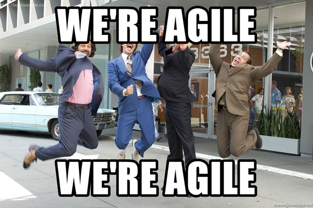
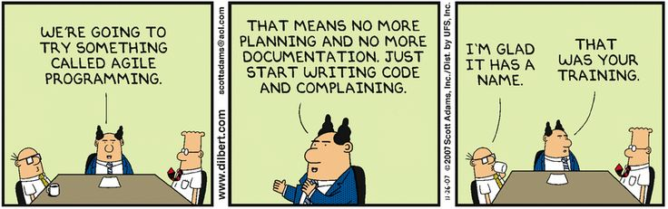

# Understanding How Software Solutions Can Be Acquired

## Learning Objectives

By the end of this lesson you will be able to:
* Differentiate between government- and contractor-led software development
* Understand effective exploratory questions for assessing and recommending government- and contractor-led software development
* Understand that government-led vs contractor-led software development selection will impact contracted solutions

## Introduction

A classic mistake with software acquisition is to first proclaim a program is “Agile” or “DevSecOps” without considering Agile or DevSecOps methodologies, then jump straight to writing work statements to contract for a software development solution. 

Taking that approach **skips many steps**, including (and probably most importantly) understanding what is needed. When we say “what is needed”, we define this both in terms of:
* The solution ultimately developed and provided (capability outcomes), **and**
* _How_ the solution is developed (what are the roles and responsibilities of government and contractor(s) respectively?)

Before charging ahead with any “contractor shall” statements, let’s take a step back and work on our understanding of what’s actually needed- establishing our needs will inform our strategies and timing for hiring contractor(s) who develop software solutions.
We have discussed different roles and responsibilities that exist within a software-intensive program before. However, we have not yet examined different approaches to acquisitions. Here’s what we have already covered:
1. **A common lexicon and understanding is essential.** If your program is adopting modern software development principles, the importance of the entire acquisition team having a fundamental understanding of modern software practices and processes cannot be overstated.
1. **Different acquisition approaches are required.** Previous acquisition approaches more often than not were _designed to support waterfall acquisitions,_ not Agile or DevSecOps acquisitions.  
1. **Many communities and stakeholders need to be involved.** The Defense Acquisition System (DAS) is complex. Acquisition processes span all functional disciplines, and in the past acquisition processes have contributed to long cycle times - these cycle times were often measured in years. The traditional acquisition lifecycle phases are: analysis, design, development, production, deployment, and sustainment.

Don’t worry, we won’t go into specific acquisition strategies yet. We will cover the Adaptive Acquisition Framework, and the new Software Acquisition Pathway in the second half of Module 103.

## Questions To Help You Get Started
For now, let’s focus on team readiness to move forward with a modern software development program. Not all teams and offices are equally prepared for the journey- recognizing that acquiring software is different than modern software development is just the first step. The next step is to consider how the program office team will move beyond the terminology and buzzwords.

### !callout-info

## Note

When we use the term ‘development’, we are referring to the program stage. Ultimately, software is in continuous development - it’s never actually done. **Don’t associate ‘development’ in terms of ‘color of money’--more to come later.**

### !end-callout

|QUESTION|WHY ASK?|WHAT IT CAN INFORM|
|---|---|---|
|**Does the entire acquisition team have a fundamental understanding of modern software practices?**|To set your team up for success, provide a common understanding and lexicon. **Bottom Line:** Establishing a common understanding and lexicon removes dependencies. There’s no longer only one person (or a few people) leading decisions. It eliminates bottlenecks!|Identifies ways and timing to train and equip the acquisition team, either through training like Digital DNA/DAU, or commercially.|
|**Is your program currently developing and deploying software?**|Creates a baseline by identifying current state.|Shows what needs to be improved, and helps start the conversation of what should be prioritized.
|**How defined and transparent to your entire team are your current processes?** Some secondary questions include: -Does the product (portfolio) have a product (portfolio) vision? -Do you have product roadmaps that have been validated with users and stakeholders? -Do you have a way to prioritize individual product’s (and the expanded portfolio’s) backlog?|Remember, one of the pillars of Agile and DevSecOps is to have repeatable and understandable processes and practices. This helps not only with automation, but also with scaling.  The more you refine (and incorporate learnings with) your processes and practices, the easier it will be to navigate and prepare for change|Identifies what needs to be improved, and starts the conversation for what should be prioritized  How the information is accessed and shared is also an important aspect of this process. Transparency of information helps to reduce time spent communicating known processes and practices.|
|**Do you have the ability to deliver operations (or operationally representative environment) consistently?** **What is the existing infrastructure (i.e, cloud infrastructure, platform, CI/CD pipeline) that connects development to operations?**|The ability to deliver continuously depends on your software delivery pipeline. This is critical to delivering software consistently and responding to user needs and changing environments.|What stakeholders need to be engaged to validate (test) or accredit the software environments and pipeline?  What improvements must be made to allow for a repeatable, known, software delivery pipeline (both software and hardware)?|
|**Does the Government program office have personnel available, or the ability to on-board additional civilian or military members, to be responsible for the aforementioned items?**|Informs whether or not the effort will be Government-Led or Contractor-Led.|Greatly impacts the contracting and acquisition strategy and approach.| 

## Government-Led Vs. Contractor-Led Software Development Approach
At this point, we’ve teased these terms a few times. Well, it’s finally time to dig in! Let’s start with definitions:

**Government-Led Approach:**
* Government team members (civilian or military) are leading the overall effort, which includes making both acquisition and technical decisions.
* Government personnel are embedded at all levels of the program from leadership to individual software practitioner teams. 
* Contractors likely will augment the Government team, but they do not have authority to direct resources or commit the Government to decisions. 
* Different contractors may work side by side in the environment (virtual or physical) without conflict because the Government is leading all work activities. 

**Contractor-Led Approach:** 
* A contractor is on contract with the Government for the delivery of completed software product(s) and/or the integrator for multiple software products. 
* The Government organizes and directs all acquisition activities and provides overarching technical goals with the contractor leading implementation and day-to-day decisions. 
     * A Government representative should be identified and embedded with the  contractor team and be involved daily or weekly. 
* Overall technology decisions may be driven by the Government, or may be the responsibility of the contractor if directed in the contract. 
Contractors work on their own to fulfill the requirements in their contract. One government program office may have several contractors with distinct areas of responsibility. 

### !callout-success
## Key Takeaway:
Regardless of the approach (Government-led or Contractor led), ** utilize multiple contractors/contracts** as recommended in Federal Acquisition Regulation (FAR) for IT/software systems to the **maximum extent practicable**: [FAR 39.103](https://www.acquisition.gov/far/39.103) _(In later lessons we will provide more implementation details)_
### !end-callout

**Note:** When using the contractor-led approach, the government should not award a contract and let the contractor develop in a traditional construct: i.e., sending the contractor off to do the work and checking in for monthly Program Management Reviews and monitoring progress by PowerPoint. Remember what Dr. Royce said in _Managing the Development of Large Software Systems:_

> “To give the contractor free rein between requirement definition and operation is inviting trouble.”
>
> [ -Dr. Winston W Royce ](http://www-scf.usc.edu/~csci201/lectures/Lecture11/royce1970.pdf)
>
> &nbsp;

The program office team should seek to learn and _become an active participant in the development process_, and the COR must be engaged to properly survey the contractor’s performance. But more on that later.

When choosing the Government-led approach, a key difference is that **all team members** are properly skilled from the outset, or there is a plan to upskill the team to be effective business and technical leads and strategists. 

### !callout-success

## Takeaway
We are not advocating one approach over the other. Remember our unofficial mantra: **“It depends.”** You know your mission, and the personnel available to you. Both approaches are valid, and can be utilized depending on the situation/need.
### !end-callout

### Differences Between Government-led and Contractor-led Software Development

|Activity / Role|Government-led|Contractor-led
|---|---|---|
|**Software Development Methodology and Processes**|Government creates and maintains program roadmaps and backlogs, and selects software development methodology and tool solutions that contractor(s) will include in their proposals.|Contractors propose program roadmaps, backlog content, preferred software development methodology , and tool solutions.  Contractors maintain backlogs and other products, although the Government is the ultimate decision maker.|
|**Software Development Process Management**|Product development decisions are made by Government team leads with input from team members, including development contractors.|Contractor provides product development recommendations to the Government.|
|**Development Team Composition**|Government teams may include civilian, military, and/or contractor software developers. May include contractors from one or more companies.|Software development team(s) comprised of contractors from the prime and any subcontractors, if applicable.|
|**DevSecOps**|Government may provide a CI/CD pipeline development environment and tool solutions; contractors will propose solutions that are developed within the existing environment|Contractors propose solutions to establish a CI/CD pipeline, DevSecOps as-a-Service to enable processes for CI/CD, tool solutions, and software development teams to develop capability solutions|
|**Reporting/Documentation**|In addition to acquisition and contracting documents, Government develops and evolves software development processes, artifacts, reports, and creates/updates software development metrics|As part of contractual requirements, contractors prepare and deliver software development process documents, development artifacts, intellectual property requirements, and provide metrics and data to the Government|
|**Product Manager**|Role filled by a civilian or military member, even if the development team has contractor personnel|Role filled by a member of the contractor’s development team.  (Sometimes the COR also takes on a similar role, often referred to as the Product owner.)|
|**Contracting Officer’s Representative (COR)**|Responsibilities reflect traditional COR duties, knowledge of Agile software development is important|Success of the program is dependent on CORs role & responsibilities.  Deep understanding of Agile software development is required to ensure Gov is aware and has input to critical activities i.e., roadmap and backlog management|

<!-- >>>>>>>>>>>>>>>>>>>>>> BEGIN CHALLENGE >>>>>>>>>>>>>>>>>>>>>> -->

### !challenge

* type: multiple-choice
* id: c8fd1c58-1323-49d4-8a2f-9d7bdd34a761
* title: Government-led Development
<!-- * points: [1] (optional, the number of points for scoring as a checkpoint) -->
<!-- * topics: [python, pandas] (optional the topics for analyzing points) -->

##### !question

When is a government program office team well-suited for government-led software development? (Select the correct answer)

##### !end-question

##### !options

* The program office team has selected Scrum Agile software development methodology and attended training as a team.
* The program office team desires a contractor to provide software developer teams, manage product backlogs, and manage sprint and release planning sessions.
* The program office team desires to have a contractor augment the Government team developing applications leveraging an established Government provided CI/CD pipeline. 
* The program office team is beginning a new effort that the PEO has decided will be an Agile program to deliver capability every 6 months.

##### !end-options

##### !answer

* The program office team desires to have a contractor augment the Government team developing applications leveraging an established Government provided CI/CD pipeline. 

##### !end-answer

<!-- other optional sections -->
<!-- !hint - !end-hint (markdown, hidden, students click to view) -->
<!-- !rubric - !end-rubric (markdown, instructors can see while scoring a checkpoint) -->
#### !explanation 
Although the PMO that has selected a methodology and attended a training is a starting point, the answer that shows the PMO best situated for government-led is one that has an established way to deliver software, i.e. CI/CD pipeline.
#### !end-explanation

### !end-challenge
<!-- ======================= END CHALLENGE ======================= -->

<!-- >>>>>>>>>>>>>>>>>>>>>> BEGIN CHALLENGE >>>>>>>>>>>>>>>>>>>>>> -->

### !challenge

* type: multiple-choice
* id: 72786f90-bb68-47cb-9652-4ce0562e45b6
* title: Software Development
<!-- * points: [1] (optional, the number of points for scoring as a checkpoint) -->
<!-- * topics: [python, pandas] (optional the topics for analyzing points) -->

##### !question

Why is it important to carefully select Government-led or Contractor-led software development? (Select the correct answer)

##### !end-question

##### !options

* To establish clear expectations for both the Government and contractor for the development effort.
* The Government needs to be able to hold the contractor responsible if the development effort is unsuccessful.
* To establish who makes decisions regarding backlog prioritization for future sprint and release cycles.
* To establish the Agile development methodology that will be used.

##### !end-options

##### !answer

* To establish clear expectations for both the Government and contractor for the development effort.

##### !end-answer

<!-- other optional sections -->
<!-- !hint - !end-hint (markdown, hidden, students click to view) -->
<!-- !rubric - !end-rubric (markdown, instructors can see while scoring a checkpoint) -->
#### !explanation
Although who makes decisions may seem like a correct answer, the Government should always be involved and lead those decisions regarding backlog prioritization regardless of Government-led or Contractor-led software development.
#### !end-explanation

### !end-challenge

<!-- ======================= END CHALLENGE ======================= -->

Let’s take a break and review: 

Source: [Peter Fossick: 12 Failure Modes in Agile Transformation: Transition](https://peterfossick.co/2015/12/28/12-failure-modes-in-agile-transformation-transition/)

Hopefully, you can sense our sarcasm - we said a lot of words, and it was necessary for some comedic relief. 

## Key Questions to Inform Government-Led or Contractor-Led Software Development Solutions

Now that you understand what government-Led vs. contractor-Led software development looks like, how do you assess which is the best solution for a program?

Section 6 of the [OUSD (A&S) Contracting Considerations for Agile Solutions (November 2019)](https://www.dau.edu/cop/it/_layouts/15/WopiFrame.aspx?sourcedoc=/cop/it/DAU%20Sponsored%20Documents/Contracting%20Considerations%20for%20Agile%20Solutions%20v1.0.pdf&action=default) presents key questions for a program to consider when developing an acquisition strategy based on program objectives.

|If the answers to these questions are mainly YES, a Government-Led software development approach may be appropriate.|If the answers to these questions are mainly YES, a Contractor-Led software development approach may be appropriate.|
|---|---|
|Does the program have a Product Vision statement and Product Roadmap for the project outcomes? What capabilities are needed in six months, nine months, or a year?|Is the contractor expected to develop vision statements and product roadmaps for project outcomes?|
|Has the program developed an initial high-level Product Backlog and assigned a Government Product Owner (PO) to manage the Product Backlog?|Will the contractor be expected to develop and manage the product backlog in support of the Government Product Owner?|
|Is the Government responsible for solution integration?|Will the contractor be expected to provide a CI/CD pipeline infrastructure/development environment?|
|Will the Government provide a CI/CD pipeline infrastructure?|Will the contractor be expected to provide DevSecOps-as-a-Service to establish and manage DevSecOps processes?
|Will the Government establish and manage DevSecOps processes existing Government selected CI/CD pipeline development environment and technical infrastructure/design?|Will the contractor be expected to propose an Agile software development methodology (i.e., Scrum) and establish/lead development processes?|
|Has the Government selected an Agile development methodology ? Does the Government have actual experience executing software development using the selected methodology? Does the Government intend to establish/lead development processes? Does the Government have demonstrated success in this area? (not just attended training!) If the Government team does not have the described experience, is there time and funding available for things such as coding bootcamps, Agile coaching, and learning?|Will the contractor be expected to advise the government on modern software development practices as part of the solution (i.e., cloud, DevSecOps, software engineering, cyber security)?|
|Does the Government have the skills and expertise necessary to be successful with modern software development (i.e., cloud/DevSecOps architects/engineers, software developers, software development engineers, cyber security engineers)?  - If the Government team does not have the described skills and expertise, is there time and funding available for things such as coding bootcamps, Agile coaching, and learning? Is the Government in a position to hire or otherwise acquire or borrow appropriately skilled resources?|Will the contractor be expected to propose sprint/release cadence to meet the Government’s desired capability delivery schedule?|
|Has the Government decided on a sprint/ release cadence? (e.g., weekly? monthly? three months? six months)?|Will the contractor be expected to manage integration risk and configuration management for parallel development efforts?|
|Does the Government have a plan to mitigate integration risk and configuration management if multiple contractor teams conduct parallel development efforts?|Will the contractor be responsible for solution integration?|

<!-- >>>>>>>>>>>>>>>>>>>>>> BEGIN CHALLENGE >>>>>>>>>>>>>>>>>>>>>> -->
<!-- Replace everything in square brackets [] and remove brackets  --> 

### !challenge

* type: multiple-choice
* id: a9e24246-e3fb-11eb-ba80-0242ac130004
* title: Government Led vs. Contractor Led Q1
<!-- * points: [1] (optional, the number of points for scoring as a checkpoint) -->
<!-- * topics: [python, pandas] (optional the topics for analyzing points) -->

##### !question

The Government created and maintains the daily product back-log and has initiated end-user meetings. Which approach best supports the above scenario?

##### !end-question

##### !options

* Government-led
* Contractor-led 

##### !end-options

##### !answer

* Government-led

##### !end-answer

### !explanation-incorrect:
Try again, remember that daily product back-log is at the tactical level and would require high involvement and support from the Government. 
### !end-explanation

### !explanation-correct:
Correct! Supporting the product back-log on a daily basis would require high level  Government involvement and direction. Similarly, the Government leading the end-user meetings is an indication of Government-led development. 
### !end-explanation

<!-- other optional sections -->
<!-- !hint - !end-hint (markdown, hidden, students click to view) -->
<!-- !rubric - !end-rubric (markdown, instructors can see while scoring a checkpoint) -->
<!-- !explanation - !end-explanation (markdown, students can see after answering correctly) -->

### !end-challenge
<!-- ======================= END CHALLENGE ======================= -->

<!-- >>>>>>>>>>>>>>>>>>>>>> BEGIN CHALLENGE >>>>>>>>>>>>>>>>>>>>>> -->
<!-- Replace everything in square brackets [] and remove brackets  --> 

### !challenge

* type: multiple-choice
* id: 2812d450-e3fc-11eb-ba80-0242ac130004
* title: Government Led vs. Contractor Led Q2
<!-- * points: [1] (optional, the number of points for scoring as a checkpoint) -->
<!-- * topics: [python, pandas] (optional the topics for analyzing points) -->

##### !question

An emerging requirement identified by the user’s must be quickly fulfilled, market research found no commercial products were available. The Government does not have software skills or expertise in-house.  Which approach best supports the above scenario?

##### !end-question

##### !options

* Government-led
* Contractor-led 

##### !end-options

##### !answer

* Contractor-led 

##### !end-answer

### !explanation-incorrect:
Remember, our goal is providing user’s capability driven by their need. Based on this scenario and time of utmost importance this is likely not the best approach. 
### !end-explanation

### !explanation-correct:
Correct! To provide timely capability the best current option is Contractor-led. Simultaneously, you should be investing in training for your entire team. 
### !end-explanation

<!-- other optional sections -->
<!-- !hint - !end-hint (markdown, hidden, students click to view) -->
<!-- !rubric - !end-rubric (markdown, instructors can see while scoring a checkpoint) -->
<!-- !explanation - !end-explanation (markdown, students can see after answering correctly) -->

### !end-challenge
<!-- ======================= END CHALLENGE ======================= -->

<!-- >>>>>>>>>>>>>>>>>>>>>> BEGIN CHALLENGE >>>>>>>>>>>>>>>>>>>>>> -->
<!-- Replace everything in square brackets [] and remove brackets  --> 

### !challenge

* type: multiple-choice
* id: 1298f95e-e3fe-11eb-ba80-0242ac130004
* title: Government Led vs. Contractor Led Q3
<!-- * points: [1] (optional, the number of points for scoring as a checkpoint) -->
<!-- * topics: [python, pandas] (optional the topics for analyzing points) -->

##### !question

A new, non-commercially available requirement requires a new product team to be established. The Government maintains the CI/CD pipeline, but does not have enough resources to staff another product team.  Which approach would best support the new product team?

##### !end-question

##### !options

* Government-led
* Contractor-led 

##### !end-options

##### !answer

* Contractor-led 

##### !end-answer

### !explanation-incorrect:
Try again, remember that Government-led and Contractor-led approaches can be combined.
### !end-explanation

### !explanation-correct:
Correct! Remember, a product or application can be Contractor-led, meaning that the contractor is required to provide the end-product. _NOTE: Government-led vs. Contractor-led can be combined, as the example above demonstrates that the CI/CD pipeline is Government-led but the specific application is Contractor-led._
### !end-explanation

<!-- other optional sections -->
<!-- !hint - !end-hint (markdown, hidden, students click to view) -->
<!-- !rubric - !end-rubric (markdown, instructors can see while scoring a checkpoint) -->
<!-- !explanation - !end-explanation (markdown, students can see after answering correctly) -->

### !end-challenge
<!-- ======================= END CHALLENGE ======================= -->

## Impact to Acquisition Strategy 
Government-led or contractor-led development is a decision that needs to be considered and assessed when you are drafting your acquisition strategy; however it will continue to be refined when you are detailing your contracting strategy and can change over time--again emphasizing the importance of utilizing a modular contracting approach.

Your program’s position on Government-led or contractor-led will impact all activities that follow, such as market research, Government hiring (if applicable), selection of acquisition pathway and acquisition strategy, and finalized by your selected contract strategy and subsequent award(s).

We will continue to reference Government-led or contractor-led development through the rest of Module 103 because the selection impacts subsequent acquisition decisions.  

Consider this scenario:
> A program borrows a work statement from another program, leaning heavily on copy/paste for defining contractor responsibilities while cherry picking language from various Agile guides. The program may even call for a specific Agile development methodology, not realizing the specifics in the “contractor shall” statements were developed for a different methodology. Worse, the program may fail to realize they are developing a request for Agile development that implies heavy Government involvement without having defined associated roles and responsibilities, or ensuring the requisite skills and expertise are available in the program.

The result of scenarios like this one is a work statement that leaves room for interpretation, and assumptions that will more than likely lead to an unsuccessful software development effort. Nevertheless, contractors will propose solutions, the government will evaluate and award a contract, and development activities will begin- only to quickly reveal, not everyone’s on the same page. Finger pointing ensues, and it’s all downhill from there.

The good news is this: the scenario above is completely avoidable. Taking this course is the first step to ensuring your program selects the appropriate approach: Government-led or Contractor-led software development.

### !challenge

* type: multiple-choice
* id: 4eb31ad4-97b7-11eb-a8b3-0242ac130003
* title: Scenario Pt 1
<!-- * points: [1] (optional, the number of points for scoring as a checkpoint) -->
<!-- * topics: [python, pandas] (optional the topics for analyzing points) -->

##### !question

For the following scenario, 
> You are a Contracting Officer recently assigned to support the new DRAGON program. DRAGON is a pilot initiative to transition the organization to Agile software development. The program team is composed of five people: yourself (the Contracting Officer), a program manager, a financial manager, a cost estimator, and an engineer. The program manager tells you she has  started writing a product vision statement for DRAGON. Additionally, she obtained a PWS from a different software program and is using it as a template for her document. The program manager tells you she is seeking your recommendations for good Agile metrics  because she doesn’t know much about software development. Similarly, this is the first software-intensive program most of the program office has supported. The PM  plans on trying to add a sixth member to your team to assign them as the Government product owner at some point in the future, but isn’t sure how long it will take to get additional manpower. 

Would you select Government-led or contractor-led software development for this scenario? 

##### !end-question

##### !options

* Government-led
* Contractor-led

##### !end-options

##### !answer

* Contractor-led

##### !end-answer

### !explanation-incorrect:
Try again, review the experience of the team with software-intensive systems. 
### !end-explanation

### !explanation-correct:
Correct--although the program office is creating the foundations to support the software-intensive program they are new to this type of capability which indicates Contractor-led is better suited for this scenario. Remember to use short periods of performance, include deliverables for IP, data and APIs within the contract plus ensure training for the Program Office to allow maximum flexibility in the future. 
### !end-explanation

<!-- other optional sections -->
<!-- !hint - !end-hint (markdown, hidden, students click to view) -->
<!-- !rubric - !end-rubric (markdown, instructors can see while scoring a checkpoint) -->
<!-- !explanation - !end-explanation (markdown, students can see after answering correctly) -->

### !end-challenge

### !callout-success
## KEY TAKEAWAYS: Understanding How Software Solutions Can Be Acquired
* Your context, mission need, and organic (military and civilian) skill sets will influence the decision of Government-led vs. Contractor-led development--ensuring both your acquisition and contracting strategy build in flexibility to tailor over time is key
* Both Government-led and Contractor-led strategies are viable, and can be combined to support the evolving software-intensive capability. Example: Government-led CI/CD pipeline and Contractor-led non-commercially available product (application). 
* Modular contracting allows the Program Office the most flexibility in continually tailoring their approach as requirements and technology changes and can be used regardless of your choice: Government-led or Contractor-led. 

### !end-callout

## Resources
* **Article:** [Managing the Development of Large Software Systems - Dr. Winston W Royce](http://www-scf.usc.edu/~csci201/lectures/Lecture11/royce1970.pdf)
* **DoD Publication:** [OUSD (A&S) Contracting Considerations for Agile Solutions (November 2019)](https://www.dau.edu/cop/it/DAU%20Sponsored%20Documents/Contracting%20Considerations%20for%20Agile%20Solutions%20v1.0.pdf)
