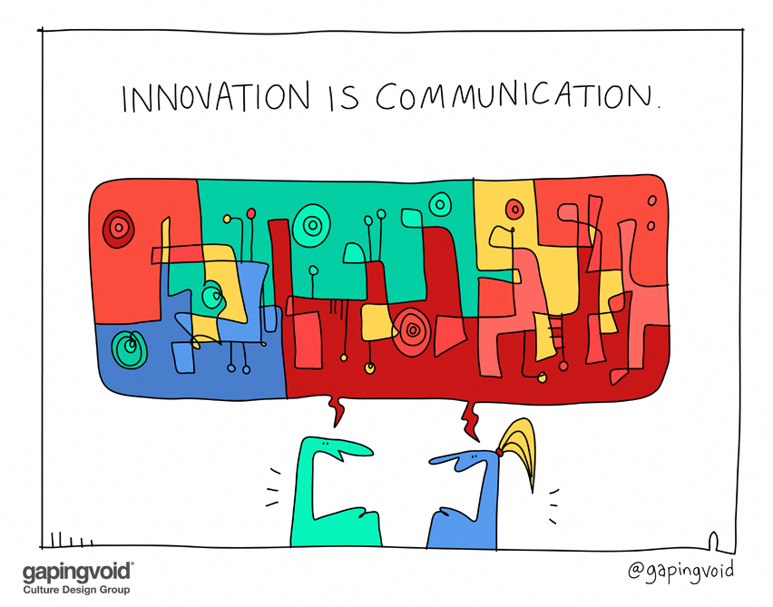
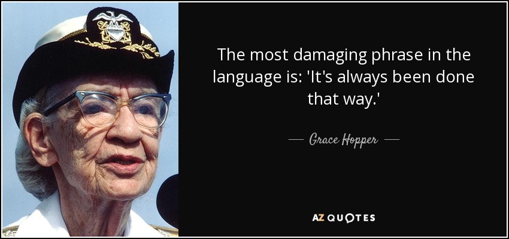
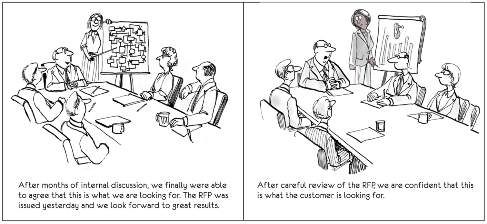
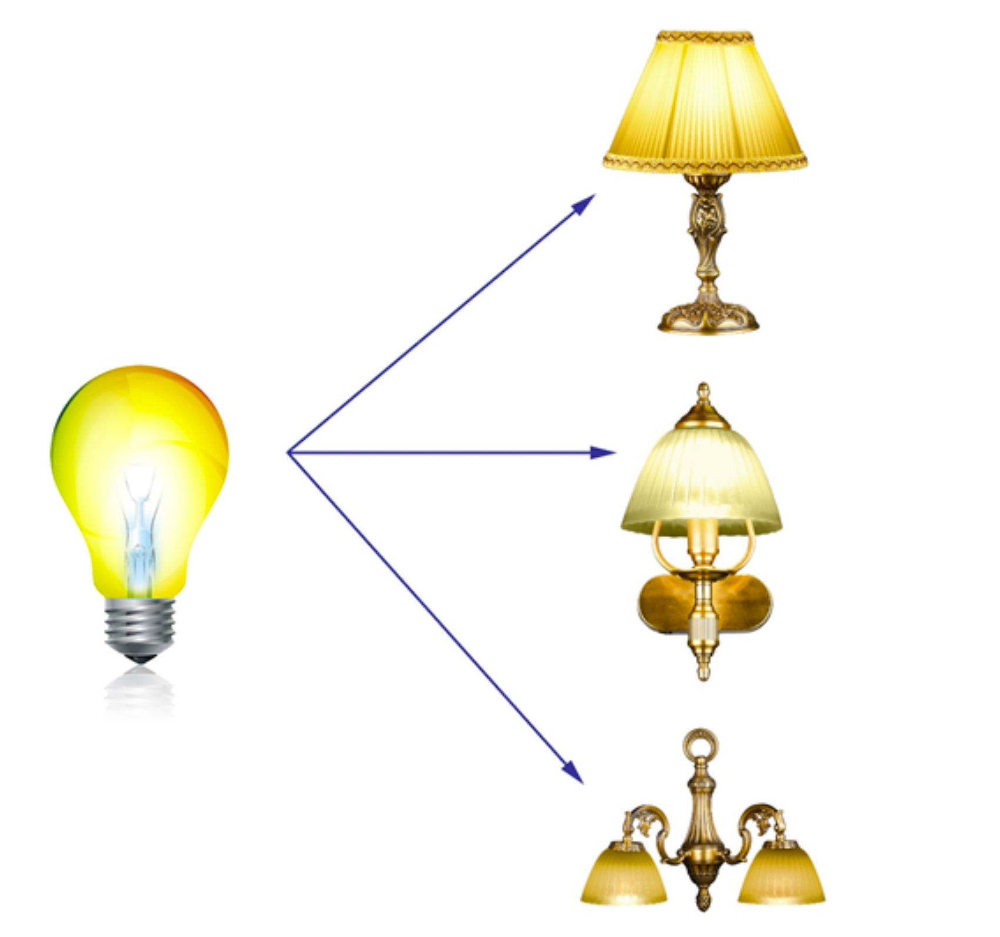

# The Digital Services Market 

## Learning Objectives

By the end of this lesson you will be able to:
* Understand why continuous market research is critical for successful modern software development.
* Recognize Government contracts exist that should be considered market research.

## Introduction
As we have stated (and will continue to state), the technological landscape is **constantly** changing. We hope this goes without saying, but it’s always good to overemphasize:

Consistent and frequent market research is a critical foundation for your software-intensive acquisition.

Your team’s access to information on current market trends and technology advances informs critical components of acquisition and contracting strategies. 

### !callout-success

## Key Takeaway: 

Our partners in industry are often the best sources of information - continuous, productive conversations between your team and contractors are strongly encouraged.

### !end-callout

## Tenets of Market Research
Our goal throughout this course is to equip your entire multidisciplinary acquisition team with a foundational understanding of modern software practices to support your ability to navigate the market. That is only the first step.

Your acquisition team will need to take action and instill processes that support a clear understanding of the marketplace, so you can award contracts for effective solutions at reasonable prices. In the past, it may have been sufficient to conduct one Request for Information (RFI), one Industry Day, or one Draft Request for Proposal (RFP), then consider your market research complete for the life of the program. **This is not the best approach for software-intensive programs.**

When supporting software-centric programs, early, frequent, and meaningful engagement with industry is paramount. Simply put, increasing communication with our industry partners is absolutely critical to the success of acquisitions over the life of the program. 

 Source: [Gaping Void](https://www.gapingvoid.com/blog/2018/02/02/the-future-of-business-is-here/)  

The Federal Acquisition Regulation (FAR) authorizes a broad range of communication with potential contractors. However, teams often don’t take full advantage of these existing flexibilities, a theme we will continue to see throughout Module 103. Perhaps it’s risk-avoidance based fear driving teams to not use these flexibilities, or comfort with known methods, or maybe even unawareness of other effective strategies. It’s often easier to do what has always been done- form habits and become comfortable. We’re human. It’s okay if you have fallen into this trap.

Our goals are to help make you more comfortable with other approaches and strategies, and to recognize innovative approaches are essential for the DoD’s success in this  constantly changing market. 

## Debunking Myths

Let’s start by discussing some common myths, pulled from the myth busting documents listed in the Resources section:
1. **Government Myth:** _“We can’t meet one-on-one with a potential offeror.”_    **FACT:** Government officials can generally meet one-on-one with potential offerors as long as no vendor receives preferential treatment.   
2. **Government Myth:** _“A protest is something to be avoided at all costs - even if it means the government limits conversations with industry.”_    **FACT:** Restricting communication won’t prevent a protest, and limiting communication might actually increase the chance of a protest – in addition to depriving the government of potentially useful information.   
3. **Government Myth:** _“Conducting discussions/negotiations after receipt of proposals will add too much time to the schedule.”_    **FACT:** Whether discussions should be conducted is a key decision for contracting officers to make. Avoiding discussions solely because of schedule concerns may be counter-productive, and may cause delays and other problems during contract performance.   
4. **Government Myth:** _“If the government meets with vendors that may cause them to submit an unsolicited proposal and that will delay the procurement process.”_    **FACT:** Submission of an unsolicited proposal should not affect the schedule. Generally, the unsolicited proposal process is separate from the process for a known agency requirement that can be acquired using competitive methods.  
5. **Government Myth:**  _“When the government awards a task or delivery order using the Federal Supply Schedules, debriefing the offerors isn’t required so it shouldn’t be done.”_    **FACT:**  Providing feedback is important, both for offerors and the government, so agencies should generally provide feedback whenever possible.   
6. **Government Myth:**  _“Industry days and similar events attended by multiple vendors are of low value to industry and the government because industry won’t provide useful information in front of competitors, and the government doesn’t release new information.”_    **FACT:** Well-organized industry days, as well as pre-solicitation and pre-proposal conferences, are valuable opportunities for the government and for potential vendors – both prime contractors and subcontractors, many of whom are small businesses.  
7. **Government Myth:** _“The program manager already talked to industry to develop the technical requirements, so the contracting officer doesn’t need to do anything else before issuing the RFP.”_    **FACT:** The technical requirements are only part of the acquisition; getting feedback on terms and conditions, pricing structure, performance metrics, evaluation criteria, and contract administration matters will improve the award and implementation process.   
8. **Government Myth:** _“Giving industry only a few days to respond to an RFP is OK since the government has been talking to industry about this procurement for over a year.”_    **FACT:** Providing only short response times may result in the government receiving fewer proposals and the ones received may not be as well-developed - which can lead to a flawed contract. This approach signals that the government isn’t really interested in competition.   
9. **Government Myth:** _“Getting broad participation by many different vendors is too difficult; we’re better off dealing with the established companies we know.”_    **FACT:** The government loses when we limit ourselves to the companies we already work with. Instead, we need to look for opportunities to increase competition and ensure that all vendors, including small businesses, get fair consideration.   

<!-- >>>>>>>>>>>>>>>>>>>>>> BEGIN CHALLENGE >>>>>>>>>>>>>>>>>>>>>> -->
<!-- Replace everything in square brackets [] and remove brackets  -->

### !challenge

* type: checkbox
* id: e0b26d04-e433-11eb-ba80-0242ac130004
* title: Market Research: Potential Vendors
<!-- * points: [1] (optional, the number of points for scoring as a checkpoint) -->
<!-- * topics: [python, pandas] (optional the topics for analyzing points) -->

##### !question

Answering questions about a potential acquisition from vendors before a solicitation is released may result in:

##### !end-question

##### !options

* Delays or extensions to due dates
* Better Bids 
* Charges of Unethical Behavior
* Lower Costs

##### !end-options

##### !answer

* Better Bids
* Lower Costs

##### !end-answer

#### !explanation-incorrect: 
Incorrect, try again.
#### !end-explanation

#### !explanation: Better Bids
Almost there, but there is another listed in the answers above. HINT: There are two results in the list above. 
#### !end-explanation

#### !explanation:Lower Costs
Almost there, but there is another listed in the answers above. HINT: There are two results in the list above. 
#### !end-explanation

#### !explanation-correct: 
Correct, you selected the two results from the list above. 
#### !end-explanation

<!-- other optional sections -->
<!-- !hint - !end-hint (markdown, hidden, students click to view) -->
<!-- !rubric - !end-rubric (markdown, instructors can see while scoring a checkpoint) -->
<!-- !explanation - !end-explanation (markdown, students can see after answering correctly) -->

### !end-challenge
<!-- ======================= END CHALLENGE ======================= -->

With this in mind, _**continuous**_ market research becomes an attractive option for teams supporting software-centric programs. To conduct business in the software industry, we must move at the speed of industry relevance. Here are some key tips to consider: 

|Key Tip|Further Discussion|
|---|---|
|**Hold Meaningful Industry Events**|Communication with industry directly benefits the Government team by promoting a standard understanding of requirements, and improving solicitation based on feedback from industry.  _Meaningful_ industry events are interactive events; these are as beneficial to industry as they are to your team.  **Do not** release draft documents asking for written responses, then consider your research complete. Draft documents can be a useful tool, but only when also used with other more interactive methods.|
|**Allow Industry Time to Plan**|Provide enough time for industry to prepare to attend your event, and/or provide written feedback. We don’t help anyone when using short turnaround times, or announce live events only days ahead of time!  Doing so can result in receiving underprepared feedback, and can signal to industry that we aren’t really interested in obtaining competition.|
|**Increase Opportunities For One-On-One Meetings**|Consider combining industry events and one-on-one vendor meetings. Direct conversations often result in the Government obtaining company information not otherwise shared in an open forum.  Allows Government teams to more accurately research if vendors are qualified in a given requirements area.  One-on-one meetings are especially beneficial when meeting with experts in the industry.|
|**Involve the Entire Acquisition Team**|The FAR requires that Contracting Officers document all market research. However, feedback from vendors (on terms and conditions, pricing structure, performance metrics, evaluation criteria, and/or contract administration) and determining if vendors are minimally qualified is the responsibility of the entire acquisition team.  Example: Your cost analyst may recommend a different Contract Line Item Number (CLIN) structure after hearing feedback from vendors on industry norms for billing and accounting practices.|
|**Conduct _Continuous_ Market Research**|We’ll hear more about modular contracting approaches in Phase B of Module 103. For now, understand that if your acquisitions will be recurring in nature, then your market research needs to be as well.  The speed of relevancy is much faster than in the traditional acquisition life cycle. This is true in many sectors, but especially in software development.  We must create processes for continuously updating market research to stay relevant.|
|**Involve Your Small Business Office**|In this fast-paced industry new companies, or companies unaccustomed to the Government acquisition process, may be the most suitable for a given requirement.  Work with your small business office to broaden your outreach to new market entrants and connect companies with professionals that can assist in navigating the Government acquisition process.|
|**Focus On Skills Vs. Compliance**|Engagements with industry should focus on their skillsets, not on their ability to follow compliance. The shift from traditional software development to Agile software development focuses on demonstrated capability of development teams vs strength of technical proposals written to comply with an RFP.|

## The Value of Collaboration

Now that we’ve established that you can engage in pre-solicitation communication with potential vendors, let’s take a look at why you should do so. 

### !callout-warning
## Don't Forget!
Engaging with your users early will also help to inform the contract and ensure it aligns with _current_ need. 
### !end-callout

The cartoon above is what we do **not** recommend. Remember, one of the core themes of this course: **common understanding and common lexicon.** As many of you encountered when you first joined the Government the acronyms we use and/or ways we define terms varies (even internally). Utilizing both pre-solicitation communication with vendors and engaging with users and stakeholders helps to prevent this pitfall. The following are benefits of this communication: 

### 1. Better Requirements

Let the experts be experts. This is particularly important in the digital services industry where technology is changing daily.

Recall from the [National Defense Strategy (NDS)](https://dod.defense.gov/Portals/1/Documents/pubs/2018-National-Defense-Strategy-Summary.pdf ): “many technological developments will come from the commercial sector”. Therefore, it shouldn’t be surprising that industry representatives are constantly exposed to new technologies and have to be aware of changing marketplace trends (or fear irrelevance). **Take advantage of their expertise.** 

By engaging with potential vendors early on, you can solicit their feedback on what is possible. Keep an open mind--the solution that you think you want may not be the best choice. As an example: 
> Prior to pre-solicitation communication your team identified the requirement as new, custom development. Through pre-solicitation communication you identified a Commercial off-the-shelf (COTS) solution that requires minimal modification. This could allow huge time savings for valuable capability deployment to users!

Don’t forget about other considerations: sustainment and maintenance. Technical data rights, intellectual property, long- and short-term costs, resources, and mission accomplishment priorities will also need to be considered. 

### 2. Better Bids
Vendors _cannot_ submit good offers on what they don’t understand. Industry is a partner to the Department, working together allows us to support the warfighter. The following are _potential outcomes_ with clear communication: 
* Allows the opportunity for vendor to identify teaming arrangements and/or subcontractors 
* Decrease the overall costs of doing business by allowing them to plan and forecast more accurately
* Find labor and other resources in advance rather than late in the game.

Answering questions about the acquisition this early in the process may seem tedious, but it can and will save time and money once the solicitation is released. As many of you have probably experienced, if you release a solicitation without communication and industry fails to understand it, you’ll be flooded with dozens of questions. When this occurs, it can cause delays and extensions to the proposal due date, which is disruptive to your program, slows the delivery of mission capability and also costly for industry.

### 3. Increased Interoperability
Remember, interoperability is the requirement of systems communicating with one another. It’s possible that you may be operating on old, outdated, or inappropriate standards (i.e. APIs) for a particular requirement--remember technology is constantly evolving. Pre-solicitation communication with industry offers vendors the opportunity to inform you of advancements, and suggest alternatives that are more effective and efficient.

Think about it in terms of universal standards for light bulbs – if we didn’t have these types of standards, you’d have to buy a different, specific lightbulb for each lamp – that would get expensive! The light bulb standards are public and available for any vendor wishing to create lightbulbs or design lamps. So, instead of worrying about interoperability requirements, vendors can focus on innovation (which they have done with new colors and more efficient light bulbs).

On the other hand, if there is a standard or requirement (e.g., interoperability with existing capability) for an upcoming acquisition, why not publish that ahead of time? Make the standards known to industry as far in advance as possible, so they may incorporate the standards into their commercial products and other offerings.

### !callout-info
## Interoperability Example
The Federal Bureau of Investigation (FBI) Law Enforcement National Data Exchange (NDEx) provides no-fee access for federal, state, local, and tribal government agencies, but software changes to access the data used to cost $250K. Using standards for information sharing has reduced the cost to $10K, making it feasible for more agencies to access the data.
### !end-callout

As an acquisition professional, you have an obligation (as stated in the FAR) to conduct your procurement in the most effective, responsible, and efficient manner possible. The FAR provides great flexibility in _how_ market research activities are conducted. Be creative in meeting your team's needs! 

By engaging with potential vendors early on, you can solicit their feedback on what is possible. The solution that you think you want may not be the best choice. 

### !challenge

* type: checkbox
* id: e8a4f02c-ac7d-4b58-8103-c6df4ce23103
* title: Market Research Activities
<!-- * points: [1] (optional, the number of points for scoring as a checkpoint) -->
<!-- * topics: [python, pandas] (optional the topics for analyzing points) -->

##### !question

You have a known acquisition need for software engineers highly skilled in security processes to supplement your Government security engineering team. Which of these activities would you recommend including in your market research activities? Select all that apply.

##### !end-question

##### !options

* Hold an industry day and review, in depth, the 50 page requirement document
* Hold one on one meetings with the most skilled companies in the industry
* Have no engagements with industry until after you release a Draft RFP and soliciting their feedback
* Work with your small business office to expand your market exposure to new market entrants
* Hold an Industry Day two weeks ahead of your planned RFP release date

##### !end-options

##### !answer

* Hold one on one meetings with the most skilled companies in the industry
* Work with your small business office to expand your market exposure to new market entrants

##### !end-answer

<!-- other optional sections -->
<!-- !hint - !end-hint (markdown, hidden, students click to view) -->
<!-- !rubric - !end-rubric (markdown, instructors can see while scoring a checkpoint) -->
<!-- !explanation - !end-explanation (markdown, students can see after answering correctly) -->

### !end-challenge

## Government Capabilities
A commonly overlooked aspect of market research stems from our previous conversation on interoperability.  Part of your market research should be to look internally for whole or partial solutions that meet your program's needs and create partnerships with those organizations.  Akin to what we discussed above (for interoperability) it’s important that you share aspects of the solution (or whole solution) to the bidding vendors so that:
1. They take it into account within their proposed solution
2. You are not charged twice to leverage this as part of your program’s solution

If the technology doesn’t exist, then existing contract vehicles should also be explored. Many Government agencies have established enterprise-wide contracts, reducing duplicative contract actions for a wide range of IT needs. 

### Existing Government Capabilities
Here are some examples of existing capabilities and potential contract vehicles that may help meet your technical requirements. **This is not an all inclusive list,** but does begin to highlight current initiatives to leverage. Remember, a tenent of modern software development is to leverage what exists - not everyone should build from scratch. Some examples are: 

#### [Cloud One](https://software.af.mil/team/cloud-one/)
Cloud One is the trusted cloud computing platform for the DOD; they deliver secure cloud hosting, cloud onboarding, cloud migration as a service, and secure cloud data transport. Check out more about how to work with the Cloud One team [here](https://software.af.mil/team/cloud-one/).

#### [Platform One](https://p1.dso.mil/#/)
Platform One is a DevSecOps Enterprise Services team supporting teams across the DOD; they enable programs to deploy a DOD-hardened software factory, on their existing or new environments (including classified, disconnected, and cloud), within days instead of years.
* **Party Bus** provides teams with instant access to developer tools and CI/CD pipelines by leveraging Platform One’s cATO (Continuous Authority To Operate).
* **Big Bang** is the Infrastructure as Code and Configuration as Code (IaC/CaC) base that can deploy onto any cloud instance.
* **Iron Bank** is a repository of digitally signed, binary container images that have been hardened and accredited for DOD-wide use across classifications (**Note:** Iron Bank is part of Platform One’s tech stack and does not need to be acquired separately.)
Check out more about how to work with the Platform One team [here.](https://p1.dso.mil/#/)

#### [Black Pearl](https://blackpearl.us/)
Black Pearl is the Naval Enterprises arm of the Platform One team. The Air Force and Department of the Navy have teamed up to bring the DoD Enterprise Services originally developed by the Air Force to the Navy and Marine Corps. Black Pearl is the umbrella portfolio of people, processes, and technologies aimed at modernizing the Naval Software Practice.
* **Party Barge** is the common DevSecOps environment offered as a Software as a Service to the Naval Enterprise. If teams do not have their own DevSecOps environment, they can rapidly onboard into Party Barge and start developing immediately.
* **Lighthouse** is the core software Platform that powers the DevSecOps environment as well as the production runtime environment where applications are deployed. Lighthouse can be used to stand up your own DevSecOps environment, or used as the baseline platform for your mission application hosting environment.
Check out more about how to work with the Black Pearl team [here.](https://blackpearl.us/)

### Existing Contract Vehicles
Here are some examples of existing contract vehicles that may be used to simplify your contracting strategy. This is not intended as an all-inclusive list, rather a snapshot of what types of enterprise-wide vehicles are potentially available for use by your organization: 

#### [GSA Vehicles](https://cic.gsa.gov/acquisitions/acquisition-resources/):
* 8(a) STARS II, a small business set-aside Government-Wide Acquisition Contract (GWAC). Provides flexible access to customized IT solutions from a large, diverse pool of 8(a) industry partners.
* Alliant 2, provides IT solutions including things such as AI, cloud computing, help desk, software development, and web services.
* GSA IT Schedule 70 Multiple Award Schedule (MAS)

#### [NIH NITAAC](https://nitaac.nih.gov/):
* NITAAC is the designated Federal Executive Agent authorized by the Office of Management and Budget (OMB) to administer three GWACs for IT. With a combined contract ceiling of $60 billion, three contracting vehicles can be used by any federal, civilian, or DOD agency to procure IT products, services and solutions.

#### [NASA Enterprise Vehicle](https://cic.gsa.gov/acquisitions/acquisition-resources/):
* Solutions for Enterprise-Wide Procurement (SEWP) (pronounced “soup”), provides hardware and product-based services supporting things such as networking and telecommunications, storage systems, security tools, cloud based solutions, training, and maintenance.

#### [Air Force DevSecOps Blanket Ordering Agreements (BOAs)](https://software.af.mil/wp-content/uploads/2020/05/Platform-One-BOAs_Distro-A.pdf) 
* Includes three different BOA areas based on scope: software licenses and tools; software services; and GovCloud compute and store solutions. Managed in coordination with Platform One program office. Virtually any labor category required to run a software organization is included in the scope of one of the BOA categories. Other program offices across the Department can award utilizing the BOAs, contact the Platform One program office to leverage. 
### !callout-success

## Key Takeaway: 

If there’s an existing contract vehicle you can use to cut down on your own acquisition lead time, it’s a win-win. Less work for your team, quicker time to award without cutting any corners.

### !end-callout

To kick-start looking at FAR and its full potential, including non-FAR contract types, we look at it from this standpoint: you can just say ‘no’ to FAR Part 15 acquisitions until you’re convinced it’s the only way. To prove that point, numerous existing software organizations have no FAR Part 15 contracts required (and their programs have been successful, too!).

The above list is not exhaustive of all possible enterprise vehicles that can be used. Do your research before creating a contract from scratch! 

### !challenge

* type: multiple-choice
* id: d6b179c1-1613-494e-9959-7dbf571338d7
* title: Contracting Approach
<!-- * points: [1] (optional, the number of points for scoring as a checkpoint) -->
<!-- * topics: [python, pandas] (optional the topics for analyzing points) -->

##### !question

You have a requirement for a service contract for various software engineer labor categories. It is anticipated that over the next 24-36 months, you will need to award additional contracts for this type of work, but the scale and scope cannot yet be determined (eliminating the use of an option as a good strategy). What approach would you take?

##### !end-question

##### !options

* Research awarding a multiple award IDIQ contract so that future requirements can be met by awarding a competitive Order off of your new IDIQ contract
* Conduct market research on available enterprise vehicles (such as GSA) to meet your service contract needs
* Look in to expanding scope on existing contract to meet your needs
* Research large businesses that can meet your requirement to increase scope over the next 24-36 months
* Conduct market research on awarding a contract under FAR Part 15 procedures

##### !end-options

##### !answer

* Conduct market research on available enterprise vehicles (such as GSA) to meet your service contract needs

##### !end-answer

<!-- other optional sections -->
<!-- !hint - !end-hint (markdown, hidden, students click to view) -->
<!-- !rubric - !end-rubric (markdown, instructors can see while scoring a checkpoint) -->
<!-- !explanation - !end-explanation (markdown, students can see after answering correctly) -->

### !end-challenge

### !callout-success
## KEY TAKEAWAYS: The Digital Services Market
* Market research can quickly become out-dated due to emerging technology--driving the importance of frequent (continuous) market research.  
* Take time to establish repeatable, clear, and understood processes to engage in frequent communication with vendors to align market research with new technology and capability.
* Pre-solicitation communication during the market research phase, is not only feasible but encouraged to provide the best opportunity for a collaborative partnership between the Government and industry. Additionally, it can result in:
      * Better Requirements, _i.e. clearer solicitations and contracts_
      * Better Bids, _i.e. increase the number of viable options_
      * Better Interoperability, _i.e. higher chance of decreasing risk of systems communicating_
### !end-callout

<!-- >>>>>>>>>>>>>>>>>>>>>> BEGIN CHALLENGE >>>>>>>>>>>>>>>>>>>>>> -->
<!-- Replace everything in square brackets [] and remove brackets -->

### !challenge

* type: paragraph
* id: e6706c92-301b-43ba-8120-7c477f39c3b9
* title: !Opt. Lesson Feedback: Digital Services Market
<!-- * points: [1] (optional, the number of points for scoring as a checkpoint) -->
<!-- * topics: [python, pandas] (optional the topics for analyzing points) -->

##### !question

Do you have any specific feedback, positive or constructive, regarding the content of this lesson? 

##### !end-question

##### !placeholder
Remember, this is optional - this is a way for you to provide input while working through the lesson content. 

If you do not have any input feel free to write N/A in the text box. 
##### !end-placeholder

### !end-challenge

<!-- ======================= END CHALLENGE ======================= -->

## Resources:
* Websites:
    * [Air Force (AF) Cloud One](https://software.af.mil/team/cloud-one/)
    * [AF Platform One Basic Ordering Agreements](https://software.af.mil/wp-content/uploads/2020/05/Platform-One-BOAs_Distro-A.pdf)
    * [AF Platform One](https://p1.dso.mil/#/)
    * [GSA Acquisition Resources](https://cic.gsa.gov/acquisitions/acquisition-resources/)
    * [NASA Enterprise Vehicle](https://cic.gsa.gov/acquisitions/acquisition-resources/)
    * [Navy Black Pearl](https://blackpearl.us/)
    * [National Institutes of Health (NIH) Information Technology Acquisition and Assessment Center (NITACC)](https://nitaac.nih.gov/)
    * [Myth Buster #1](https://www.whitehouse.gov/sites/whitehouse.gov/files/omb/procurement/memo/Myth-Busting.pdf)
    * [Myth Buster #2](https://www.whitehouse.gov/sites/whitehouse.gov/files/omb/procurement/memo/myth-busting-2-addressing-misconceptions-and-further-improving-communication-during-the-acquisition-process.pdf)
    * [Myth Buster #3](https://www.whitehouse.gov/sites/whitehouse.gov/files/omb/procurement/memo/myth-busting_3_further_improving_industry_communications_with_effectiv....pdf)
    * [Myth Buster #4](https://www.whitehouse.gov/wp-content/uploads/2019/05/SIGNED-Myth-Busting-4-Strenthening-Engagement-with-Industry-Partners-through-Innovative-Business-Practices.pdf)
