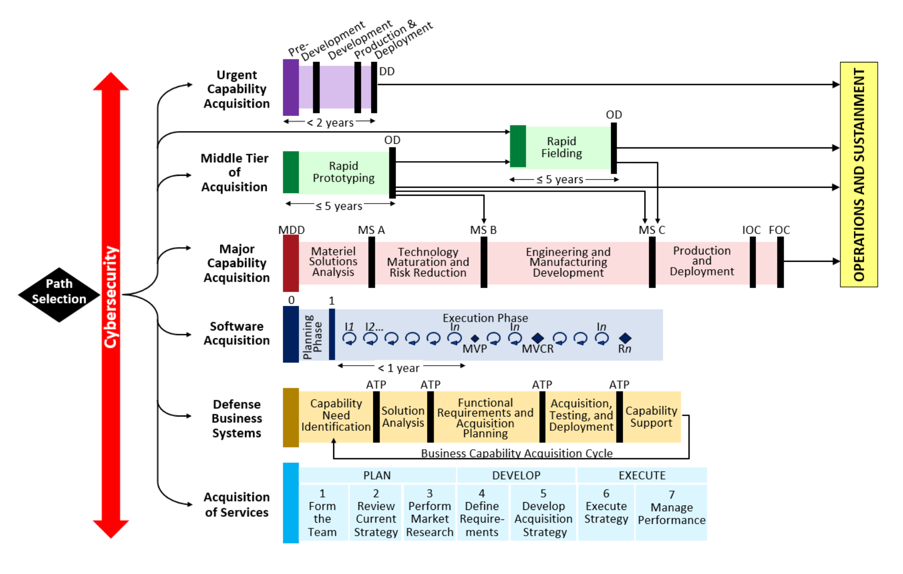
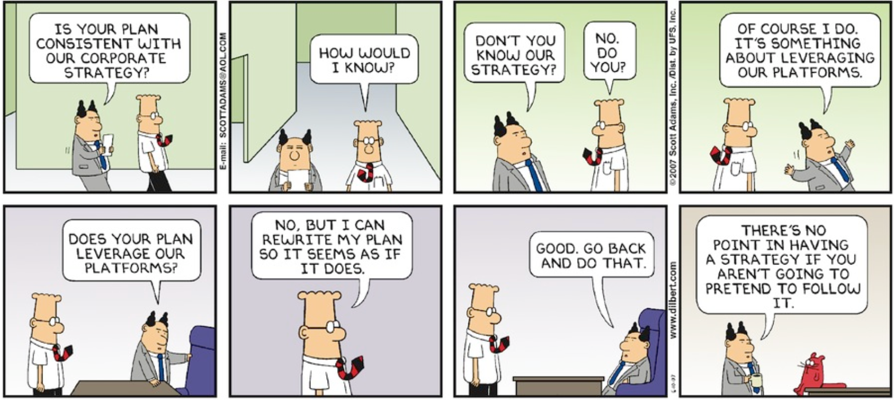
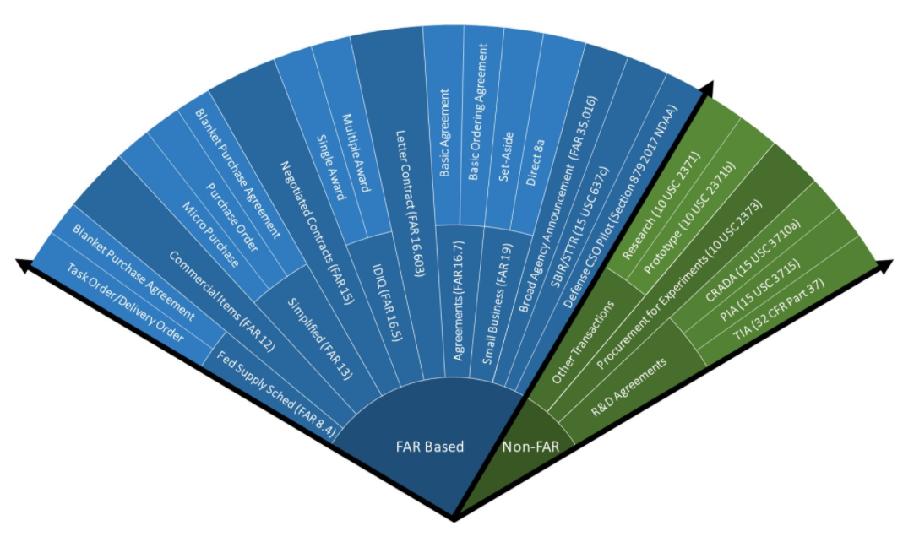
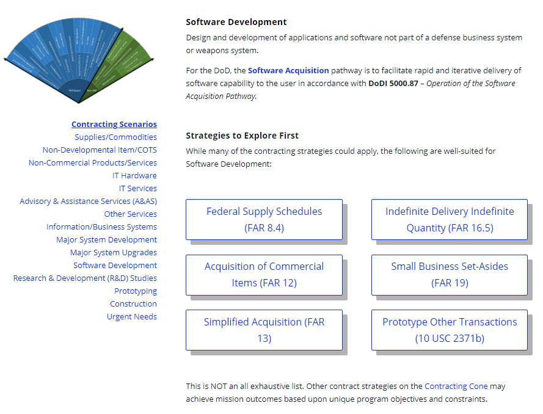

# Acquisition Strategy vs Contracting Strategy

## Learning Objectives

By the end of this lesson you will be able to:

* Understand the difference between acquisition strategies and contracting strategies.
* Recognize the unique considerations of acquisition & contracting strategies for a modern software development program.

Before we cover any more material, let’s restate an essential Agile and DevSecOps mythbuster we emphasized throughout Releases 1 and 2:

AGILE, DEVSECOPS, AND/OR ANY OTHER MODERN SOFTWARE PRACTICE 
≠ 
NO PLANNING

What it means is that planning **does not** have to be a multi-year event. Using planning documents that are probably already familiar to you, we are going to tie in the values, processes, and mindset of Agile and DevSecOps -we want to move forward with a new perspective, looking at activities we already do as acquisitions professionals in a new light.

## Introduction

### !challenge

* type: multiple-choice
* id: 47437089-bb6b-4f03-b245-dea9c1affc05
* title: Acquisition vs. Contracting
<!-- * points: [1] (optional, the number of points for scoring as a checkpoint) -->
<!-- * topics: [python, pandas] (optional the topics for analyzing points) -->

##### !question

A contracting strategy is another name for an acquisition strategy.

##### !end-question

##### !options

* True
* False

##### !end-options

##### !answer

* False

##### !end-answer

#### !explanation
As the challenge question suggests, anyone involved with a defense acquisition program has likely heard the term acquisition strategy, and that an approved acquisition strategy is required before a program can begin. However, it can sometimes be conflated with a contracting strategy.
#### !end-explanation
<!-- other optional sections -->
<!-- !hint - !end-hint (markdown, hidden, students click to view) -->
<!-- !rubric - !end-rubric (markdown, instructors can see while scoring a checkpoint) -->
<!-- !explanation - !end-explanation (markdown, students can see after answering correctly) -->

### !end-challenge

Before we define, we want to clarify as the challenge question above demonstrates. Anyone involved with a defense acquisition program has likely heard the term acquisition strategy, and that an approved acquisition strategy is required before a program can begin.

An **acquisition strategy** is _**more**_ than a “check the box” activity. It is a _living document_ laying out the plan the program follows to achieve its objectives - given the information known at the time it is created - and is _intended to evolve_ with a program.

A **contracting strategy** is a key component of the acquisition strategy that enables the program to execute via negotiated contracts. If you missed the challenge question, you are not alone--this is a common misunderstanding within acquisitions

**Example**: When someone says their program acquisition strategy is an Indefinite Delivery/Indefinite Quantity (IDIQ), or Other Transaction (OT), their program is these as the **contracting strategy** to achieve **acquisition strategy** objectives.

## Acquisition Strategy Further Defined

An **acquisition strategy** is a comprehensive, integrated plan identifying an acquisition approach that describes required business, technical, and support strategies. The plan does this by managing program risks and opportunities, while meeting program objectives- it communicates the relationship between acquisition phases, work efforts and key program events. Examples of program events include decision points, reviews, contract awards, test activities, production considerations, and operational deployment objectives. 
Source: [Defense Acquisition Guide, CH 1-4.1](https://www.dau.edu/pdfviewer?Guidebooks/DAG/DAG-CH-1-Program-Management.pdf)

Acquisition strategy specifics are driven by the policy of the selected [Adaptive Acquisition Framework (AAF) pathway](https://aaf.dau.edu/) delivering a solution, capability, or system. We’ll discuss the AAF pathways and their applicability to software-intensive programs in the next lesson, but the graphic below is a quick preview:

 
[Adaptive Acquisition Framework](https://aaf.dau.edu/)

## Acquisition Strategy vs. Acquisition Plan

We didn’t have a challenge question, but you guessed it (hopefully) - an acquisition strategy shouldn’t be confused with an acquisition plan. An **acquisition plan** provides the details of how an acquisition strategy will be implemented.

There is some overlap of content between the two, however. There may also be an opportunity in some cases to combine the two, usually for smaller programs. Key differences between the acquisition strategy and acquisition plan are highlighted in the following table:

|Acquisition Strategy (AS)|Acquisition Plan (AP)|
|---|---|
|Required by AAF pathway policy|Required by Federal Acquisition Regulation (FAR) Part 7|
|Discusses strategic plan to achieve program objectives across the entire acquisition program lifecycle|Discusses specifics of technical, business, management, and other significant considerations that will control the acquisition|
|One AS per program|One AP per acquisition activity, where acquisition activity can be defined as one contract action or multiple contract actions that support a common objective (when required by FAR); unless program uses a Simplified Acquisition Management Plan (SAMP)|
|Key components:<ul><li>program risks</li><li>contract strategy</li><li>gov vs. contracted solutions</li><li>test and sustainment strategies</li><li>enterprise architecture considerations, etc.</li></ul>|Key components:<ul><li>cost/technical/ schedule risks</li><li>statement of need</li><li>cost</li><li>sources of supply</li><li>competition</li><li>contract type</li><li>source selection, etc.</li></ul>|

### !challenge

* type: checkbox
* id: c68a8e2a-e47a-4a69-9bc4-39d57fb05352
* title: Acquisition Plan
<!-- * points: [1] (optional, the number of points for scoring as a checkpoint) -->
<!-- * topics: [python, pandas] (optional the topics for analyzing points) -->

##### !question

When will your program require an acquisition plan?

##### !end-question

##### !options

* To support approval for a specific acquisition activity.
* To support the overall approach and strategy for the lifecycle of the program.
* If you are not utilizing Simplified Acquisition Procedures.
* It is the first document generated to initiate and approve a program.

##### !end-options

##### !answer

* To support approval for a specific acquisition activity.
* If you are not utilizing Simplified Acquisition Procedures.

##### !end-answer

<!-- other optional sections -->
<!-- !hint - !end-hint (markdown, hidden, students click to view) -->
<!-- !rubric - !end-rubric (markdown, instructors can see while scoring a checkpoint) -->
<!-- !explanation - !end-explanation (markdown, students can see after answering correctly) -->

### !end-challenge

## Who Is Responsible
So now you know the difference between an acquisition strategy and a contracting strategy. But who’s responsible?

The answer: **everyone on the acquisition team.** No one person delivers - we succeed only with comprehensive functional support from all team members.

That being said, identifying and understanding who has lead responsibility and/or authority to make decisions is very important.

| |Acquisition|Contracting|
|---|---|---|
|Authority|[DoD Instruction (DoDI) 5000.02](https://www.esd.whs.mil/Portals/54/Documents/DD/issuances/dodi/500002p.pdf?ver=2020-01-23-144114-093) assigns the program manager responsibilities to: plan acquisition programs, prepare programs for key decisions, execute approved acquisition and product support strategies, and employ a thoughtful, innovative, and disciplined approach to program management in accordance with DoD Directive (DoDD) 5000.01, based on the authority in Sections 113 and 133 of Title 10, U.S. Code (U.S.C.).  DoDI 5000.02 establishes the AAF pathways, each with their own policy and program manager  responsibilities for managing acquisition programs.  The Milestone Decision Authority (MDA) or Decision Authority (DA), based on the AAF pathway, is the program decision authority and can tailor oversight and decision levels based on the characteristics of the capability being acquired. For certain types/values of programs, decision authority cannot be delegated.|The authority for a contracting officer is based in U.S. Code (U.S.C.). 41 U.S.C. 1702(b)(3)(G) requires agency heads to establish & maintain a procurement career program, including the selection, appointment, and termination of appointment of contracting officers. This authority flows through each service through contracting leadership positions.  The Federal Acquisition Regulation (FAR) provides details as to the qualifications required to hold a warrant.  Above certain dollar values, Contracting Officers have to complete reviews and obtain approvals before negotiating or entering into contracts|
|Responsibility|Typically the program manager is responsible for leading efforts to create the acquisition strategy.|Typically the contracting officer & contract specialist team will be responsible for leading efforts to create the contract strategy.|

It’s helpful to understand where the authority for acquisition and contracting comes from to inform responsibility and leadership roles for the tactical level team.

To reiterate, because this part is so important: **everyone on the acquisition team is responsible for supporting both the acquisition and contract strategy planning**. Remember no one person delivers, we need the support of all functions.

## Why is the Acquisition Strategy Important?

When in doubt, ‘insert Dilbert comic.’

Jokes aside, plans don’t have to stay stagnant - we can adjust and revisit our approaches as we learn. Remember our emphasis on Build-Measure-Learn? Bring that energy to all aspects of your acquisition.

**Example:**
* **Existing Programs**: Adapting an existing acquisition strategy (i.e., transition from a traditional waterfall development strategy to a strategy better suited for software development).
  * An acquisition strategy more than likely will not be updated daily, but probably good to review quarterly or bi-annually and adjust as needed. Also, it may help in leadership buy-in, showing that you plan to update the plan at regular cadences.
* **New Programs**: Reach out to other software intensive programs and see what you can learn from them.   
  * Hint: You just met a bunch of software acquisition professionals attending Digital DNA. Incorporate their knowledge as part of developing a new acquisition strategy for a new program.

Key considerations of an acquisition strategy for a software-intensive program include, but are not limited to:
* Train your entire acquisition team for a shared understanding of how and why things will be done differently to support a software development effort
* Start small with number of products, funding invested, and contract ceiling
  * Use a flexible and modular contract strategy enabling software development practices
* Risk-based business and technical management approach for addressing  iterative software delivery balanced with security, intelligence threats, quality, etc.
* Create a roadmap and cadence for software deliveries to operations
* Tailoring of acquisition processes -- remember, one of the goals of the  Adaptive Acquisition Framework  is to support flexible solutions and increase innovation
* Investigate and utilize (as applicable)  existing enterprise services, infrastructure, and resources to include software development tools and government software developers/coders.
* Remove over the fence activities
  * **Example**: shift test left by collaborating early and often  with the test and evaluation community to develop test strategies enabling continuous test.
* Architecture strategies
* Cybersecurity strategies in accordance with applicable cybersecurity policies and issuances
* Intellectual property, training, and product support strategies
* Statutory and regulatory compliance strategy

### !challenge

* type: checkbox
* id: 9ae36347-7844-41f1-a8ee-049eb4f1001a
* title:  SW Intensive Acq Strat
<!-- * points: [1] (optional, the number of points for scoring as a checkpoint) -->
<!-- * topics: [python, pandas] (optional the topics for analyzing points) -->

##### !question

Which are key considerations of an acquisition strategy for a software-intensive program?

##### !end-question

##### !options

* The program should identify likely commercial or government-provided technical solutions for cloud usage, networking, and establishing environments for DevSecOps or justify why existing enterprise services will not meet the needs.
* Based on technical constraints, prior experience, and other considerations, the program should state whether it has already selected an Agile development framework (e.g., SAFe, Scrum, XP).
* The program should describe what gaps exist, in terms of bringing sufficient expertise in modern software practices into the team.
* Based on the technical vision, the program should describe the approach it will take to software design, highlighting any known constraints and identifying how the program will deal with emergent design issues as the system evolves across iterations.

##### !end-options

##### !answer

* The program should identify likely commercial or government-provided technical solutions for cloud usage, networking, and establishing environments for DevSecOps or justify why existing enterprise services will not meet the needs.
* Based on technical constraints, prior experience, and other considerations, the program should state whether it has already selected an Agile development framework (e.g., SAFe, Scrum, XP).
* The program should describe what gaps exist, in terms of bringing sufficient expertise in modern software practices into the team.
* Based on the technical vision, the program should describe the approach it will take to software design, highlighting any known constraints and identifying how the program will deal with emergent design issues as the system evolves across iterations.

##### !end-answer

<!-- other optional sections -->
<!-- !hint - !end-hint (markdown, hidden, students click to view) -->
<!-- !rubric - !end-rubric (markdown, instructors can see while scoring a checkpoint) -->
<!-- !explanation - !end-explanation (markdown, students can see after answering correctly) -->

### !end-challenge

## Contracting Strategy

A **contracting strategy** is part of an overarching acquisition strategy. The contracting strategy discusses the contract(s) put in place to achieve program objectives set out in an acquisition strategy.   

**Examples:**
* A commercial item contract under FAR Part 12
* A task order under an existing Indefinite Delivery Indefinite Quantity (IDIQ) contract
* An Other Transaction (OT) agreement.
* Contracting strategies also include elements such as contract type selection (i.e., firm-fixed-price, cost-reimbursement, time & materials), product or service contract, competition (i.e., full and open, sole source), and source selection, to name a few.

**Contracting strategies** enable execution of the acquisition strategy. Contracting strategies (FAR-based and non-FAR based) are presented in the [Contracting Cone](https://aaf.dau.edu/aaf/contracting-cone/).

 
**Contracting Cone**

Recall that an acquisition strategy for a software program calls for a contracting strategy that enables software development teams to rapidly design, develop, test, integrate, deploy, and support software capabilities.

The [software development scenario](https://aaf.dau.edu/aaf/contracting-cone/scenarios/software-development/) included in the Contracting Cone highlights specific contracting strategies well-suited for software development. These contracting strategies can be used with any of the AAF pathways. These strategies can also be used in combination as part of a modular contracting strategy for acquiring software-intensive solutions. Modular contracting will be discussed in depth in a future lesson.

 
[Contracting Cone - Software Development Scenario](https://aaf.dau.edu/aaf/contracting-cone/scenarios/software-development/)

This is just the start - there is much more to come on the topic of contracting. For now, these basic concepts should be a framework for you to start thinking about how your current strategies and contracts can be reworked in the future to better flow with software development and its unique needs. 

### !callout-success

##TAKEAWAY:

Although acquisition strategies and contracting strategies are **separate**, they are **complimentary**.

### !end-callout

### !challenge

* type: multiple-choice
* id: 4bcaa772-30d3-4ea1-b6b7-12d4114aa4d8
* title: SW Intensive Contracting Strategy
<!-- * points: [1] (optional, the number of points for scoring as a checkpoint) -->
<!-- * topics: [python, pandas] (optional the topics for analyzing points) -->

##### !question

Which are important features of a contracting strategy for a software-intensive acquisition?

##### !end-question

##### !options

* Contracting strategies should encourage proposals for production that are based on quantity, schedule, and logistics requirements.
* Contracting strategies should create a business environment that supports small, frequent releases and responds to change, taking into consideration programmatic risks and the scope and purpose of a program.
* Contracting strategies should create a business environment that incentivizes cost saving efficiencies.
* Contracting strategies should encourage proposals for solutions that are not commercially available and are developed specifically for the government.

##### !end-options

##### !answer

* Contracting strategies should create a business environment that supports small, frequent releases and responds to change, taking into consideration programmatic risks and the scope and purpose of a program.

##### !end-answer

<!-- other optional sections -->
<!-- !hint - !end-hint (markdown, hidden, students click to view) -->
<!-- !rubric - !end-rubric (markdown, instructors can see while scoring a checkpoint) -->
<!-- !explanation - !end-explanation (markdown, students can see after answering correctly) -->

### !end-challenge
### !challenge

* type: multiple-choice
* id: da1fcb7b-6d28-4bf1-8e38-1a3095857091
* title:  Acquisition & Contracting Strategy
<!-- * points: [1] (optional, the number of points for scoring as a checkpoint) -->
<!-- * topics: [python, pandas] (optional the topics for analyzing points) -->

##### !question

What is the relationship between an acquisition and contracting strategy?

##### !end-question

##### !options

* An acquisition strategy implements the contracting strategy.
* An acquisition strategy is a key component of the contracting strategy that enables the program to execute via negotiated contracts.
* A contracting strategy is a key component of the acquisition strategy that enables the program to execute via negotiated contracts.
* A contracting strategy determines the key components of the acquisition strategy.

##### !end-options

##### !answer

* A contracting strategy is a key component of the acquisition strategy that enables the program to execute via negotiated contracts.

##### !end-answer

<!-- other optional sections -->
<!-- !hint - !end-hint (markdown, hidden, students click to view) -->
<!-- !rubric - !end-rubric (markdown, instructors can see while scoring a checkpoint) -->
<!-- !explanation - !end-explanation (markdown, students can see after answering correctly) -->

### !end-challenge
