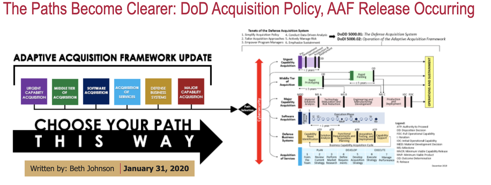

# An Overview: The Adaptive Acquisition Framework (AAF)

## Learning Objectives

By the end of this lesson you will be able to:

* Understand how the Defense Acquisition System was transformed.
* Understand the intent of Adaptive Acquisition Framework (AAF).
* Describe why the AAF differs from previous acquisition policy.

## Introduction
Did you know the DoDI 5000.02 was completely overhauled in 2020?! It’s no longer titled  “Operation of the Defense Acquisition System.” Now it’s named [“Operation of the Adaptive Acquisition Framework,”](https://www.esd.whs.mil/Portals/54/Documents/DD/issuances/dodi/500002p.pdf?ver=2020-01-23-144114-093) and includes [six acquisition pathways](https://aaf.dau.edu/). Spoiler alert…there’s a pathway for Software acquisition!

Why was 5000.02 overhauled? The goal is no longer to tailor-out, but to tailor-in. By creating and prioritizing multiple easily-adaptable pathways that users can combine and execute  simply, there is added potential for a more timely  acquisitions process, thereby supporting valuable capability delivery.

**IMPORTANT**: The Adaptive Acquisition Framework and _all acquisition pathways_ are **living documents**, intended to be updated regularly based on feedback from programs implementing them.

Sound familiar? As the acquisition professional, you are a **critical piece of the framework** that ensures change by supporting necessary feedback. Whether it’s the AAF itself or other policies that are at conflict, let us know how we can support you! 

### !challenge

* type: paragraph
* id: 6505cbf7-3592-4d27-bb76-dfdc1968447a
* title: Feedback
<!-- * points: [1] (optional, the number of points for scoring as a checkpoint) -->
<!-- * topics: [python, pandas] (optional the topics for analyzing points) -->

##### !question

**If you have experience with the Adaptive Acquisition Framework, do you have any feedback that would help refine it or make it better?**

(Type N/A if not)

##### !end-question

##### !placeholder

##### !end-placeholder

<!-- other optional sections -->
<!-- !hint - !end-hint (markdown, hidden, students click to view) -->
<!-- !rubric - !end-rubric (markdown, instructors can see while scoring a checkpoint) -->
<!-- !explanation - !end-explanation (markdown, students can see after answering correctly) -->

### !end-challenge

  
Source: https://www.dau.edu/News/The-Paths-Become-Clearer--DoD-Acquisition-Policy,-AAF-Release-Occurring

Before we continue discussing the AAF and its implications, we need to introduce some foundational acquisition concepts and content for you. We know - this might not be the most exciting thing for you to read about, but don’t worry: there’s Agile humor just around the corner!  

## Quick Background
A friendly reminder for those of you not familiar with DoD acquisitions: The Defense Acquisition System (DAS) is the management process for **all DoD acquisition programs**. [DoD Directive 5000.01, The Defense Acquisition System](https://www.esd.whs.mil/Portals/54/Documents/DD/issuances/dodd/500001p.pdf?ver=2020-09-09-160307-310) provides the overarching management principles and mandatory policies currently governing the DAS.

The DAS supports the [National Defense Strategy](https://www.defense.gov/Explore/Spotlight/National-Defense-Strategy/) by developing in conjunction with others a lethal and effective force based on U.S. technological innovation. By also encouraging a culture of performance, the two yield decisive and sustained U.S. military advantage.

The AAF supports the DAS with the objective of delivering effective, suitable, survivable, sustainable, and affordable solutions to the end user in a timely manner. To achieve those solutions, Milestone Decision Authorities (MDAs), other Decision Authorities (DAs), and Program Managers (PMs) have broad authority to plan and manage their programs in a manner consistent with sound business practices.

The AAF acquisition pathways provide opportunities for MDAs, DAs, and PMs to develop acquisition strategies and employ acquisition processes that match the characteristics of the capability being acquired. 

### !callout-success

## Takeaway:

AAF pathways are guided by policy that prescribes specific phases, activities, and artifacts required for each pathway.

### !end-callout

### !challenge

* type: multiple-choice
* id: ba2ed611-183a-4d3c-86b0-0da23d336b73
* title: Pathways
<!-- * points: [1] (optional, the number of points for scoring as a checkpoint) -->
<!-- * topics: [python, pandas] (optional the topics for analyzing points) -->

##### !question

Which of the following is true about the AAF pathways?

##### !end-question

##### !options

* The pathways support DoD’s one-size-fits-all approach.
* Each pathway has its own guiding policy that, in combination with functional policy, lays out the tailorable framework for the pathway.
* The specific phases, activities, and artifacts required for each pathway are set and program managers may not tailor.
* A program must select and follow only one pathway.

##### !end-options

##### !answer

* Each pathway has its own guiding policy that, in combination with functional policy, lays out the tailorable framework for the pathway.

##### !end-answer

<!-- other optional sections -->
<!-- !hint - !end-hint (markdown, hidden, students click to view) -->
<!-- !rubric - !end-rubric (markdown, instructors can see while scoring a checkpoint) -->
<!-- !explanation - !end-explanation (markdown, students can see after answering correctly) -->

### !end-challenge

## The Adaptive Acquisition Framework

Rewriting the DoD 5000 series and introducing the AAF has been transformational. Previously, the DoD took a “one-size-fits-all” approach, with predefined processes that offered only limited flexibility, and a laundry list of required documentation and review. By recognizing that this is a fundamentally inadequate approach, the rewrite embraces that _there is more than one way_.  

Breaking apart what was formerly the DoDI 5000.02, the newly-created AAF pathways are guided by their own policy as well as  separate functional policies, applicable to each individually. As a result, the DoD now emphasizes delegation and ensures decision-making occurs at lower levels by tailoring program oversight and treating each capability acquisition as unique. 

As we said, this is merely an introduction. We highly recommend diving further into the policy- for more details on the DoD 5000 series rewrite, refer to February 2021’s [OUSD Acquisition & Sustainment (A&S) DoD 5000 Series Acquisition Policy Transformation Handbook](https://www.acq.osd.mil/ae/assets/docs/DoD%205000%20Series%20Handbook%20%2809%20FEB%2021%29.pdf).

### !challenge

* type: checkbox
* id: f1e6cf83-7dc8-4b95-93b6-47e257fa483a
* title: Tailoring and AAF
<!-- * points: [1] (optional, the number of points for scoring as a checkpoint) -->
<!-- * topics: [python, pandas] (optional the topics for analyzing points) -->

##### !question

Which AAF pathways allow process and documentation tailoring to support and enable program objectives?

##### !end-question

##### !options

* Middle Tier of Acquisition
* Major Capability Acquisition
* Defense Business Systems
* Software Acquisition
* Urgent Capability Acquisition

##### !end-options

##### !answer

* Middle Tier of Acquisition
* Major Capability Acquisition
* Defense Business Systems
* Software Acquisition
* Urgent Capability Acquisition

##### !end-answer

<!-- other optional sections -->
<!-- !hint - !end-hint (markdown, hidden, students click to view) -->
<!-- !rubric - !end-rubric (markdown, instructors can see while scoring a checkpoint) -->
<!-- !explanation - !end-explanation (markdown, students can see after answering correctly) -->

### !end-challenge

### !challenge

* type: checkbox
* id: 8e77b182-51f2-476d-99de-2a37ba4b58d8
* title: Transformation of 5000
<!-- * points: [1] (optional, the number of points for scoring as a checkpoint) -->
<!-- * topics: [python, pandas] (optional the topics for analyzing points) -->

##### !question

Why is the rewrite of the DoDI 5000 series transformational for the DoD?

##### !end-question

##### !options

* It provides multiple acquisition pathways designed to be combined and tailored to develop acquisition strategies, and employs processes that align with the capability being acquired.
* It recognizes that the previous “one-size-fits-all” approach was inadequate.
* It embraces the concept of a single process to simplify DoD acquisitions.
* It embraces that there is more than one way.
##### !end-options

##### !answer

* It provides multiple acquisition pathways designed to be combined and tailored to develop acquisition strategies, and employs processes that align with the capability being acquired.
* It recognizes that the previous “one-size-fits-all” approach was inadequate.
* It embraces that there is more than one way.

##### !end-answer

<!-- other optional sections -->
<!-- !hint - !end-hint (markdown, hidden, students click to view) -->
<!-- !rubric - !end-rubric (markdown, instructors can see while scoring a checkpoint) -->
<!-- !explanation - !end-explanation (markdown, students can see after answering correctly) -->

### !end-challenge
