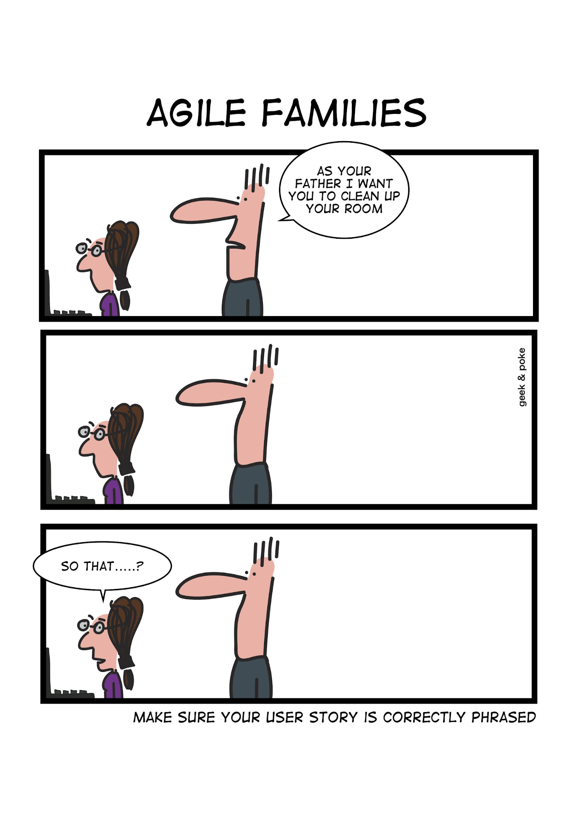
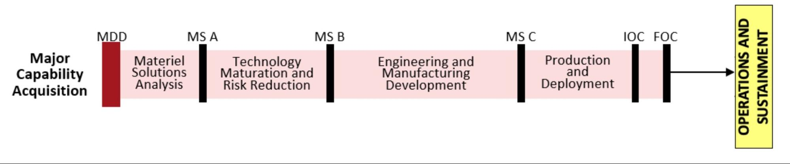
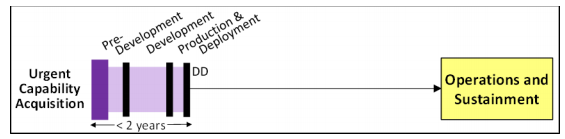
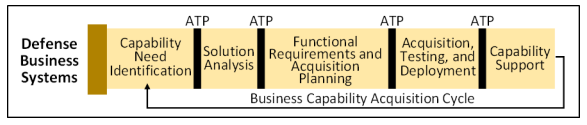
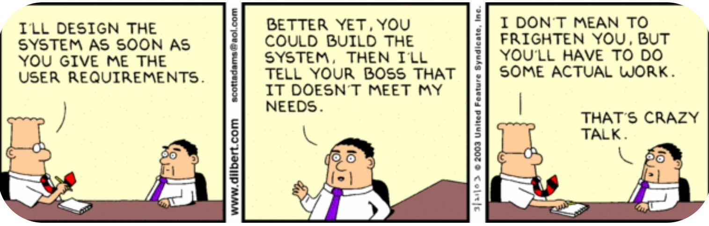
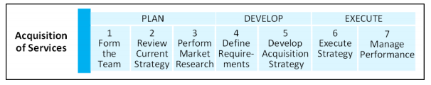
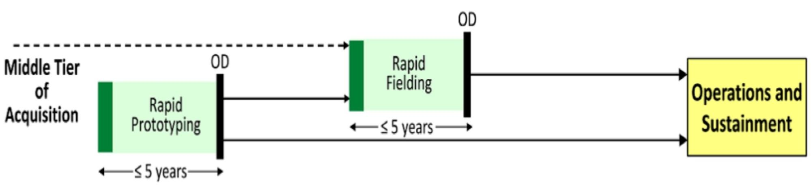
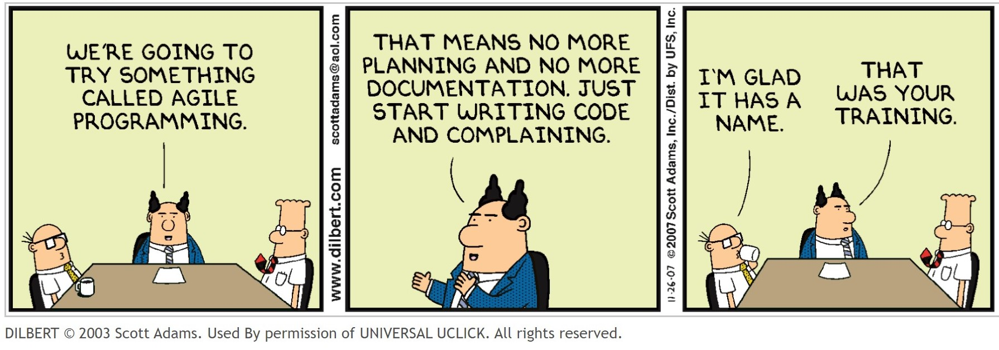
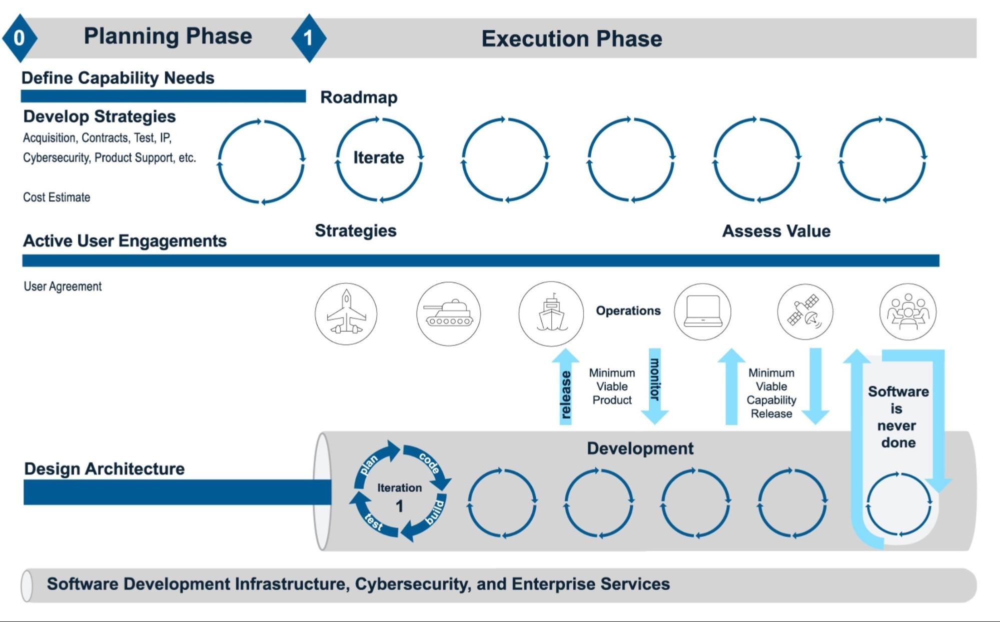
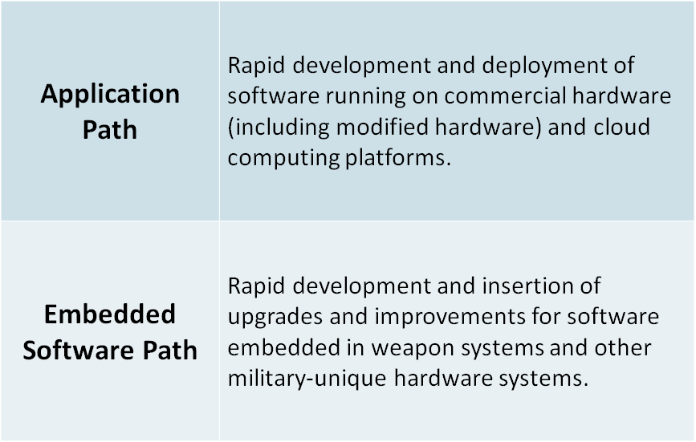

# The Pathways: The Adaptive Acquisition Framework

## Learning Objectives

By the end of this lesson you will be able to:

* Understand which AAF pathways are the best candidates for software development.
* Describe the different pathways’ ability to support software-intensive programs.

## Introduction

So, which AAF pathways can or should we use when contracting for software development? This should come as no surprise to you by now, but our answer is ‘**it depends**’.

This module addresses each pathway and how we might leverage them. However, do not let that limit or prevent you from adapting in new and innovative ways! These pathways are subject to change, and there may be opportunities to improve upon what is already available.  

Similar to previous modules, we will be providing summaries and/or a portion of the information available through other resources and training. It is important that after you complete this module, you continue to do your own research. We will provide links for you to further your understanding at the end of the module - feel free to ask for more. 

But first, we keep our promises:

 Source: [Agile Families](https://geek-and-poke.com/geekandpoke/2016/2/21/agile-families) 

## The Pathways And Their Uses
So you’ve been researching all the new pathways, and are excited to use one in your program. You’re interested in improving a current acquisition strategy, or planning a new capability and need to establish an acquisition strategy for the first time. No matter which situation you find yourself in, the goals remain the same - delivering valuable capability at the speed of relevance.

The pathways available to you will be explored in the following order:

* Major Capability Acquisition
* Urgent Capability Acquisition
* Business System Acquisition
* Acquisition of Services
* Middle Tier of Acquisition
* Software Acquisition

The arrangement of these pathways is intentional. We start with what will probably be the most familiar pathways because they’re the most established, then move toward newly available pathways (Middle Tier of Acquisition and Software Acquisition). We then examine combining pathways, often including the Software Acquisition pathway. How to implement combined pathways has been a common question within the context of our roles as educators and acquisition professionals, so we find it pertinent to address here. However, do not limit yourself to the examples in this discussion - there are always more options!

### !callout-success

## Takeaway:

Multiple contracting strategies or contract types and vehicles can be applied to all  pathways. _More to come on this topic later_.

### !end-callout

### !challenge

* type: multiple-choice
* id: 2b546242-1d8a-480f-af26-07a79febc4c6
* title: !‘New’ Pathways
<!-- * points: [1] (optional, the number of points for scoring as a checkpoint) -->
<!-- * topics: [python, pandas] (optional the topics for analyzing points) -->

##### !question

Does the program you currently support utilize (or plan to)  a _‘newer’_ pathway, i.e. Middle Tier Acquisition or Software Acquisition?

##### !end-question

##### !options

* Yes; Middle Tier Acquisition
* Yes; Software Acquisition Pathway
* No
* Not Applicable

##### !end-options

##### !answer

* *

##### !end-answer

<!-- other optional sections -->
<!-- !hint - !end-hint (markdown, hidden, students click to view) -->
<!-- !rubric - !end-rubric (markdown, instructors can see while scoring a checkpoint) -->
<!-- !explanation - !end-explanation (markdown, students can see after answering correctly) -->

### !end-challenge

### !challenge

* type: paragraph
* id: 4eb00c61-838c-479d-8c34-fb481951c5d2
* title: !‘New’ Pathways Pt 2
<!-- * points: [1] (optional, the number of points for scoring as a checkpoint) -->
<!-- * topics: [python, pandas] (optional the topics for analyzing points) -->

##### !question

If you answered yes to the question above, what has been your experience with the new pathways? Some secondary questions to help frame your answer: was it easy to find information on the pathway? Was it easy to implement in your organization and receive approvals? Do you have any feedback on how the pathway could be improved?

##### !end-question

##### !placeholder

Don't forget to check the top right hand corner of your screen, there will be a red notification on the bell that means the learning guides have commented or have questions on your answers. Don't miss out on opportunities to engage! 

##### !end-placeholder

<!-- other optional sections -->
<!-- !hint - !end-hint (markdown, hidden, students click to view) -->
<!-- !rubric - !end-rubric (markdown, instructors can see while scoring a checkpoint) -->
<!-- !explanation - !end-explanation (markdown, students can see after answering correctly) -->

### !end-challenge

## Major Capability Acquisition Pathway

The [Major Capability Acquisition (MCA) pathway](https://aaf.dau.edu/aaf/mca/) is for programs intending to acquire and modernize uniquely military programs providing enduring capability. Acquisitions like these typically follow a structured “analyze > design > develop > integrate > test > evaluate > produce > support” approach. 

This pathway is designed to support major defense acquisition programs and systems, as well as other complex acquisitions. Acquisition and product support processes, reviews, and documentation are tailored based on program size, complexity, risk, urgency, and other factors. 

### Pathway Highlights:

* The [Joint Capabilities Integration and Development System (JCIDS)](https://www.jcs.mil/Portals/36/Documents/Library/Instructions/CJCSI%205123.01H.pdf?ver=2018-10-26-163922-137) requirements process is jointly applicable as a potential combination of the two.
* MCA programs are designated by an Acquisition Category ([ACAT](https://aaf.dau.edu/aaf/mca/acat/)), which identifies the program’s:
  * Milestone Decision Authority (MDA), 
  * Required processes, and 
  * Documents.
* Statutory and Regulatory requirements are defined in the [Milestone Document Identification (MDID)](https://www.dau.edu/mdid/Pages/Default.aspx).
  * Statutory requirements will not be waived unless permitted by the relevant statute
  * PMs will “tailor-in” the regulatory information that will be used to describe their program at the [MDD](https://aaf.dau.edu/aaf/mca/mdd/) or program inception.
* Successfully demonstrated technologies in an operational environment via the [Middle Tier of Acquisition (MTA) Rapid Prototyping](https://aaf.dau.edu/aaf/mta/prototyping/) or other prototyping authorities may be transitioned to major capability acquisition programs.

### !callout-info
## Key Takeaway
Remember, you do **not** have to use **only one pathway**. 
### !end-callout

## Urgent Capability Acquisition

### !callout-warning

## IMPORTANT NOTE:

You _cannot choose_ to be a UCA program. A Quick Reaction Capability need **is required** to use this pathway, such as a validated:
* Urgent Operational Need (UON), 
* Joint Emergent Operational Need (JEON) or 
* Joint Urgent Operational Need (JUON).

### !end-callout

The [Urgency Capability Acquisition (UCA) pathway](https://aaf.dau.edu/aaf/uca/) is intended to field capabilities fulfilling urgent existing and/or emerging operational needs and/or quick reactions **in less than 2 years.**

### Pathway Highlights:

* Requirements processes like the Accelerated Joint Capabilities Integration and Development System (JCIDS) apply.
* Features an aggressively streamlined acquisition processes, and documents must be tailored to support capability development and _must deliver 2 years or less._
* Regulatory requirements are tailored or waived as appropriate. Statutory and Regulatory requirements are defined in the [Milestone Document Identification (MDID)](https://www.dau.edu/mdid/Pages/Default.aspx).
* The pathway goal is to plan for capability in a few weeks, with development and production measured in months. Useful capability is quickly delivered to the warfighter.

While you can not choose this pathway, we didn’t want to omit any pathways from here as  UON, JEON or JUON designations are constantly being reviewed which means a program requirement could be handed to your team and you will need to know how to shape your strategy to fit this pathway. 

## Defense Business Systems Pathway

The [Defense Business Systems (DBS) pathway](https://aaf.dau.edu/aaf/dbs/) is **applicable for all defense business capabilities and their supporting business systems**, including “as-a-service” solutions like:

* Financial
* Contracting
* Logistics
* Planning & Budgeting
* Installations Management
* Human Resources Management, and
* Training & Readiness Systems.

This pathway may also be used to acquire non-developmental, software intensive programs that aren’t business systems.

### Pathway Highlights:
* JCIDS and MDAP program designations are not applicable.
* [Business System Categories (BCATs)](https://aaf.dau.edu/aaf/dbs/dbs-bcat/) are defined in the DBS policy ([DoDI 5000.75](https://www.esd.whs.mil/Portals/54/Documents/DD/issuances/dodi/500075p.PDF?ver=2020-01-24-132012-177)).
* [Statutory requirements](https://aaf.dau.edu/overview/) are clearly defined in DBS policy. Conversely, regulatory requirements should be tailored to fit the program need.
* Clinger Cohen Act (CCA) compliance is accomplished using an iterative process.
* The [Business Capability Acquisition Cycle (BCAC)](https://aaf.dau.edu/aaf/dbs/) is intended to be **cyclical** and **flexible**, rapidly achieving intended business outcome(s) based on validated capability need(s).
* BCAC Authority to Proceed (ATP) decision points may be tailored as necessary to successfully deliver business capabilities.
* BCAC implements a unique business systems governance and management structure:
  * Assigns responsibilities to the functional and acquisition communities;
  * Provides direction for the identification of business needs and for the development of capability requirements and their supporting IT;
  * Emphasizes continuous process improvement as part of ongoing business capability support.

<!-- >>>>>>>>>>>>>>>>>>>>>> BEGIN CHALLENGE >>>>>>>>>>>>>>>>>>>>>> -->
<!-- Replace everything in square brackets [] and remove brackets  -->

### !challenge

* type: multiple-choice
* id: 1d9b95de-ea28-11eb-9a03-0242ac130003
* title: DBS and Software Pathway
<!-- * points: [1] (optional, the number of points for scoring as a checkpoint) -->
<!-- * topics: [python, pandas] (optional the topics for analyzing points) -->

##### !question
Is it possible to use the DBS and Software Acquisition Pathway together?
##### !end-question

##### !options

* True
* False

##### !end-options

##### !answer

* True

##### !end-answer

##### !explanation-correct:

Correct! While the intent of the DBS pathway is to explore COTS and other non-developmental software solutions vs. custom software development. However, per [DoDI 5000.87](https://www.esd.whs.mil/Portals/54/Documents/DD/issuances/dodi/500087p.PDF?ver=virAfQj4v_LgN1JxpB_dpA%3d%3d) - Operation Of The Software Acquisition Pathway, programs meeting the definition of a covered Defense Business System ([10 U.S.C. 2222](https://uscode.house.gov/view.xhtml?req=(title:10%20section:2222%20edition:prelim)%20OR%20(granuleid:USC-prelim-title10-section2222)&f=treesort&edition=prelim&num=0&jumpTo=true) or [40 U.S.C 11103](https://www.law.cornell.edu/uscode/text/40/11103)) _may elect_ to incorporate the Software pathway for **custom-developed software.** 

##### !end-explanation

<!-- other optional sections -->
<!-- !hint - !end-hint (markdown, hidden, students click to view) -->
<!-- !rubric - !end-rubric (markdown, instructors can see while scoring a checkpoint) -->
<!-- !explanation - !end-explanation (markdown, students can see after answering correctly) -->

### !end-challenge
<!-- ======================= END CHALLENGE ======================= -->

 Source: [Dilbert by Scott Adams](https://dilbert.com/strip/2003-03-21) 

## Acquisition of Services Pathway

We have talked a lot about software-as-a-service models. You may be thinking, “This is the pathway for my program.” Well that may be true - but it also may not be.

### !callout-danger

## Remember:

Contracting and acquisition strategies are not the same thing.

### !end-callout

For many programs, the Acquisition of Services Pathway is not viable.

Why? Because the acquisition decision authority for Service Categories (S-CATs) can’t serve as the Milestone Decision Authority or Decision Authority for a defense acquisition program. 

Furthermore, the Acquisition of Services Pathway Policy ([DoDi 5000.74](https://www.esd.whs.mil/Portals/54/Documents/DD/issuances/dodi/500074p.pdf?ver=2020-01-10-083053-313)) is **not applicable**, stating in section 1.1(b)(8):

>“[This issuance does not apply to] Services that are managed and reviewed as part of major and non-major defense acquisition programs and major and non-major information technology (IT) acquisition programs, services that meet the Major Automated Information Systems thresholds (to include software as a service), or non-major programs whose primary purpose is to provide capabilities, goods, or systems in accordance with DoDI 5000.02. However, it may apply to services in the operations and support phase of these programs at the discretion of the milestone decision authority.”

Let’s clarify here. Some of the areas service requirements are found include:
* Maintenance, overhaul, repair, servicing, rehabilitation, salvage, modernization, or modification of supplies, systems, or equipment
* Routine recurring maintenance of real property
* Housekeeping and base services
* Advisory and assistance services (A&AS)
* Operation of government-owned equipment, facilities, and systems
* Communication services
* Architect-engineering (see FAR part 36.6)
* Transportation and related services (see FAR part 47)
* Research and development (see FAR part 35)

 Source: [Guidebook for the Acquisition of Services](https://www.acq.osd.mil/dpap/ccap/cc/corhb/files/miscellaneous_training/guidebook_for_acquisition_of_services_24march2012.pdf) 

### !challenge

* type: checkbox
* id: b11a162f-c6dd-4af7-a49b-880ec6bbef63
* title: Acquisition of Services Pathway
<!-- * points: [1] (optional, the number of points for scoring as a checkpoint) -->
<!-- * topics: [python, pandas] (optional the topics for analyzing points) -->

##### !question

Why isn’t the Acquisition of Services pathway a valid selection for executing a software development program?

##### !end-question

##### !options

* The Acquisition of Services policy does **not** require an acquisition strategy that discusses the elements for a DoD program of record as the Middle Tier of Acquisition, Major Capability Acquisition, Defense Business Systems, and Software Acquisition pathways do.
* It does **not** apply to services that are managed and reviewed as part of major and non-major defense acquisition programs, and major and non-major information technology acquisition programs. 
* The Acquisition of Services pathway is **only** appropriate for acquisitions less than $1 million.
* The Acquisition of Services pathway S-CAT Acquisition Decision Authority is **not** appropriate to serve as the Milestone Decision Authority or Decision Authority for a defense acquisition program.

##### !end-options

##### !answer

* The Acquisition of Services policy does **not** require an acquisition strategy that discusses the elements for a DoD program of record as the Middle Tier of Acquisition, Major Capability Acquisition, Defense Business Systems, and Software Acquisition pathways do.
* It does **not** apply to services that are managed and reviewed as part of major and non-major defense acquisition programs, and major and non-major information technology acquisition programs. 
* The Acquisition of Services pathway S-CAT Acquisition Decision Authority is **not** appropriate to serve as the Milestone Decision Authority or Decision Authority for a defense acquisition program.

##### !end-answer

##### !explanation: The Acquisition of Services policy does **not** require an acquisition strategy that discusses the elements for a DoD program of record as the Middle Tier of Acquisition, Major Capability Acquisition, Defense Business Systems, and Software Acquisition pathways do.

Almost! There should be at _least_ two other correct answers

##### !end-explanation

##### !explanation: It does **not** apply to services that are managed and reviewed as part of major and non-major defense acquisition programs, and major and non-major information technology acquisition programs. 

Almost! There should be at _least_ two other correct answers

##### !end-explanation

##### !explanation: The Acquisition of Services pathway S-CAT Acquisition Decision Authority is **not** appropriate to serve as the Milestone Decision Authority or Decision Authority for a defense acquisition program.

Almost! There should be at _least_ two other correct answers

##### !end-explanation

<!-- other optional sections -->
<!-- !hint - !end-hint (markdown, hidden, students click to view) -->
<!-- !rubric - !end-rubric (markdown, instructors can see while scoring a checkpoint) -->
<!-- !explanation - !end-explanation (markdown, students can see after answering correctly) -->

### !end-challenge

## Middle Tier of Acquisition Pathway

The [Middle Tier of Acquisition (MTA) pathway](https://aaf.dau.edu/aaf/mta/) fills a gap in the DAS for capabilities having reached a certain level of maturity, allowing them to be rapidly prototyped or fielded within an acquisition program **within 5 years of program start**. 

The MTA pathway may be used to accelerate capability maturation before transitioning to another acquisition pathway or may be used to minimally develop a capability before rapidly fielding.

### Pathway Highlights:

* MTA programs are not subject to the Joint Capabilities Integration and Development System (JCIDS) requirements process.
* PMs may seek appropriate alternatives to any regulatory requirements increasing burden without adding value to their programs.
* PMs will comply with statutory requirements, unless waived in accordance with relevant provisions.
* Two options within MTA:
  * The [rapid prototyping](https://aaf.dau.edu/aaf/mta/prototyping/) path provides for the use of **innovative technologies** to rapidly develop fieldable prototypes to demonstrate new capabilities and meet emerging military needs.
    * **Objective**: field a prototype meeting defined requirements that can be demonstrated in an operational environment and provide for residual operational capability within 5 years of the MTA program start date.
  * The [rapid fielding](https://aaf.dau.edu/aaf/mta/fielding/) path provides for the use of **proven technologies** to field production quantities of new or upgraded systems with minimal development required.
    * **Objective**: begin production within 6 months and complete fielding within 5 years of the MTA program start date.

### !callout-info

## Note:

Middle Tier is not an acquisition strategy that can be utilized for the lifetime of the program. After _5 years,_ you **must** transfer to another pathway!

### !end-callout

**Software Applicability**: Middle Tier rapid prototyping/rapid fielding may provide an opportunity to demonstrate new software capability in an operational environment, especially if you need more than a year to deliver.  

### !callout-info

## Note:

The Software Pathway does require demonstrated capability **within a 1 year** of funds being obligated. You will learn more about this below.

### !end-callout

If you intend to transition to the Software Acquisition Pathway after MTA, we highly recommend incorporating iterative software development components of the Software Acquisition Pathway.

Tips and more for transitioning can be found on the AAF website. Take some time and click through - there is a lot of information available: [Vignettes to Use Multiple Pathways or Transition Across Acquisition Pathways](https://aaf.dau.edu/aaf/selecting-a-pathway/)

 Source: [Dilbert by Scott Adams](https://dilbert.com/strip/2007-11-26) 

## Software Acquisition Pathway

The newest addition to AAF, the [Software Acquisition Pathway](https://aaf.dau.edu/aaf/software/) is intended to facilitate rapid and iterative delivery of software capability to the user. Examples of these are software-intensive systems and/or software-intensive components or subsystems. The software acquisition pathway is for the timely acquisition of **custom software capabilities** developed for the DoD.

### Pathway Highlights:

* **Not subject** to the Joint Capabilities Integration and Development System (JCIDS) - _unless the Vice Chairman of the Joint Chiefs of Staff (VCJCS), Office of the Undersecretary of Defense for Acquisition & Sustainment (OUSD A&S), and Service Acquisition Executives (SAEs) agree on a new process specific to software._
* Programs **will not** be treated as Major Defense Acquisition Programs (MDAPs).
* No formal milestones. Instead, two phases:
  * [Planning](https://aaf.dau.edu/aaf/software/planning-phase/) and [Execution](https://aaf.dau.edu/aaf/software/execution-phase/).
* Delegated decision authorities.
* Programs will **demonstrate the viability and effectiveness of capabilities for operational use not later than 1 year after the date on which funds are first obligated** to develop the new software capability.
  * _Note:_ If your program **cannot** deliver within one (1) year consider using another pathway initially that aligns to the software pathway and transition at a future date
* Similar to the [Defense Innovation Board: Software is Never Done (SWAP Study)](https://media.defense.gov/2019/Apr/30/2002124828/-1/-1/0/SOFTWAREISNEVERDONE_REFACTORINGTHEACQUISITIONCODEFORCOMPETITIVEADVANTAGE_FINAL.SWAP.REPORT.PDF). The Software Acquisition Pathway recognizes that there are two paths for software development:

### !callout-info

## Note:

For embedded software, the system the software is embedded within may be acquired via other acquisition pathways (e.g., Major Capability Acquisition).

### !end-callout

### !challenge

* type: checkbox
* id: 66be7bd5-b06d-41dc-9d05-374a92883628
* title: SW Acquisition Pathway
<!-- * points: [1] (optional, the number of points for scoring as a checkpoint) -->
<!-- * topics: [python, pandas] (optional the topics for analyzing points) -->

##### !question

Which of the following are features of the Software Acquisition pathway that are designed to enable principles of modern software development?

##### !end-question

##### !options

* Capitalizes on active user engagement and leveraging enterprise services.
* Integrates modern software development practice such as Agile Software Development, DevSecOps, and Lean Practices.
* Layering a waterfall and agile approach will help you meet the one (1) year delivery deadline.
* The Business Capability Acquisition Cycle is intended to be cyclical and flexible to drive rapid achievement of intended business outcome(s) based on a validated capability need.
* Tightly coupled mission-focused government-industry software teams leverage automated tools for development, integration, test, and certification to iteratively deploy software capabilities.

##### !end-options

##### !answer

* Capitalizes on active user engagement and leveraging enterprise services.
* Integrates modern software development practice such as Agile Software Development, DevSecOps, and Lean Practices.
* Tightly coupled mission-focused government-industry software teams leverage automated tools for development, integration, test, and certification to iteratively deploy software capabilities.

##### !end-answer

##### !explanation: Layering a waterfall and agile approach will help you meet the one (1) year delivery deadline.
Try again! Layering waterfall and agile _could_ be a recipe for disaster.  
##### !end-explanation

##### !explanation: The Business Capability Acquisition Cycle is intended to be cyclical and flexible to drive rapid achievement of intended business outcome(s) based on a validated capability need.
Try again! This is a tenant of another pathway: Defense Business System Pathway.
##### !end-explanation

##### !explanation-correct: 
Correct! You selected all three answers. 
* Early and Upfront user engagement is necessary.  Additionally, it's important to craft an approach that supports continuous feedback. 
* Modern software principles are necessary and underpin the Software Pathway as well as any Software Intensive Program regardless of what Pathway is chosen.
* To effectively deliver rapid capability it’s imperative that we are more closely aligned with our industry counterparts.  
##### !end-explanation

<!-- other optional sections -->
<!-- !hint - !end-hint (markdown, hidden, students click to view) -->
<!-- !rubric - !end-rubric (markdown, instructors can see while scoring a checkpoint) -->
<!-- !explanation - !end-explanation (markdown, students can see after answering correctly) -->

### !end-challenge

### !challenge

* type: multiple-choice
* id: 03d59e9a-1872-4720-9fb2-e78ccfda5347
* title: 6 Pathways
<!-- * points: [1] (optional, the number of points for scoring as a checkpoint) -->
<!-- * topics: [python, pandas] (optional the topics for analyzing points) -->

##### !question

Which of the following is NOT one of the six AAF pathways?

##### !end-question

##### !options

* Major Capability Acquisition
* Software Acquisition
* Rapid Capability Fielding
* Defense Business Systems

##### !end-options

##### !answer

* Rapid Capability Fielding

##### !end-answer

<!-- other optional sections -->
<!-- !hint - !end-hint (markdown, hidden, students click to view) -->
<!-- !rubric - !end-rubric (markdown, instructors can see while scoring a checkpoint) -->
<!-- !explanation - !end-explanation (markdown, students can see after answering correctly) -->

### !end-challenge

### !challenge

* type: multiple-choice
* id: 2abcecf2-78d1-42f1-b2c2-6a843999509b
* title: JCIDS and AAF
<!-- * points: [1] (optional, the number of points for scoring as a checkpoint) -->
<!-- * topics: [python, pandas] (optional the topics for analyzing points) -->

##### !question

Which AAF pathways are NOT required to follow the Joint Capabilities Integration and Development System (JCIDS) requirements process?

##### !end-question

##### !options

* Major Capability Acquisition, Middle Tier of Acquisition, and Software Acquisition
* Major Capability Acquisition, Defense Business Systems, and Middle Tier of Acquisition
* Middle Tier of Acquisition, Defense Business Systems, and Software Acquisition
* Middle Tier of Acquisition, Urgent Capability Acquisition, and Software Acquisition

##### !end-options

##### !answer

* Middle Tier of Acquisition, Defense Business Systems, and Software Acquisition

##### !end-answer

<!-- other optional sections -->
<!-- !hint - !end-hint (markdown, hidden, students click to view) -->
<!-- !rubric - !end-rubric (markdown, instructors can see while scoring a checkpoint) -->
<!-- !explanation - !end-explanation (markdown, students can see after answering correctly) -->

### !end-challenge

### !callout-success
## KEY TAKEAWAYS: THE PATHWAYS: ADAPTIVE ACQUISITION FRAMEWORK (AAF)
* DODI 5000.02 was completely overhauled in 2020 to the [“Operation of the Adaptive Acquisition Framework”](https://www.esd.whs.mil/Portals/54/Documents/DD/issuances/dodi/500002p.pdf?ver=2020-01-23-144114-093) containing six (6) acquisition pathways.
  * Acquisition of Services 
  * Defense Business Systems
  * Major Capability Acquisition
  * Middle Tier of Acquisition
  * Software Acquisition
  * Urgent Capability Acquisition
* The AAF and all acquisition pathways are living documents intended to be updated regularly based on feedback from programs implementing them. 
* The Software Pathway was the most recent of the [six (6) Adaptive Acquisition Framework (AAF) pathways;](https://aaf.dau.edu/ )  but is **not** the only pathway that can be used to procure software intensive programs. _Remember: you can use multiple pathways or transition pathways as appropriate!_
### !end-callout

## Resources
* **DoD Policy**:  [“Operation of the Adaptive Acquisition Framework”](https://www.esd.whs.mil/Portals/54/Documents/DD/issuances/dodi/500002p.pdf?ver=2020-01-23-144114-093)
* **Websites:**
  *  [Adaptive Acquisition Framework (AAF)](https://aaf.dau.edu/) 
  *  [Software is Never Done](https://media.defense.gov/2019/Apr/30/2002124828/-1/-1/0/SOFTWAREISNEVERDONE_REFACTORINGTHEACQUISITIONCODEFORCOMPETITIVEADVANTAGE_FINAL.SWAP.REPORT.PDF ) Defense Innovation Board (DIB), _Software and Acquisition Practices Study,_ 2019. 
