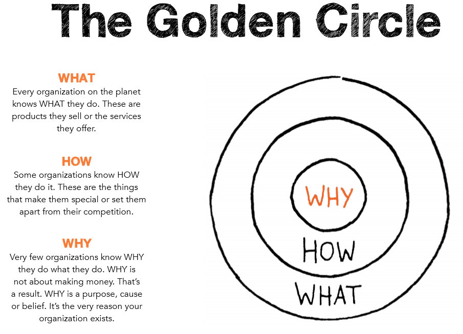

# Developing an Acquisition Strategy for Modern Software Development

## Learning Objectives

By the end of this lesson you will be able to:

* Understand key components of an acquisition strategy for modern software development
* Know the types of information, both technical and acquisition, that need to be covered in an Acquisition Strategy
* Recognize the topics that should be considered while creating the Acquisition Strategy

## Introduction
Simon Sinek’s book [_Start with Why: How Great Leaders Inspire Everyone to Take Action_](https://www.amazon.com/Start-Why-Leaders-Inspire-Everyone/dp/1591846447) articulates our starting point: **the why**.

It’s  easy to get lost in day to day tasks and lose sight of the larger picture. Fortunately for us, the DoD has a very powerful **why:** To deter war and protect the security of the United States.  _Everyone,_ regardless of their position or grade/rank _directly_ supports that mission. 

The following diagram provides context for you and your organization to better understand your missions: What, How and Why! 

 Source: [The Golden Circle](http://www.humanbusiness.eu/start-with-why/)

The software and technology industries move much faster than our current average within the acquisition timeline. New policies currently being created help enable speed - but _we need_ software acquisition professionals who support software intensive systems _to meet the demand and the scale of the DoD._ 

## Developing an Acquisition Strategy
To reiterate: an **acquisition strategy** is a comprehensive, integrated plan identifying the acquisition approach. It describes the business, technical, and support strategies managing program risks/opportunities and meeting program objectives, and communicates the relationship between acquisition phases, work efforts and key program events. Decision points, reviews, contract awards, test activities, production considerations, and operational deployment objectives are all acquisition phases or events that fall under an acquisition strategy.

The DoD is complex. Depending on your choice, there are different statutory and regulatory compliances you must meet. Since covering every possible scenario is not possible here, instead we will discuss acquisition strategy elements common to software-intensive programs.

The [2019 OUSD for Acquisition and Sustainment (A&S) Software Acquisition Strategy: Agile Guidance](https://www.dau.edu/cop/it/DAU%20Sponsored%20Documents/Software%20Acquisition%20Strategy%20Agile%20Guidance.pdf) calls for a software acquisition strategy that considers the following:

### 1. Software is Never Done
Think of software acquisition as _**continuous**_ engineering. Software never reaches a stable end state- instead, prioritize accommodating continual fixes, upgrades, and new capabilities. 

### 2. Code delivery should be a non-event
This is a process that _should occur often_. By relying on iterative cycles and continuous integration/continuous delivery (CI/CD), delivering code early and often refines the conception and implementation of needed capabilities over time.

### 3. Technology can help reduce the burden of documentation
Avoid heavyweight documentation that provides a false sense of feasibility. Instead, move in favor of constant monitoring and fast, evidence-based feedback.

Remember, not all documentation has to be manual. Code can be dual purpose, also serving as documentation.

### 4. Incorporate the _whole_ team early and often
By working to include your entire time on decisions and projects from the jump, you successfully “shift left” accreditation and test and evaluation (T&E) activities, while engaging with important stakeholders upfront and throughout the acquisition process. In order for the acquisition strategy to exemplify a culture of inclusion, it must also address key functional areas such as:
* test and evaluation,
* risk management,
* funding,
* contracting,
* acquisition approach, etc.

Just as in your personal life, the Government plans with an eye toward reducing risk, specifically the risk of buying the wrong solution. Furthermore, documentation plays an important role here. It’s easy to forget why a choice is made, and we have all witnessed the turnover of personnel due to military movements, promotions, relocation, etc.

### !callout-success

## Takeaway: 

You can’t control personnel turnover. What you can mitigate is the loss of knowledge and data. Prioritizing documentation not only provides your team with historical data about planning and past decisions, it allows you to on-board new personnel and easily tell the evolution or ‘story’ of your program.

### !end-callout

### !challenge

* type: checkbox
* id: 403c933b-4a30-4c48-be69-9839063a7f84
* title: Acquisition Approaches
<!-- * points: [1] (optional, the number of points for scoring as a checkpoint) -->
<!-- * topics: [python, pandas] (optional the topics for analyzing points) -->

##### !question

You can mitigate the loss of knowledge and data through thorough program and software documentation. In what ways can this kind of documentation help retain knowledge and data within the program office?  

##### !end-question

##### !options

* Provide historical data
* Consumes the way you run your program and is too prescriptive
* Tells the evolutionary story of your effort 
* Code can be documentation and serve a dual purpose
* Always is a manual collection process 

##### !end-options

##### !answer

* Provide historical data
* Tells the evolutionary story of your effort 
* Code can be documentation and serve a dual purpose

##### !end-answer

<!-- other optional sections -->
<!-- !hint - !end-hint (markdown, hidden, students click to view) -->
<!-- !rubric - !end-rubric (markdown, instructors can see while scoring a checkpoint) -->
<!-- !explanation - !end-explanation (markdown, students can see after answering correctly) -->

### !end-challenge

## Standard Acquisition Strategy Elements

**Note**: Don’t be alarmed if this seems like a lot of information. Many of these areas are focused on technical aspects of your program. We list many components in this section, and it might feel overwhelming. Stick with us - planning doesn’t take years even if it feels like it might with all this information. Not everything has to be defined on Day One!

 

Don’t forget: An acquisition team has team members with both technical- and acquisition-related expertise in several areas. 

### !callout-success
## Takeaway:
Over time, you will need to define the elements of an acquisition strategy, remember this is a living document. Plans and strategies should be updated!
### !end-callout

When crafting your Acquisition Strategy, it is essential to consider these key elements. 

|Acquisition Strategy Component|What It Should Address for Software Development|
|---|---|
|**Acquisition Approach**| <ul><li>AAF pathway selection and tailoring of acquisition processes to adopt modern software development practices (e.g., Lean, Agile, DevSecOps).</li><li>Dependencies between parallel or concurrent AAF pathways</li><li>Software solution(s) (COTS, custom software, COTS + custom software)</li><li>Hardware and software dependencies</li><li>Opportunities for innovation solutions</li></ul> |
|**Architecture**| <ul><li>How the program enables a modular open systems approach that is interoperable with required systems</li></ul>|
|**Contracting Strategy**|<ul><li>Modular contracting strategy for software solutions, _can_ lower the barrier to entry for companies and small businesses to allow programs to more frequently identify innovative technical solutions</li><li>Performance in an Agile context, and protecting intellectual property while giving the Government access to source code needed to scan for issues in a DevSecOps environment</ul></li> |
|**Cost and Funding**|<ul><li>Program funding levels by year, for at least the following two years</li><li>If applicable, discuss funding to be provided across multiple appropriations categories, and if that aligns with the program roadmap</li></ul> |
|**Cybersecurity**|<ul><li>Recurring assessment of the supply chain, development environment, processes and tools, continuous automated cybersecurity test, and operational evaluation to provide a system resilient to offensive cyber operations</li></ul> |
|**Intellectual Property**|<ul><li>Strategy ensuring government will have access to (not necessarily ownership of) the source code to support future analysis and use</li></ul>|
|**Metrics**|<ul><li>Minimum set of high-level metrics for the program addressing frequency of quality software is delivered to operation, user satisfaction, and delivered quality</li><li>How the metrics will be used to identify risks that need to be managed</li></ul>|
|**Operational Mission**|<ul><li>Expected operational mission of the program, in terms of an initial set of features planned</li><li>Identifies the user(s) and indicates how the program fits into current and future integrated architectures</li></ul>|
|**Product Support Strategy**|<ul><li>Ensuring life cycle supportability using an approach that recognizes software systems will typically continue to evolve over time, without a hard and fast separation between acquisition and sustainment</li></ul>|
|**Program Resourcing**|<ul><li>Existing gaps, in terms of bringing sufficient expertise in modern software practices into the team, and a plan for filling those gaps in a way that scales up realistically (e.g., leveraging expertise available from the enterprise, or contracting for consulting, coaching, or training)</li><li>Based on skills and expertise, identify if the program will pursue a government-led or contractor-led development effort</li></ul>|
|**Requirements Management**|<ul><li>Approach to managing requirements that enables Agile software development, with particular attention to the relationship between the roadmap and requirements development</li><li>Approach to adapting pre-defined or legacy requirements to reflect changing user needs or an evolving understanding of the system</li><li>How the work to be done will be managed and prioritized by factors such as user need, risk, cost, time required</li></ul>|
|**Risk-based business and technical management approach**|<ul><li>Approaches to rapidly and iteratively delivering software capabilities balanced against quality, security, intelligence threats, system safety, performance, and other factors</li><li>Mechanism by which risk management aligns with the program roadmap</li></ul>|
|**Schedule Interdepencies**|<ul><li>Technical and/or organizational interdependencies between the program and other programs with activity on the critical path</li><li>Intersections with other organizations that own interfaces, systems, authorities, funding, required-by dates, and impacts to software delivery</li></ul>|
|**Statutory & Regulatory Compliance**|<ul><li>Applicable to selected AAF pathway and tailored as allowable for software development</li></ul>|
|**Test Strategy**|<ul><li>Plan for validating software quality, integration and automation of testing, along with planned test platforms, resources, and infrastructure coordinated with the test and evaluation community</li></ul>|
|**Threat Assessment**|<ul><li>Threat assessment in relation to the capabilities and/or operational concepts the system will support</li></ul>|

While the above items reference some software-related items, they are really general programmatic guidelines that must be considered for all acquisition programs.

Next, let’s take a closer look at the elements of an acquisition strategy that are specific to software development or software-intensive acquisitions: 

## Software Development Unique Specific Strategy Elements

|Acquisition Strategy Component|What It Should Address for Software Development|
|---|---|
|**Agile Software Development Methodology**|<ul><li>Selected Agile methodology or framework (e.g., Agile Scrum, Scrum of Scrums, Xtreme Programming, Scaled Agile Framework) or considerations that will influence the choice</li><li>If multiple teams using different methodologies, how program will ensure that the teams will be able to operate effectively within the enterprise</li></ul>|
|**Design Considerations**|<ul><li>Technical vision for the software, and approach to design: brownfield, greenfield, or a hybrid software development</li><li>Major architectural challenges expected, and strategy for working through them</li></ul>|
|**Minimum Viable Product (MVP)**|<ul><li>Strategy for achieving the first deployment of operational software</li><li>Strategy for additional deployments of working software after MVP and how frequently working software will be delivered</li><li>Strategy for engaging required T&E and certification authorities in a timeframe that allows for the desired deployment of MVP and ongoing functionality</li></ul>|
|**Tech Stack**|<ul><li>Fundamental technical decisions related to Cloud usage, networking, and the establishment of environments for software development, integration, and deployment (DevSecOps)</li><li>Approach to acquiring a new or adopting an existing technical infrastructure for the development and deployment environment and DevSecOps tool pipeline (IaaS, PaaS, SaaS, PaaS)</li></ul>|
|**Roadmap**|<ul><li>How often to deliver working software to operational users, based on a cadence that is appropriate to meet user needs.</li><li>Overall approach for managing iterative software development, showing how the software iterations fit with any constraints from interfacing systems or hardware dependencies.</li><li>How detailed requirements to be prioritized and developed with user involvement while ensuring progress toward implementing the high-level features needed.</li><li>Align and integrate with development and fielding for the systems in which software is embedded</li></ul>|
|**Software Transition Strategy (as applicable)**|<ul><li>Plan to transition software to a different organization (e.g. a DoD Lifecycle Software Center), including complete software technical baseline, including all software capability descriptions (e.g. features, story points, use cases, etc.), all as-built architecture and design products, traceability products, interface definitions including interfaces to proprietary software elements, and any other requisite documentation</li></ul>|
|**User Engagement**|<ul><li>How the program will engage end users and represent the user community and receive continuous feedback throughout the acquisition and development lifecycles</li></ul>|
|**Value Statement**|<ul><li>Value proposition of the capability to be provided (whether the business value or value to the warfighter) that suggests measurable outcomes independent of specific, low-level requirements</li><li>System characteristics driven by interoperability and/or joint integrated architectures, capability areas, or system-of-systems</li></ul>|

These two tables provide a high level overview of a multitude of topics that you should consider when creating your acquisition strategy. Some will fall more into the wheelhouse of your technical team, but your acquisition team should have an awareness and at a minimum a basic understanding of **all** items considered when creating your acquisition strategy. 

### !challenge

* type: multiple-choice
* id: 265a9a2f-30aa-49c9-9ed5-812e6c2c8baa
* title: Comparing Acquisitions
<!-- * points: [1] (optional, the number of points for scoring as a checkpoint) -->
<!-- * topics: [python, pandas] (optional the topics for analyzing points) -->

##### !question

Which answer is least applicable for this scenario?
A software development effort for a new business system category (BCAT) Enterprise system solution following the Defense Business Systems (DBS) pathway.

##### !end-question

##### !options

* Threat Assessment
* Requirements Management
* Architecture
* Product Support Strategy

##### !end-options

##### !answer

* Threat Assessment

##### !end-answer

<!-- other optional sections -->
<!-- !hint - !end-hint (markdown, hidden, students click to view) -->
<!-- !rubric - !end-rubric (markdown, instructors can see while scoring a checkpoint) -->
<!-- !explanation - !end-explanation (markdown, students can see after answering correctly) -->

### !end-challenge

### !callout-success
## INSERT TITLE
KEY TAKEAWAYS: DEVELOPING AN ACQUISITION STRATEGY FOR MODERN SOFTWARE DEVELOPMENT
* Acquisition strategies for Software Intensive Programs vary based upon the context of that specific program but they all have _some_ similar key elements:
    * Software is Never Done
    * Code Delivery should be a non-event
    * Technology can reduce the burden of documentation
    * Incorporate the whole team early and often
* In order for the acquisition strategy to exemplify a culture of inclusion, it must also address key functional areas such as: 
    * test and evaluation, 
    * risk management, 
    * funding, 
    * contracting, 
    * acquisition approach, etc.
* The following key areas should be considered for acquisition strategies that address Software Intensive programs.  
    * Agile Software Development Methodology
    * Design Considerations
    * Minimum Viable Product (MVP)
    * Tech Stack
    * Roadmap
    * Software Transition Strategy (as applicable)
    * User Engagement
### !end-callout

## Resources: 

* **Book:** Sinek, Simon. [_Start with Why,_](https://www.google.com/books/edition/Start_with_Why/iyw6ul1x_n8C?hl=en&gbpv=0&kptab=overview) 2009.
* **DoD Guidance:** [2019 OUSD for Acquisition and Sustainment (A&S) Software Acquisition Strategy: Agile Guidance](https://www.dau.edu/cop/it/DAU%20Sponsored%20Documents/Software%20Acquisition%20Strategy%20Agile%20Guidance.pdf) 

