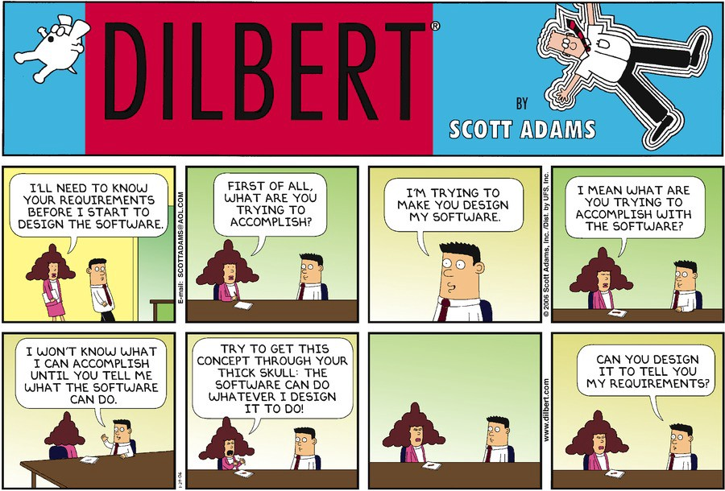
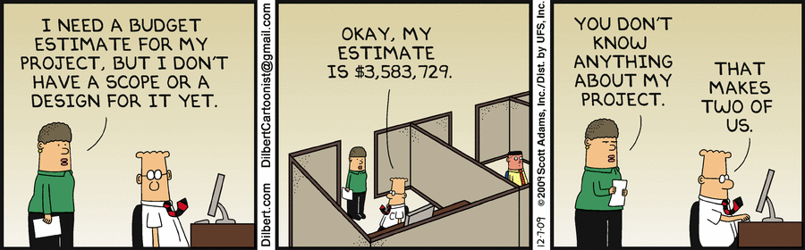

# Tactical View: The Acquisition Strategy

## Learning Objectives

By the end of this lesson you will be able to:
* Understand key components of an Acquisition Strategy for modern software development
* Recognize the types of information, both technical and acquisition, that need to be covered in an Acquisition Strategy
* Remember the topics that should be considered while creating an Acquisition Strategy

>“If you cut time on planning, you’ll likely learn the truth of Meskimen’s Law: “There’s never time to do it right, but always time to do it over.”
>
>- Larry Ashe
>
> &nbsp;

## Introduction
By now you’re probably thinking there’s a lot to consider when creating your acquisition strategy- you’re not wrong. But don’t forget: an acquisition team has team members with expertise in several different topic areas, both technical and acquisition related.

This lesson will be centered around answering this question:

 <strong>On a software-intensive program, what should I be paying extra attention to when creating an acquisition strategy?</strong> 
  

 Source: [Dilbert by Scott Adams](https://dilbert.com/strip/2006-01-29)

This field is evolving- there are no defined answers for the challenges you are facing. Instead, we’re counting on you to take the concepts we provide and build on them - carrying the field forward. **Think about what is provided here in the context of your program, your mission, and your service.**

Certain components are essential regardless of the status of your program, whether it’s an existing program of record or a new start. However, we do think there may be some differences in approach that are worth highlighting. For the remainder of the section, we will break out topics further by either existing program or new start, defined as:

|Component|Existing Program|New Start|
|---|---|---|
|**Acquisition Strategy**|Approved Acq Strategy exists, but option remains to update/ modify|In-progress, a pathway is identified but not approved|
|**Funding Available**|Yes - for year of execution and outyears (i.e. over the Future Year Defense Program (FYDP)); updating estimates annually|Minimal funding only for initial PMO - working estimate to justify FYDP|
|**Operational Capability Status**|In progress, work is on-going -- operational capability is fielded and being updated or modernized; or in development|Not available - still working initial strategy and securing funding|
|**Contract Status**|At least one contract exists (if not multiple)|Not available outside direct Program Office support|
|**IP Status**|Data rights could belong to either the contractor or government|Not determined yet| 

### !challenge

* type: checkbox
* id: 5bb88c2c-121c-4488-aa5e-96ffd3272646
* title: Acquisition Strategy
<!-- * points: [1] (optional, the number of points for scoring as a checkpoint) -->
<!-- * topics: [python, pandas] (optional the topics for analyzing points) -->

##### !question

Why does it matter whether you are an existing program or new start when discussing an Acquisition Strategy?

##### !end-question

##### !options

* It impacts the options you have -- appropriations or “colors of money”, opportunity to compete and award new contracts, data available. Applies to both programmatic decisions and IP status
* Existing program as defined above aligns to ‘brownfield’ development discussed in Module 102
* There is no difference in approach if you are a new start or existing program
* New programs are the only ones that can chose their acquisition strategy and utilize the AAF

##### !end-options

##### !answer

* It impacts the options you have -- appropriations or “colors of money”, opportunity to compete and award new contracts, data available. Applies to both programmatic decisions and IP status
* Existing program as defined above aligns to ‘brownfield’ development discussed in Module 102

##### !end-answer

<!-- other optional sections -->
<!-- !hint - !end-hint (markdown, hidden, students click to view) -->
<!-- !rubric - !end-rubric (markdown, instructors can see while scoring a checkpoint) -->
<!-- !explanation - !end-explanation (markdown, students can see after answering correctly) -->

### !end-challenge

## Funding
The DoD further defines funding by the type of work performed. For most of you, the common appropriations leveraged to support software-intensive programs include:
* Research, Development, Test and Evaluation (RDT&E)
* Procurement
* Operations and Maintenance (O&M)

Other essential rules for funding exist, but for our purposes we will focus on the following:

## 1. Don’t confuse the program phase with the funding phase.
In _software development_, we often say “_software is never done_” when referring to our work. While this is true, [DoDi 7000.14-R Financial Management Regulation (FMR)](https://comptroller.defense.gov/FMR/) defines the activity performed or dollar value invested, and aligns the work to either RDT&E, Procurement or O&M.

Always defer to your FM Support. Determinations vary across the services, or even across different Program Executive Officers (PEOs).

If you want to learn more, look at the section “Budgeting for Information Technology and Automated Information Systems” within the FMR.  

## 2. RDT&E, Production, and O&M can _all_ support software-intensive programs.

Software is referenced under all three appropriations within the Budgeting for Information Technology and Automated Information Systems in the FMR.  Again, defer to your FM Support to navigate!

The decision of what is considered appropriate use can vary. Do not assume another program is approaching it wrong or incorrectly- the FMR does leave room for interpretation!

## 3.  Utilize flexibility available reprogramming.
Remember, you have the ability to request reprogramming in the year of execution: Below Threshold Reprogramming (BTR) and Above Threshold Reprogramming (ATR). This provides flexibility if you did not estimate the perfect breakout between multiple appropriations, **and** your service is able to support movement of funds.

**For _existing programs_:**
* Your operating history will help you navigate appropriations and assist in determining what is required.
  * **Note**: you can always re-evaluate if past decision criteria is still applicable/the best criteria
* Don’t forget about reprogramming options
* If appropriations are impacting your program, create documentation explaining the impact its having and provide it to the OSD BA-8 Team to support justification of a long-term solution

**For _new starts_:**
* As a new start, typically you don’t have to navigate multiple appropriations (at least initially)
* Keep in mind the above as you continue planning

Hopefully we gave you some good news. You may have more flexibility than you thought! As always, our unofficial mantra is: ‘**it depends**’.
### Planning, Programming, Budgeting, and Execution (PPBE) Process Improvements

Navigating multiple appropriations and the overall PPBE process can be difficult. The PPBE process requires a definition of requirement two years out, and is not consistent with the speed of technology. This is one of the drivers behind the Single Appropriation for Software and Digital Technology Pilot, i.e. Budget Activity (BA) 8, or “BA-8”. Though this is not available to most programs, we want to remind you that we are working concurrently while you are updating processes and policies to best support and enable software intensive-programs. 

### !callout-info
## Single Appropriation for Software and Digital Technology “BA-8” Pilot  
BA-8 is a pilot intended to evaluate the effectiveness of having a single budget appropriation for 'Software and Digital Technology' that encompasses development, implementation, fielding and sustainment for programs selected and approved by Congress.   

This pilot exists due to feedback from stakeholders that different funding appropriations were artificially delaying and/or otherwise causing issues in years of execution for software-intensive programs.   

Currently, BA-8 is available to 8 programs. The Department requested an _additional_ 8 programs be included in FY22 and is on consideration by Congress as part of the FY22 President's Budget. There will be future opportunities to be added to the pilot in **FY23**.
### !end-callout

### !challenge

* type: multiple-choice
* id: 6fca77ca-08df-4884-8fcb-fee8f0b532a8
* title: Appropriations and SW Programs
<!-- * points: [1] (optional, the number of points for scoring as a checkpoint) -->
<!-- * topics: [python, pandas] (optional the topics for analyzing points) -->

##### !question

What appropriations can support software-intensive programs?

##### !end-question

##### !options

* RDT&E
* Procurement
* O&M
* Only RDT&E and O&M
* RDT&E, Procurement and O&M

##### !end-options

##### !answer

* RDT&E, Procurement and O&M

##### !end-answer

<!-- other optional sections -->
<!-- !hint - !end-hint (markdown, hidden, students click to view) -->
<!-- !rubric - !end-rubric (markdown, instructors can see while scoring a checkpoint) -->
<!-- !explanation - !end-explanation (markdown, students can see after answering correctly) -->

### !end-challenge

### !challenge

* type: multiple-choice
* id: a4830144-4dff-408f-b14c-6f881940f7d2
* title: !Current utilization of multiple appropriations
<!-- * points: [1] (optional, the number of points for scoring as a checkpoint) -->
<!-- * topics: [python, pandas] (optional the topics for analyzing points) -->

##### !question

Is your software-intensive program currently utilizing multiple appropriations?

##### !end-question

##### !options

* Yes
* No
* Not Applicable

##### !end-options

##### !answer

* *

##### !end-answer

<!-- other optional sections -->
<!-- !hint - !end-hint (markdown, hidden, students click to view) -->
<!-- !rubric - !end-rubric (markdown, instructors can see while scoring a checkpoint) -->
<!-- !explanation - !end-explanation (markdown, students can see after answering correctly) -->

### !end-challenge

### !challenge

* type: paragraph
* id: 6afbb50b-e135-4dda-9c16-620e9a1181bd
* title: !Current utilization of multiple appropriations
<!-- * points: [1] (optional, the number of points for scoring as a checkpoint) -->
<!-- * topics: [python, pandas] (optional the topics for analyzing points) -->

##### !question

If you answered yes to the previous question, what is your experience navigating multiple appropriations? Is there any impact on your program? Did it impact priorities in current work? Did it impact contracts (new or contract modifications required)?

##### !end-question

##### !placeholder
Don't forget to check the top right hand corner of your screen, there will be a red notification on the bell that means the learning guides have commented or have questions on your answers. Don't miss out on opportunities to engage! 
##### !end-placeholder

<!-- other optional sections -->
<!-- !hint - !end-hint (markdown, hidden, students click to view) -->
<!-- !rubric - !end-rubric (markdown, instructors can see while scoring a checkpoint) -->
<!-- !explanation - !end-explanation (markdown, students can see after answering correctly) -->

### !end-challenge

## Cost Estimate / Cost Estimating Methodologies

 Source: [Dilbert by Scott Adams](https://dilbert.com/strip/2009-12-07) 

We acknowledge that estimating is challenging for everyone involved. We are inherently optimistic in our estimates- there are studies that prove this if you don’t believe us!

All approaches to cost estimation still apply: analogy, parametric, engineering, and actuals. Similarly, what data you can use is highly dependent on what stage of the program you are in. Utilize your **cost team or cost support**. They can help you navigate, and have access to data from other programs.

As always, the best data is your own. Team composition, capability, mission, and deployment environment can all greatly impact costs. Don’t have your own data? Don’t worry- this is one of the benefits of starting small with contracts, scope, and number of products/fielding locations -- it allows you to collect data!

That being said, we know you need to justify funding levels over the Fiscal Years Defense Program (FYDP) and life-cycle.

**For _existing programs_**:
* Transition to your program actuals as soon as you have data. Program mission, deployment environment/classification, and skillset required drastically impact cost and schedule
* If you don’t have enough data or only have previous estimate data, use that as initial input
* If you are replacing a **currently fielded capability**, ensure you overlap both existing and new baseline availability as one is phased out and the other is introduced. Without it, there is an increased risk to users of no capability or less capability.

**For _new starts_**:
* A potential strategy for initial years is to use some of the funding/timeline typically budgeted for Analysis of Alternatives. With an average of two years and $5M, the goal should be working software at the end. Use this time to build up your team’s foundational understanding of DevSecOps, then build product(s)
* Another potential strategy is not to focus so heavily on the type of software approach: use our previous data ‘waterfall programs’ to help create initial estimates, then iterate!

Things to be cautious of or keep in mind (for all programs):
* **Scaling too quickly.** Keep in mind that doubling your budget = doubling your portfolio, which is a high rate of scale even by industry standards. Once begun, it can be very difficult to maintain.
* **Constraints foster innovation.** This applies where constraints can be defined as lack of funding or accelerated delivery timelines 

### !challenge

* type: multiple-choice
* id: 6bd08d65-43b7-4d02-b323-044a8d497fc8
* title: !SW Cost Estimating
<!-- * points: [1] (optional, the number of points for scoring as a checkpoint) -->
<!-- * topics: [python, pandas] (optional the topics for analyzing points) -->

##### !question

Is creating and defending a cost-estimate difficult for your software-intensive program when using modern software development practices (i.e. Agile, Scrum, DevSecOps, etc.)?

##### !end-question

##### !options

* Yes
* No
* Not Applicable - not currently supporting a software-intensive program

##### !end-options

##### !answer

* *

##### !end-answer

<!-- other optional sections -->
<!-- !hint - !end-hint (markdown, hidden, students click to view) -->
<!-- !rubric - !end-rubric (markdown, instructors can see while scoring a checkpoint) -->
<!-- !explanation - !end-explanation (markdown, students can see after answering correctly) -->

### !end-challenge

### !challenge

* type: paragraph
* id: b3e441b3-57ef-43c7-97d2-0d8f65640fe5
* title: !SW Cost Estimating
<!-- * points: [1] (optional, the number of points for scoring as a checkpoint) -->
<!-- * topics: [python, pandas] (optional the topics for analyzing points) -->

##### !question

If you answered yes to the question above, what specifically is difficult regarding defending your software-intensive program cost estimate? Or alternatively, are there any strategies that have been successful?

##### !end-question

##### !placeholder
Don't forget to check the top right hand corner of your screen, there will be a red notification on the bell that means the learning guides have commented or have questions on your answers. Don't miss out on opportunities to engage! 
##### !end-placeholder

<!-- other optional sections -->
<!-- !hint - !end-hint (markdown, hidden, students click to view) -->
<!-- !rubric - !end-rubric (markdown, instructors can see while scoring a checkpoint) -->
<!-- !explanation - !end-explanation (markdown, students can see after answering correctly) -->

### !end-challenge

## Contracts

While acquisition strategies do not need to specifically detail particular contract types (those are detailed in your Acquisition Plan), you should be thinking about shifting contracting left, much like when we say to ‘shift testing left’.

Here are some things to keep in mind when getting started. 

### 1. Determine overarching strategy: Government-led or contractor-led development
Remember, you can always change your strategy later, but this greatly impacts your approach and specific contract vehicles. Work with your **contracting team** to navigate and utilize the FAR. 

### 2. Implement modular contracting
Not only is it IT preference as identified in the FAR, but the principles of Agile software development are consistent with modular contracting as well.

As defined by [48 CFR § 39.002](https://www.law.cornell.edu/cfr/text/48/39.002), **modular contracting** is the use of _one or more contracts_ to acquire information technology systems. This reduces program risk by decreasing dependency on one vendor, or one vendor and their chosen sub-contractors.

For more information, review FAR Part 39 “Acquisition of Information Technology”, or stay tuned for the next lesson! 

### 3. Continuous contracting approach
By continually supporting market research and awarding new contracts, we are well-positioned to be flexible and responsive to the changing environment. This means no more “big bang” single contract awards. A contract award is **not** the end, it’s the beginning. 

**For existing programs:**
* Evaluate your current awarded contracts first and understand contract deliverables and data rights/IP to determine how to incorporate modular contracting

**For existing programs _and_ new starts:**
* Start small in contract scope and ceiling when trying new vehicles and incentive structures
  * Utilize shorter periods of performance on base and options
    * **Example:** Base: 6 months; Options: 3-6 months each

### !callout-info
## Potential strategy:
Utilize ‘contracting test scripts’ to document goals of contract. This serves as documentation, creates plain language to help communicate across functional roles and stakeholders, and can be utilized for future contracts and modifications based on what you learn. Similar to writing a test before writing code, before we write a whole contract with deliverables we can use this concept to easily document our intent and goals. Some examples:

* We believe allowing for telework/remote work we will gain access to a wider talent base
* We believe by allowing contractors to phase in support, we will receive more responses from both large and small companies

### !end-callout

To be clear, the details of your modular contracting strategy do not need to be 100% defined and documented in your Acquisition Strategy. Your acquisition strategy, contracting strategy, and acquisition plan do not have to be completed separately or treated as serial discrete activities.

Don’t worry if you have questions regarding contracting strategy details. We cover more in the upcoming lesson! 

### !challenge

* type: checkbox
* id: 9a28909e-be12-4ee6-b904-24dc8f271552
* title: Modular Contracting
<!-- * points: [1] (optional, the number of points for scoring as a checkpoint) -->
<!-- * topics: [python, pandas] (optional the topics for analyzing points) -->

##### !question

Modular contracting is an appropriate strategy for software intensive programs because

##### !end-question

##### !options

* It decreases risk by decreasing dependency of success on a single vendor (or single vendor and subcontractors)
* It allows the program to be most responsive to change
* It allows the program to target specific skills or technology
* Can accelerate review timelines to award if utilize smaller contract ceilings to remain within Simplified Acquisition Procedures
* Supports ability to optimize contracting processes, the more you award the more opportunities to learn and improve 

##### !end-options

##### !answer

* It decreases risk by decreasing dependency of success on a single vendor (or single vendor and subcontractors)
* It allows the program to be most responsive to change
* It allows the program to target specific skills or technology
* Can accelerate review timelines to award if utilize smaller contract ceilings to remain within Simplified Acquisition Procedures
* Supports ability to optimize contracting processes, the more you award the more opportunities to learn and improve

##### !end-answer

<!-- other optional sections -->
<!-- !hint - !end-hint (markdown, hidden, students click to view) -->
<!-- !rubric - !end-rubric (markdown, instructors can see while scoring a checkpoint) -->
<!-- !explanation - !end-explanation (markdown, students can see after answering correctly) -->

### !end-challenge

### !challenge

* type: multiple-choice
* id: 2e536774-ea3e-11eb-9a03-0242ac130003
* title: !Modular Contracting
<!-- * points: [1] (optional, the number of points for scoring as a checkpoint) -->
<!-- * topics: [python, pandas] (optional the topics for analyzing points) -->

##### !question

Does your current (or previous) software intensive program utilize a modular contracting strategy?

##### !end-question

##### !options

* Yes; my _current_ program is utilizing a modular contracting approach
* Yes; my _previous_ program is utilizing a modular contracting approach
* No
* No; a modular contracting approach is currently not viable for our software-intensive capability
* Not Applicable - not currently supporting a software-intensive program

##### !end-options

##### !answer

* *

##### !end-answer

<!-- other optional sections -->
<!-- !hint - !end-hint (markdown, hidden, students click to view) -->
<!-- !rubric - !end-rubric (markdown, instructors can see while scoring a checkpoint) -->
<!-- !explanation - !end-explanation (markdown, students can see after answering correctly) -->

### !end-challenge

### !callout-info
## FY21 NDAA Sec. 834
Another pilot that is on-going that is evaluating opportunities to improve the Department’s processes and align to modern software development is the FY21 National Defense Authorization Act (NDAA) [**Sec. 834. Pilot program on the use of consumption-based solutions to address software-intensive warfighting capability.**](https://www.congress.gov/bill/116th-congress/house-bill/6395/text)  
### !end-callout

## Data
We know we have covered a lot here, but stay with us. We are on the last section: data- and data matters.

Software-intensive acquisitions are **substantially impacted by contractual arrangements for data rights** between contractors and the Government. For this reason, data must be considered when creating your Acquisition Strategy.

The specific details of your approach to data will be outlined in your Acquisition Plan and resultant contracts, but the topic needs to be considered at the Acquisition Strategy phase. 

### !callout-secondary
## Definitions
[FAR 27.401](https://www.acquisition.gov/far/subpart-27.4) defines data in the following ways:   
* **Data:** Recorded information, regardless of form or the media on which it may be recorded. The term includes technical data, and computer software. The term does not include information incidental to contract administration, such as financial, administrative, cost/pricing, or management information.
* **Form, fit, and function data:** In the context of computer software - data identifying source, functional characteristics, and performance requirements, specifically excluding software-related source code, algorithms, processes, formulas, and flow charts.
* **Restricted computer software:** Computer software developed at _private expense_ that is defined as:
  * A trade secret
  * Commercial, financial and confidential, or privileged, or
  * Is copyrighted computer software, including minor modifications of computer software.
* **Unlimited rights:** The rights of the Government to use, disclose, reproduce, and prepare derivative works. The government may distribute copies of those derivative works to the public, perform and/or display them publicly in any manner and for any purpose, and direct or permit others to do so.
### !end-callout

### !challenge

* type: multiple-choice
* id: 16a77ffd-bd72-4c58-b91d-49cc4b35f581
* title: Definition Check
<!-- * points: [1] (optional, the number of points for scoring as a checkpoint) -->
<!-- * topics: [python, pandas] (optional the topics for analyzing points) -->

##### !question

Government has rights to use, disclose, reproduce, prepare derivative works, distribute copies to the public, and perform publicly and display publicly

##### !end-question

##### !options

* Unlimited Data Rights
* Form, Fit, and Function
* Data
* Restricted Computer Software

##### !end-options

##### !answer

* Unlimited Data Rights

##### !end-answer

<!-- other optional sections -->
<!-- !hint - !end-hint (markdown, hidden, students click to view) -->
<!-- !rubric - !end-rubric (markdown, instructors can see while scoring a checkpoint) -->
<!-- !explanation - !end-explanation (markdown, students can see after answering correctly) -->

### !end-challenge

### !challenge

* type: multiple-choice
* id: 6d8c0718-48d9-44cc-be8e-8b77b4885e3b
* title: Definition Check
<!-- * points: [1] (optional, the number of points for scoring as a checkpoint) -->
<!-- * topics: [python, pandas] (optional the topics for analyzing points) -->

##### !question

Software developed at private expense or is a trade secret is:

##### !end-question

##### !options

* Unlimited Data Rights
* Form, Fit, and Function
* Data
* Restricted Computer Software

##### !end-options

##### !answer

* Restricted Computer Software

##### !end-answer

<!-- other optional sections -->
<!-- !hint - !end-hint (markdown, hidden, students click to view) -->
<!-- !rubric - !end-rubric (markdown, instructors can see while scoring a checkpoint) -->
<!-- !explanation - !end-explanation (markdown, students can see after answering correctly) -->

### !end-challenge

### Data Rights in Acquisition Strategies
While definitions and contract data rights may seem straightforward, there are many issues to consider when deciding who (contractor or Government) gets what type of rights to what data in any particular contract. The clauses and alternates associated with this FAR part provide a variety of arrangements and tailoring.

If you’re thinking: _”cut to the chase, what data rights do I need in software development?”_ you might be disappointed by our response. The answer is, once again, **“it depends.”**

The FAR provides a variety of arrangements that can be tailored to support Government and contractor interests, given the particular circumstances of any software-intensive acquisition.

While historically the Government prefers to retain complete license to data, the potential for applying work, in whole or in part, to commercial markets is a powerful incentive for commercial contractors to engage on Government contracts. This point is so important that it is stated in the FAR: “...agencies shall balance the Government’s needs and the contractor’s legitimate proprietary interests.” (FAR 27.402(b))

The fate of your program (beyond the term your acquisition strategy covers), can be sealed with how you approach data in the beginning. While specific details (such as what FAR clauses on data will be included) will not be detailed in your acquisition strategy, it is certainly a topic to consider and plan for. 

### !callout-info
## Takeaway
Notice how many times we referenced multiple roles within an acquisition team--finance, cost, and contracting were all discussed here. Use your team to navigate and adapt the components of the acquisition strategy to meet the specific needs of your program.

### !end-callout

### !callout-success
## KEY TAKEAWAYS: TACTICAL VIEW: THE ACQUISITION STRATEGY
* Software is referenced under all three appropriations--RDT&E, Procurement and O&M--within the _Budgeting for Information Technology and Automated Information Systems_ in the FMR.  As part of a true balanced team **pull your FM support in early and often to navigate!** 

* Starting small and learning can be an incredible part of your strategy _especially_ when it comes to **cost estimation**. _It allows you to collect data!_ 

* Shifting contracting left, similar to the recommendation ‘shift testing left’. **Your Contracting team should also be involved early and often!** Here are some strategies you can employ to accomplish this: 
  * Determine overarching strategy for Government-led or Contractor-led
  * Implement Modular Contracting
  * Continuously evolve contracting approach
  * Don’t forget to frequently update Market Research
### !end-callout

## Resources:
* **Websites:**
  * [48 CFR § 39.002](https://www.law.cornell.edu/cfr/text/48/39.002)
  * [DoDi 7000.14-R Financial Management Regulation (FMR)](https://comptroller.defense.gov/FMR/)
  * [FAR 27.401](https://www.acquisition.gov/far/subpart-27.4)
  * [FY21 NDAA Sec. 834. Pilot program on the use of consumption-based solutions to address software-intensive warfighting capability.](https://www.congress.gov/bill/116th-congress/house-bill/6395/text)
