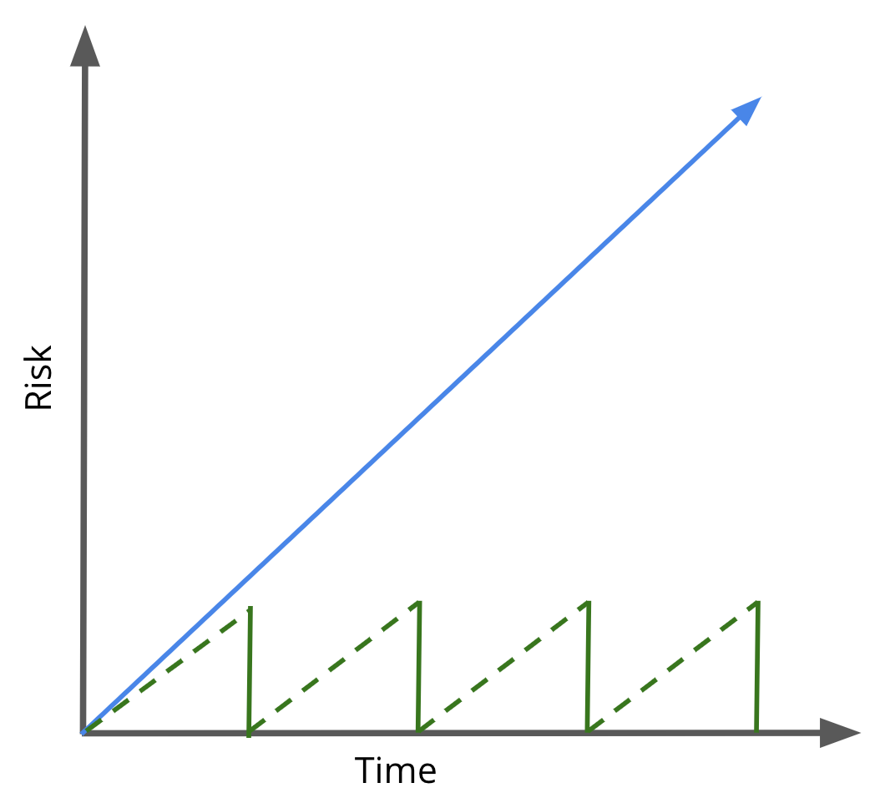
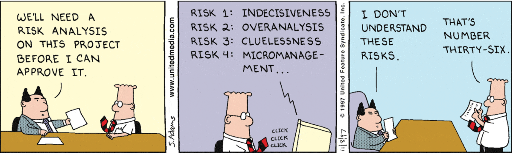
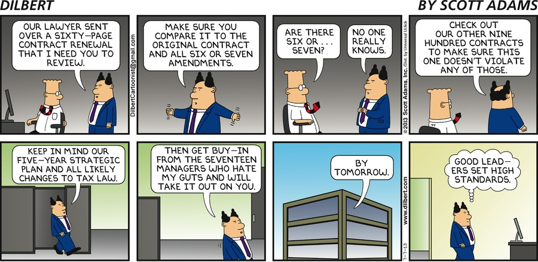

# Modular Contracting: Contract Strategies for Software-Intensive Programs

## Learning Objectives

By the end of this lesson you will be able to:

* Define what modular contracting is
* Know the types of strategies that can be used to employ a modular contracting strategy
* Understand the benefits of a modular contracting strategy

Even if you are not active within the contracting phase, this is important information. Remember, the goal is that the entire team has a foundational understanding. 

## Introduction

So you’ve defined your requirement and started to learn more about the marketplace, vendors, existing Government capabilities, and contract vehicles. 

What's next?

It’s time to make a more detailed **Acquisition Plan**, and define elements such as:
* Acquisition vehicle
* Contract type
* Contract Line Item Number (CLIN) structure
* Pricing structure
* Evaluation methodology, and
* Socializing your strategy with stakeholders (while obtaining approval, if required by your service policy or regulations)

Once again, the technology landscape is constantly changing, and many answers are not defined for the challenges you and your team face- but these lessons are here to guide you through how to stand up a software intensive procurement.

### !callout-info
## A note on examples and applicability…

While it is not possible to cover every possible situation, for the rest of Release 3, let’s look at things in two ways:

<ol><li>Government Led Development</li>
<li>Contractor Led Development</li></ol>

This is applicable across all topics - contract types, CLIN structures, requirements documentation format, etc.

Our examples will **not** be the only way to implement these strategies, but rather **used as a starting point** for applying these concepts to your own programs and your own challenges.

### !end-callout

### !challenge

* type: multiple-choice
* id: 8fa80859-273c-412b-b84d-e0814dc1c651
* title: Course Examples and Scenarios
<!-- * points: [1] (optional, the number of points for scoring as a checkpoint) -->
<!-- * topics: [python, pandas] (optional the topics for analyzing points) -->

##### !question

Examples and scenarios presented in this course should be used as a starting point for discussions and brainstorming within your own program offices. They should not be treated as the only way to approach acquisition strategies for software-intensive programs.

##### !end-question

##### !options

* True
* False

##### !end-options

##### !answer

* True

##### !end-answer

<!-- other optional sections -->
<!-- !hint - !end-hint (markdown, hidden, students click to view) -->
<!-- !rubric - !end-rubric (markdown, instructors can see while scoring a checkpoint) -->
<!-- !explanation - !end-explanation (markdown, students can see after answering correctly) -->

### !end-challenge

## Modular Contracting
Here’s an unfortunate, all-too-common DoD software-intensive program story:

> Your program is identified as a priority and fully funded. You spend _months, maybe even years_, gathering requirements from every end-user and stakeholder imaginable. Then, you guessed it, the scope snowballs tenfold. You dredge through an _18-month full and open-source selection_. The awarded contract outsources all risk to _one contractor_. The team is hailed as _successful for spending all funding_ ahead of schedule and arriving at the contract award phase _without protest_.
> 
> During execution, the Government gets monthly “stoplight” charts from the contractor to indicate the project is still on track for its _planned delivery/deployment in 5 years time_.
> 
> Several years later, your _entire team has changed over at least twice_ since the contract award. The traffic light charts suddenly shift from green to yellow, and eventually red. _Cost, schedule, and performance are all suffering_. **No new capability has been delivered** to the field, and finger pointing begins. 

What if we told you there’s a way to _reduce your program risk and incentivize contractor performance, all while meeting the Government’s need for timely access to rapidly changing technology_? What if we said it greatly mitigates the risk of that scenario playing out for your program, and that the approach is recommended in the FAR? 

Think it’s too good to be true? Well, the above underlined text is paraphrased from FAR 39.103 Modular Contracting, which directly implements 41 U.S.C. 2308. The FAR goes on to say **“agencies should, to the maximum extent practicable, use modular contracting to acquire major systems of information technology.”**

### !callout-success
## TAKEAWAY

Modular contracting has shared goals with modern software development:

<ol>
<li>Improvement in investment manageability and budgetary feasibility</li>  
<li>Reduction of overall risk</li>
<li>Frequent delivery of usable capabilities, providing value to customers more rapidly</li>
<li>Increased flexibility</li>
<li>Creation of new opportunities for small businesses</li>
<li>Greater visibility into contract performance</li>
</ol>

Adapted from TechFar Hub: https://techfarhub.cio.gov/

### !end-callout

## “Why should we use modular contracting?”

Modular contracting enables the team to address complex technology objectives incrementally, increasing the likelihood of obtaining success. Creating contracts directly tied to creating and delivering value will inherently shift risk that exists in monolithic contracts. 

Think back to the story shared at the start of this lesson. The program office spent countless taxpayer dollars and took over five years before realizing that value was not being delivered to the end-user. Their program was on the projection of the **blue** line in the above graph; as time went on, risk of not delivering was increasing.

Modular contracting allows your program to “buy down” risk with each contract award, demonstrated by the **green** lines in the above graph. This type of approach enables a team to **follow a feedback loop** and quickly iterate on future contract awards.

By having only one contract action directing the fate of your program, you are not reducing acquisition complexity; rather - it hides the complexity inherent in any development effort behind the veil of “only one contract.” Identifying a modular strategy decreases risk by eliminating the single point of failure, while also empowering the acquisition team to procure only what is required. 

## “What exactly *is* modular contracting?”

Modular contracting is when an acquisition overall is divided into smaller increments.  
These smaller pieces are easier to manage individually compared to one comprehensive acquisition. 

|“Traditional” Contracting Strategy|Modular Contracting Strategy|
|---|---|
|Award **one** contract Compete the following scope areas as part of one large contract:<ul><li>Sustainment of legacy software applications</li><li>Modernization of legacy software applications</li><li><ul><Li>Some greenfield, some brownfield</li></ul></li><li>Creation of new software applications supporting new requirements</li><li>On-site support for geographically separated user groups</li><li>Management of the CI/CD pipeline and responsible for obtaining ATO</li><li>All additional tools required for teams to work on software applications (COTS licenses, security tools, hardware, etc.)</li></ul>|Award **several** contracts Compared to the “traditional” column, each bullet point becomes a standalone contract<ul><li>Note, you can even take it further--some bullet points (in traditional strategy breakdown) may even be supported by more than one contract.</li><li>**Example**: software application work may be awarded on a per-application basis</li></ul> Market research is used to determine if each requirement should be competed amongst small businesses, pursued as an 8(a) contract, a traditional DoD contractor, etc.; or, if there is an existing Government capability that can be used (such as Black Pearl or Platform One).  Market research is also used to determine the best contract vehicle for each requirement (GWACs, IDIQs, BOAs, etc.)|

Hopefully it is clear this strategy can be applied to a large scope or complex system, or a smaller scope or system. As we’ll discuss shortly, the number of contracts is **not** the only factor that makes a strategy “modular.”

We will become a broken record during this Release (if we haven’t already). These examples are **not** intended to represent the **only** ways to implement modular contracting.

Modular contracting is **any** approach that divides an acquisition into smaller increments with the intended outcome being reduced program risk, incentivizing contractor performance, and meeting the Government’s need to rapidly-changing technology.

### !challenge

* type: checkbox
* id: 3aed7d7a-aafa-4ce6-a479-457bf615f524
* title: Modular Contracting
<!-- * points: [1] (optional, the number of points for scoring as a checkpoint) -->
<!-- * topics: [python, pandas] (optional the topics for analyzing points) -->

##### !question

What is the intent of modular contracting?

##### !end-question

##### !options

* Reduce program risk
* Create more paperwork
* Incentivize contractor performance
* Provide access to rapidly-changing technology

##### !end-options

##### !answer

* Reduce program risk
* Incentivize contractor performance
* Provide access to rapidly-changing technology

##### !end-answer

<!-- other optional sections -->
<!-- !hint - !end-hint (markdown, hidden, students click to view) -->
<!-- !rubric - !end-rubric (markdown, instructors can see while scoring a checkpoint) -->
<!-- !explanation - !end-explanation (markdown, students can see after answering correctly) -->

### !end-challenge

## “Other than quantity of contracts, what makes a contracting strategy “modular”?”

Strategies that divide the acquisition into smaller pieces is what makes a contracting strategy modular. Here are some common ways to achieve: 

### Period of Performance (PoP)
Long PoPs can create situations where it is more difficult for the Government to change contractors. You may want to consider changing contractors for many reasons, but most commonly due to:
* Needing to recompete a contract that has reached its natural end
* A change in requirements by the Government, or,
* Poor performance by the incumbent.

Where possible, consider limiting PoPs to six months or one year, with an overall contract length not exceeding three to five years.
_Examples:_  
* Base PoP of three months, six option PoPs of six months each, overall contract length 3 years and 3 months
* Base PoP of six months, three option PoPs of one year each, overall contract length 3 years and 6 months

Doing this builds performance incentive into the construct of the contract. The contractor controls their performance, which informs the Government decision to exercise an option or not. 

### !callout-warning
## Options
Remember, we do not want to default to exercising the ‘next option’ strategy. The goal is to have more frequent opportunities for feedback, and the **option** to change strategy or approach. This can look like re-prioritizing, increasing or decreasing support levels, and/or competing a new contract.

### !end-callout

If the contract is for product delivery, initial delivery should happen within a year (if not faster), regardless of your chosen acquisition pathway. Shorter PoPs reduce the risk of termination due to unsatisfactory contractor performance; options provide a natural exit strategy.

As we’ve noted several times in Digital DNA, software is never done. Even after three to five years of performance, you shouldn’t be surprised if you have to award another contract. Remember, the technological landscape is constantly changing! In both Government-led and contractor-led scenarios, work is required to continue enhancing the software and fixing other issues. 

### !challenge

* type: checkbox
* id: f0bdbc7f-e793-4de5-88f5-a5af5152534a
* title: PoP Modular Contracting
<!-- * points: [1] (optional, the number of points for scoring as a checkpoint) -->
<!-- * topics: [python, pandas] (optional the topics for analyzing points) -->

##### !question

What else is required to be in place for shorter periods of performance on base and option CLINs to incentivize contractor performance?

##### !end-question

##### !options

* The acquisition team must have a feedback cycle established with software practitioners and users to support continuation (exercise of next option)
* The acquisition team must be willing to not exercise the next option
* The acquisition team must have the ability to compete and establish another contract
* The acquisition team must constantly threaten to not award next option

##### !end-options

##### !answer

* The acquisition team must have a feedback cycle established with software practitioners and users to support continuation (exercise of next option)
* The acquisition team must be willing to not exercise the next option
* The acquisition team must have the ability to compete and establish another contract

##### !end-answer

<!-- other optional sections -->
<!-- !hint - !end-hint (markdown, hidden, students click to view) -->
<!-- !rubric - !end-rubric (markdown, instructors can see while scoring a checkpoint) -->
<!-- !explanation - !end-explanation (markdown, students can see after answering correctly) -->

### !end-challenge

### Scoping contracts by system or solution

Smaller contracts are easier to re-compete, easier to manage, easier to transition, and easier to identify potential points of failure. Have a clear vision of what you are buying, and **why**. Identify if your contract and the way you currently envision it is the best way to meet your needs, and explore additional options and approaches before finalizing your strategy.

Instead of thinking that the Government acquisition job is easier by awarding one massive contract, think carefully about how your contract is enabling product delivery.

Some questions to consider:
* What does success look like? And what does it **not** look like? How will contract objectives enable that success?
* Are there companies specializing in certain aspects of your requirement that may be best suited to work on solely that portion of the scope? Rely on market research to inform how you divide scope and contracts.
* Can existing Government capabilities be used? If so, should you require a contractor to deliver that same capability? Or should you partner with the other Government group to obtain that capability? (Market research includes Government capabilities, too!)
* Think about transitions for when contractors inevitably change. What contract strategy will make those transitions easier? How does the integration between product purchases and service purchases impact that transition? 

### !challenge

* type: paragraph
* id: 9aff7ec9-8be0-40f3-ba32-60e572d4378e
* title: Defend Alternative
<!-- * points: [1] (optional, the number of points for scoring as a checkpoint) -->
<!-- * topics: [python, pandas] (optional the topics for analyzing points) -->

##### !question

We have discussed at length the benefit and value of modular contracting, now defend the one-contract model and argue why it is more advantageous for your program or a software-intensive program.

##### !end-question

##### !placeholder

Sometimes the best way to learn a topic is to argue against it. We intentionally are challenging you to argue against modular contracting.

##### !end-placeholder

<!-- other optional sections -->
<!-- !hint - !end-hint (markdown, hidden, students click to view) -->
<!-- !rubric - !end-rubric (markdown, instructors can see while scoring a checkpoint) -->
<!-- !explanation - !end-explanation (markdown, students can see after answering correctly) -->

### !end-challenge

### Timing - New Acquisitions
When considering awarding multiple contracts versus one, it may seem overwhelming. But keep in mind, flexibility in award schedules is a key advantage of a modular approach: your future contract awards can **and should** take advantage of lessons learned from earlier contract awards. Furthermore, your future awards can **and should** take advantage of any changes or advancement of technology. This approach allows you to start small (in both scope, ceiling, and number of awards), and iterate and improve for future awards.

Sound familiar? Sounds pretty similar to “start small, deliver, and use feedback to learn”-  the cadence of modern software development.

### Another Strategy: Multiple Awards - Single Solicitation
Depending on program requirements, you may have situations where making multiple awards from one solicitation is advantageous to the Government.

**Example 1**: If your requirement for software developers is to work under a T&M or Labor Hour contract supporting a Government-led development team, the contractor is not on contract to deliver completed software. They are actually contracted to provide labor hours to work with the Government team, and multiple awards can be made from the same solicitation.

**Example 2**: If the program is pursuing Contractor-led development, the Government can award the development of different applications to different contractors, again from the same solicitation. Sound familiar? “Reducing duplication of work or optimizing workflows or processes” is a tenet of modern software processes, now part of the acquisition processes!

Shorter PoPs, natural contract off-ramps, and multiple contractors working in the same requirements area encourages contractors to continue performing satisfactorily. By doing this, the Government builds in performance incentives.

On the Government side, making multiple awards often enables work to be competed amongst small businesses (we all have small business goals to meet!), while simultaneously lowering award values. It also reduces the number of required Government reviews before award. 

### !challenge

* type: paragraph
* id: 6d928979-0a87-40fd-adfe-12e9a0477d37
* title: Multiple Awards
<!-- * points: [1] (optional, the number of points for scoring as a checkpoint) -->
<!-- * topics: [python, pandas] (optional the topics for analyzing points) -->

##### !question

What are some challenges that come to mind when thinking about how to create a solicitation that allows for multiple awards?

##### !end-question

##### !placeholder

##### !end-placeholder

<!-- other optional sections -->
<!-- !hint - !end-hint (markdown, hidden, students click to view) -->
<!-- !rubric - !end-rubric (markdown, instructors can see while scoring a checkpoint) -->
<!-- !explanation - !end-explanation (markdown, students can see after answering correctly) -->

### !end-challenge

### Flexible Contracting Techniques
For each contract award, Contracting Officers have flexibility to pursue contracting techniques that best facilitates the acquisition at hand. For example, the contract vehicle used (IDIQ/GWACs/BOAs/8(a)/etc.) and the contract type (FFP/T&M/etc.) can be tailored for each contract award, and the most appropriate vehicle and type can be used. 

### !challenge

* type: checkbox
* id: 29e5afef-f8af-4c03-82c2-2e52e74b299a
* title: Modular Contracting
<!-- * points: [1] (optional, the number of points for scoring as a checkpoint) -->
<!-- * topics: [python, pandas] (optional the topics for analyzing points) -->

##### !question

In what ways can your contracting strategy be considered a modular approach? Select all that apply.

##### !end-question

##### !options

* Utilizing PoPs not to exceed 3-5 years, including the use of options that are 6-12 months each
* Strategically timing future contract awards instead of awarding all work at the start of the project
* Utilizing Government capabilities where available versus 100% of work on contract for a contractor to deliver
* Encouraging the prime contractor to subcontract to various SMEs and experts
* Utilizing different contracting techniques on each contract awards, vice assuming a “one size fits all” solution

##### !end-options

##### !answer

* Utilizing PoPs not to exceed 3-5 years, including the use of options that are 6-12 months each
* Strategically timing future contract awards instead of awarding all work at the start of the project
* Utilizing Government capabilities where available versus 100% of work on contract for a contractor to deliver
* Utilizing different contracting techniques on each contract awards, vice assuming a “one size fits all” solution

##### !end-answer

<!-- other optional sections -->
<!-- !hint - !end-hint (markdown, hidden, students click to view) -->
<!-- !rubric - !end-rubric (markdown, instructors can see while scoring a checkpoint) -->
<!-- !explanation - !end-explanation (markdown, students can see after answering correctly) -->

### !end-challenge

For software-intensive projects, the pros to modular contracting when compared to a traditional approach outweigh the cons. Taking a modular approach compartmentalizes failures, mitigates the risk of failure, and brings the size of contract actions below the threshold for greater oversight. 

### !challenge

* type: paragraph
* id: 0d336f68-d6b6-4356-a74b-1445c5b4d4c0
* title: Risk
<!-- * points: [1] (optional, the number of points for scoring as a checkpoint) -->
<!-- * topics: [python, pandas] (optional the topics for analyzing points) -->

##### !question

Describe how you can use the feedback loop to improve future contract awards. What are some examples of things you can measure during the contract award and initial execution phase that can inform your next contract award strategy?

##### !end-question

##### !placeholder

##### !end-placeholder

<!-- other optional sections -->
<!-- !hint - !end-hint (markdown, hidden, students click to view) -->
<!-- !rubric - !end-rubric (markdown, instructors can see while scoring a checkpoint) -->
<!-- !explanation - !end-explanation (markdown, students can see after answering correctly) -->

### !end-challenge
