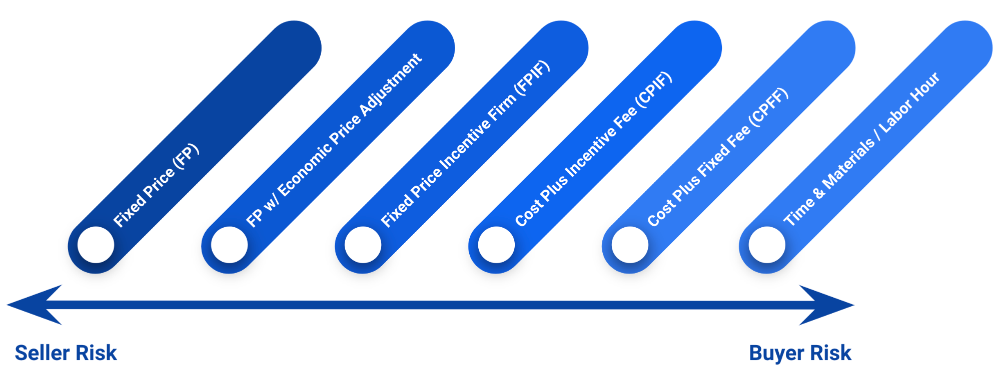
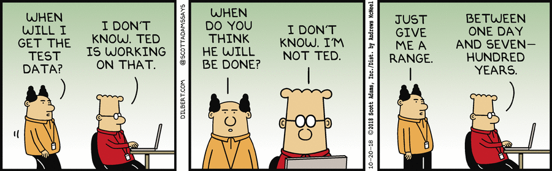

# Contract Types:  Contract Strategies for Software-Intensive Programs 

## Learning Objectives

By the end of this lesson you will be able to:

* Know the contract types best suited for software development
* Understand the driver of Government-led vs Contractor-led in choosing contract type
* Describe the most appropriate contract type 

## Introduction

We’ve covered the foundations of modular contracting. Now it’s time to move on to contract types, CLIN structures, and pricing structures. 

### !callout-danger
## DISCLAIMER:
For those that are not contracting functionals, this is still important information. For example:
* **Program Managers**: Contracts provide expectations for work performed and delivered, a thorough understanding of types of work, the deliverables, and pricing. Knowledge of this is critical to supporting overall strategy, and supporting communication across all functions.
* **Finance and Cost**: Think of all the data! Within a contract you have a ceiling value, and you will be receiving actuals for your program - remember those are the best inputs for future models.
* **Engineering/Test**: Knowledge of technical inputs and expectations, and the potential to provide feedback and inform next options or future contracts. If it’s government-led or contractor-led, you are helping to set the deliverables and scope!
**Bottom Line**: Contracts support capability delivery- how well they do that is determined by  multi-functional team involvement supporting the development and evaluation of each contract.

### !end-callout

The Government can appoint a Government employee (civilian or military) to be the Product Owner for the development effort. Sometimes the role is “Product Manager”, or another role as defined by your organizational structure - _don’t get hung up on the specific role title_.

For this lesson, we define the **Product Owner** as:

>The individual working closely with the user community and ensures project requirements:
> 1. Reflect the needs and priorities of the user community and
> 1. Align with mission objectives.
Source: [DAU Glossary](https://aaf.dau.edu/aaf/software/glossary/)

This definition applies regardless of the acquisition pathway, contract type, or whether it’s Government-led or contractor-led development work. 

### !callout-info
##As a reminder…

While it is not possible to cover every possible situation, we will continue to look at things in two ways:

<ol><li>Government-Led Development</li>
<li>Contractor-Led Development</li></ol>

This is applicable across all topics - contract types, CLIN structures, requirements documentation format, etc.

### !end-callout

## Contract Types
As always, you have options! In fact, FAR 16.103 requires sound judgment to be exercised when selecting contract type to achieve these two things - management of risk and incentivising performance.

The Contracting Officer is responsible for selecting the contract type that results in reasonable contractor risk and provides the greatest incentive for efficient and satisfactory performance.

However, while contract type is ultimately the responsibility of the contracting officer, don’t make the mistake of associating responsibility with one person or group. Contracts support capability delivery- involving your multi-functional team in supporting the development and evaluation of each contract is essential. 

### !challenge

* type: multiple-choice
* id: 2cc491df-d79c-43ff-9c27-d417586ba0e7
* title: Roles and Responsibilities
<!-- * points: [1] (optional, the number of points for scoring as a checkpoint) -->
<!-- * topics: [python, pandas] (optional the topics for analyzing points) -->

##### !question

Understanding the roles, responsibilities, and functions of other members of your team will improve overall performance and help when navigating future unknowns.

##### !end-question

##### !options

* True
* False

##### !end-options

##### !answer

* True

##### !end-answer

<!-- other optional sections -->
<!-- !hint - !end-hint (markdown, hidden, students click to view) -->
<!-- !rubric - !end-rubric (markdown, instructors can see while scoring a checkpoint) -->
<!-- !explanation - !end-explanation (markdown, students can see after answering correctly) -->

#### !explanation
Hopefully this isn't surprising. Studies have proven that understanding the individual responsibilities of your team can create empathy and support new approaches to decrease burden, i.e. improved processes. Remember, the goal is that the entire team has a foundational understanding of all aspects of acquisition.

#### !end-explanation

### !end-challenge

 Quick Rabbit Hole: Before discussing contract types, let's talk person services.

> **Personal services contracts**, as defined in FAR 37.104, are characterized by the employer-employee relationship between the Government and contractor’s personnel. The Government, unless authorized by statute, is required to obtain employees via direct hire, or other procedures required by civil service laws.
>
> A contract may be considered a personal service contract if contractor personnel are subject to continuous supervision. However, giving an order for a specific service, with the right to reject the finished product, **is not** the type of supervision or control that creates a personal services contract situation.
>
> Each contract should be evaluated on its own facts and circumstances. But _most contracts for software development **do not** fall in the personal services category_.
>
> See FAR 37.104(d) for a complete list of things to consider.
>
> **Now, back to the lesson…**

## Spectrum of Contract Type & Risk

There is no one-size-fits-all solution for contract types for software development. It didn’t work for clothes so it’s not too surprising it doesn’t work here either. The spectrum of contract types is available, from fixed price (FP) to time and materials/labor hour (TMLH).

Instead of discussing the pros, cons and best/worst use cases for each contract type, we’re going to approach the next section based on what kind of software development you are pursuing: Government-led or contractor-led development. 

## Government-Led Development
Government-led development often looks to augment current teams with additional skills. The most common contract format currently is services provided via various labor categories, not delivery of completed products.

Contractors may work alongside civilians, military members, and/or other contractors. Meanwhile, the Government product owner(s) ensure continued alignment with mission objectives across all software practitioner responsibilities, and product/infrastructure teams.

Given this approach, the most frequently used contract type is Time and Materials (T&M) or Labor Hour (LH). 

 Quick Rabbit Hole: _Why would you select T&M over LH or vice versa?_

> Choosing one or the other depends on how your program addresses ancillary material needs, such as COTS software purchases to enable software development or Cloud instances:
>
> * For larger programs with several product teams, it may make sense to provide  these tools via a different contract vehicle, managed by the Government.
> * For smaller programs with fewer application or product teams, it may make more sense to use T&M and have the contractor provide the additional tools.
>
> Now, back to the lesson… 

Via a T&M or LH contract type, the Government can procure services (for all labor categories) needed to accomplish their goals in software development. This ranges from developers and designers, to software engineers and security assessors, and anything in between.

T&M or LH may be particularly beneficial to the Government if one vendor has no direct or exclusive control over the outcome of the product - multiple contractors can come together under a blended team, or the team is a mix of civilians or military members with contractor teammates.

### !callout-success

## TAKEAWAY: Government-Led

**The Government is responsible** for ensuring the environment exists to deliver defined processes, additional tools, and the overall tech stack and software delivery pipeline (refer back to Release 2).

**NOTE**: Individual contracts can support this ability, but _Government responsibility is technical leadership and direction_ within the software practitioner responsibilities, and product and infrastructure teams.

### !end-callout

If capability is not delivered on a regular cadence, the following questions can be asked:
* Do we have all the skills required, i.e. can be filled by the Government and/or an existing contractor?
* Do we have well-defined processes?
* Do we need to re-evaluate our strategy of Government-led development?

To reiterate - Government-led does not mean we have to build it all. Remember the Pizza-as-a-Service analogy describing the differences of what you manage vs. what the vendor manages in the tech stack, like IaaS, PaaS, and SaaS?

Government-led can utilize vendor-managed services when defining their tech stack. Consult your engineering team!

T&M and LH contracts can be used with a Not-To-Exceed (NTE) ceiling. These contract types allow the contractor the flexibility to support the mission by scaling up and down as needed.

For T&M and LH contract types, contractors bill hours to the Government and the Government pays only for hours rendered. While T&M/LH requires more oversight than a FP contract, this oversight should already be happening due to the nature of Government-led software development. Since the development work is being led by the Government, much of the traditional risk of using T&M/LH, like rapidly increasing cost, is reduced due to Government oversight. 

### !challenge

* type: multiple-choice
* id: 59694db7-65e2-4dc3-b24a-5a406cb53134
* title: T&M/LH Contract Types
<!-- * points: [1] (optional, the number of points for scoring as a checkpoint) -->
<!-- * topics: [python, pandas] (optional the topics for analyzing points) -->

##### !question

While T&M or LH contract types are most frequently used for this type of work (Government-led development), what other contract type(s) can you see being successfully applied to enable software development?

##### !end-question

##### !options

* Fixed-Price Incentive Firm (FPIF)
* Fixed-Price Award-Fee (FPAF)
* Cost-Plus Incentive Fee (CPIF)
* Cost-Plus Award-Fee (CPAF)
* Cost-Plus Fixed Fee (CPFF)
* T&M and LH are most appropriate

##### !end-options

##### !answer

* *

##### !end-answer

<!-- other optional sections -->
<!-- !hint - !end-hint (markdown, hidden, students click to view) -->
<!-- !rubric - !end-rubric (markdown, instructors can see while scoring a checkpoint) -->
<!-- !explanation - !end-explanation (markdown, students can see after answering correctly) -->

### !end-challenge
### !challenge

* type: paragraph
* id: 83529d7c-dbcf-4d1d-ae70-8be6341bf0ec
* title: T&M/LH Contract Types
<!-- * points: [1] (optional, the number of points for scoring as a checkpoint) -->
<!-- * topics: [python, pandas] (optional the topics for analyzing points) -->

##### !question

If you selected other contract types above please provide a short explanation of your selected contract type(s).

##### !end-question

##### !placeholder

##### !end-placeholder

<!-- other optional sections -->
<!-- !hint - !end-hint (markdown, hidden, students click to view) -->
<!-- !rubric - !end-rubric (markdown, instructors can see while scoring a checkpoint) -->
<!-- !explanation - !end-explanation (markdown, students can see after answering correctly) -->

### !end-challenge

## Contractor-Led Development
In Contractor-led development, **the most common contract format is for delivery of completed software products, which may or may not include the tech stack (i.e. full capability to deliver)**. As a reminder, contractor-led development contractors typically work as an individual team, with the addition of the Government Product Owner - this reduces risk of drift from mission need and allows greater flexibility for change as needed.

Given this approach, a frequently used contract type is Fixed Price (FP).

Even though the development is led by a contractor, the Government is still involved with the contractor team during iteration planning and management of the product backlog. Keep in mind, the Government Product Owner is also commonly dual-hatted as the Contracting Officer’s Representative (COR). 

### !challenge

* type: multiple-choice
* id: 83513d44-545d-4356-888c-0a610ae8a79f
* title: PO = COR
<!-- * points: [1] (optional, the number of points for scoring as a checkpoint) -->
<!-- * topics: [python, pandas] (optional the topics for analyzing points) -->

##### !question

Do you agree the Government Product Owner should be dual-hatted as the Contracting Officer’s Representative (COR)?
##### !end-question

##### !options

* Yes
* No
* It depends

##### !end-options

##### !answer

* *

##### !end-answer

<!-- other optional sections -->
<!-- !hint - !end-hint (markdown, hidden, students click to view) -->
<!-- !rubric - !end-rubric (markdown, instructors can see while scoring a checkpoint) -->
<!-- !explanation - !end-explanation (markdown, students can see after answering correctly) -->

### !end-challenge
### !challenge

* type: paragraph
* id: a91633ed-ed06-4ff6-acf1-7aa52475b703
* title:  PO = COR
<!-- * points: [1] (optional, the number of points for scoring as a checkpoint) -->
<!-- * topics: [python, pandas] (optional the topics for analyzing points) -->

##### !question

Explain your answer above in one to two sentences.

What are some benefits or issues with the Government Product Owner being dual-hatted as the Contracting Officer’s Representative (COR)?

##### !end-question

##### !placeholder

##### !end-placeholder

<!-- other optional sections -->
<!-- !hint - !end-hint (markdown, hidden, students click to view) -->
<!-- !rubric - !end-rubric (markdown, instructors can see while scoring a checkpoint) -->
<!-- !explanation - !end-explanation (markdown, students can see after answering correctly) -->

### !end-challenge

Under a Fixed Price contract type, the Government must ensure the definition of “done” is clear, comprehensive, and objective.

Unlike FP contracts you have seen previously, **the definition of “done” is not defined in the contract**. Instead, contracts will contain items such as product vision, length of sprints and iterations, technical requirements for integration into other systems, and security requirements. The** definition of “done” is instead established post-award**, at the beginning of each sprint or iteration.

The definition of “done” in this context should always mean that working software has been produced, meeting the criteria the Government has defined (i.e. documented, tested, verified, releasable). “Done” should also require that the application is available to end-users. The “done” that is established post-award is what work will be accomplished in each sprint or iteration.

Think back to Release 2 and how software work is planned. You are not awarding a contract with a predefined list of features and software capabilities. The team needs to work through discovery and framing, user interviews, etc., to be able to plan the backlog and start working on the software.

Given their involvement with the contractor team, your COR will be instrumental in defining what “done” will look like for each sprint or iteration.

### !challenge

* type: multiple-choice
* id: 33adf4ba-1ba1-4eb5-918a-3d8c921c31be
* title: FP Contract Type
<!-- * points: [1] (optional, the number of points for scoring as a checkpoint) -->
<!-- * topics: [python, pandas] (optional the topics for analyzing points) -->

##### !question

While the FP contract type is frequently used for this type of work (Contractor-led development), what other contract type(s) can you see being successfully applied to enable software development?

##### !end-question

##### !options

* Fixed-Price Incentive Firm (FPIF)
* Fixed-Price Award-Fee (FPAF)
* Cost-Plus Incentive Fee (CPIF)
* Cost-Plus Award-Fee (CPAF)
* Cost-Plus Fixed Fee (CPFF)
* T&M and LH are most appropriate

##### !end-options

##### !answer

* *

##### !end-answer

<!-- other optional sections -->
<!-- !hint - !end-hint (markdown, hidden, students click to view) -->
<!-- !rubric - !end-rubric (markdown, instructors can see while scoring a checkpoint) -->
<!-- !explanation - !end-explanation (markdown, students can see after answering correctly) -->

### !end-challenge
### !challenge

* type: paragraph
* id: b54129cf-e2a3-4152-9770-2f743ec2b27b
* title: FP Contract Type
<!-- * points: [1] (optional, the number of points for scoring as a checkpoint) -->
<!-- * topics: [python, pandas] (optional the topics for analyzing points) -->

##### !question

If you selected other contract types above please provide a short explanation of your selected contract type(s).

##### !end-question

##### !placeholder

##### !end-placeholder

<!-- other optional sections -->
<!-- !hint - !end-hint (markdown, hidden, students click to view) -->
<!-- !rubric - !end-rubric (markdown, instructors can see while scoring a checkpoint) -->
<!-- !explanation - !end-explanation (markdown, students can see after answering correctly) -->

### !end-challenge
