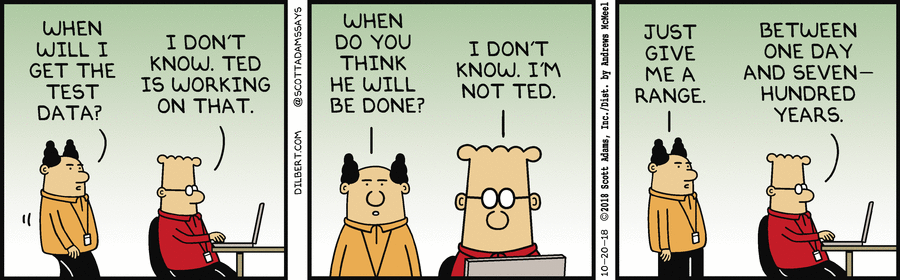

# Pt 1. Contract Strategies and Types 

## Learning Objectives

By the end of this lesson, you should be able to:

* Identify Government-led versus Contractor-led drivers when choosing a contract type
* Describe the most common applications of Firm Fixed Price (FFP), Fixed Price (FP) Incentives, and Fixed Price Level of Effort (FPLoE).

## Introduction

We’ve covered the foundations of modular contracting in previous lessons. Now it’s time to move on to contract types, Contract Line Item Number (CLIN) structures, and pricing structures. 

### !callout-danger
## Don't Forget! 
**Contracting is a great tool for you and your team, especially when aligning software practices with the Defense Acquisition System.**   

Need proof? Here are some examples: 
* **Program Managers**: Contracts provide expectations for work performed and delivered, a thorough understanding of types of work, the deliverables, and pricing. This knowledge is critical to supporting strategy and communication across all functions.
* **Finance and Cost**: Contracts have a ceiling value, and you will receive actuals from your program, which are the best input for future models. Think of the data!
* **Engineering/Test**: Contracts define technical inputs and expectations, providing the potential for feedback and informing options for future contracts. Whether government- or contractor-led, contracts set deliverables and scope!  

**Bottom Line**: Contracts support capability delivery. How well they do that is determined by multi-functional team involvement who support the development and evaluation of each contract. 

### !end-callout

The Government appoints a Government employee, either civilian or military, to be the Product Owner for development efforts. _Don’t get hung up on the title_- the role will be similar, but the title may change depending on your organizational structure. _Example: sometimes "Product Owner" and "Product Manager" are used interchangeably._ 

For this lesson, the **Product Owner** is the individual working closely with the user community to ensure that project requirements: 
> 1. Reflect the needs and priorities of the user community and
> 1. Align with mission objectives.
 Source: [DAU Glossary](https://aaf.dau.edu/aaf/software/glossary/) 

This definition applies regardless of the acquisition pathway, contract type, or whether development work is Government or contractor-led. 

## Government- or Contractor-Led Development
Your approach to Government- or Contractor-led Development influences the contract type  you might use. Phase A’s _Understanding How Software Solutions Can Be Acquired_ included questions to help inform your decision one way or the other, with a key factor being your current team’s skill set. 

Skill sets change, so this doesn’t have to be a permanent decision -- another reason _modular contracting_ is such a critical enabler! 

### !callout-info
##Keep in mind

No matter which approach is taken, the Government must work closely with the Contractor. Software and technology projects demand more frequent involvement due to increased cycle time.   

The biggest difference between Contractor- and Government-led development is who makes technical decisions and coordinates day-to-day implementation. The Government **always** has the responsibility to lead and provide strategic guidance. 
### !end-callout

### Government-Led Development
Government-led development is where Government team members, civilian and/or military, lead teams responsible for developing software, managing infrastructure, etc. The Government-led teams are often augmented with additional skills. 

Currently, services provided by various labor categories are the _most common contract,_ **not** delivery of completed custom products.

Contractors may work alongside civilians, military members, and/or other contractors. Meanwhile, the Government product owner(s) ensure continued alignment with mission objectives across all software practitioner responsibilities, and product/infrastructure teams.

> Note: We will not go into significant detail in this lesson, but more than likely your program will need to procure **Commercial Off the Shelf (COTS)** products to augment your capability, software delivery pipeline, and/or platform.

### Contractor-Led Development
During Contractor-led development, the contractors are responsible for development and delivering all aspects of the requirement/capability.  **The most common contract format is for delivery of completed software products, which may or may not include the tech stack (i.e. full capability to deliver).**

> **Remember:** This _does not_ absolve the Government of responsibility. A frequently employed strategy is embedding a Government Product Owner to work on a daily or frequent basis, with the Contractor supporting iteration planning and product backlog management.  

### !challenge

* type: checkbox
* id: 5704fd4d-ca49-45fe-96d4-aa208a9022ff
* title: Government vs Contractor Led Development
<!-- * points: [1] (optional, the number of points for scoring as a checkpoint) -->
<!-- * topics: [python, pandas] (optional the topics for analyzing points) -->

##### !question

Select the following statements that are **true**:

##### !end-question

##### !options

* The decision of government- vs. contractor-led development should be made by the team
* A program can start as contractor-led and transition to government-led development
* The decision of government- vs. contractor-led does **not** impact contract type
* Contractor-led development prevents utilization of modular contracting

##### !end-options

##### !answer

* The decision of government- vs. contractor-led development should be made by the team
* A program can start as contractor-led and transition to government-led development

##### !end-answer

<!-- other optional sections -->
<!-- !hint - !end-hint (markdown, hidden, students click to view) -->
<!-- !rubric - !end-rubric (markdown, instructors can see while scoring a checkpoint) -->
<!-- !explanation - !end-explanation (markdown, students can see after answering correctly) -->

#### !explanation
The last two statements are **false.** The decision of government- vs. contract-led does influence which contract types are more appropriate and will best support the program, by reducing risk and cost. Secondarily, contractor-led does not prevent modular contracting in fact it can help reduce risk of dependency and provide performance incentives--keep in mind that you will have to make sure the contracts appropriately address IP/data to ensure that continued flexibility!

#### !end-explanation

### !end-challenge

## Introduction to Contract Types
When selecting a contract type, it’s important to remember that you have options! So many options, in fact, [FAR 16.103](https://www.acquisition.gov/far/part-16#FAR_16_103) states that sound judgment must be exercised when selecting contract type to achieve two things: 
* _management of risk, and_ 
* _incentivising performance_.

Selecting a contract type is ultimately the responsibility of the contracting officer. _However,_ don’t make the mistake of associating responsibility with one person or functional discipline. Contracts support capability delivery - **involving your team in support of the development and evaluation of each contract is essential.**

### !challenge

* type: multiple-choice
* id: 2cc491df-d79c-43ff-9c27-d417586ba0e7
* title: Roles and Responsibilities
<!-- * points: [1] (optional, the number of points for scoring as a checkpoint) -->
<!-- * topics: [python, pandas] (optional the topics for analyzing points) -->

##### !question

Understanding the roles, responsibilities, and functions of other members of your team will improve overall performance and help when navigating future unknowns.

##### !end-question

##### !options

* True
* False

##### !end-options

##### !answer

* True

##### !end-answer

<!-- other optional sections -->
<!-- !hint - !end-hint (markdown, hidden, students click to view) -->
<!-- !rubric - !end-rubric (markdown, instructors can see while scoring a checkpoint) -->
<!-- !explanation - !end-explanation (markdown, students can see after answering correctly) -->

#### !explanation
Studies have proven that understanding the individual responsibilities of your team creates empathy and supports improved processes. The goal should be a team where every member has a foundational understanding of all aspects of acquisition. 
#### !end-explanation

### !end-challenge

 Quick Rabbit Hole:  Before discussing contract types, let's talk personal services.

> **Personal services contracts**, as defined in [FAR 37.104,](https://www.acquisition.gov/far/37.104) are characterized by the employer-employee relationship between the Government and contractor’s personnel. The Government, unless authorized by statute, is required to obtain employees via direct hire, or other procedures required by civil service laws.
>
> A contract may be considered a personal service contract if contractor personnel are subject to continuous supervision. However, giving an order for a specific service, with the right to reject the finished product, **is not** the type of supervision or control that creates a personal services contract situation.
>
> Each contract should be evaluated on its own facts and circumstances. But _most contracts for software development **do not** fall in the personal services category_.
>
> See [FAR 37.104(d)](https://www.acquisition.gov/far/37.104) for a complete list of things to consider.
>
> **Now, back to the lesson…**

**No one-fits-all** solution exists for contract types or pricing strategies for software development. It doesn’t work for clothes - it's not surprising it doesn't work for software development either.

The contract type should result in reasonable risk to both the contractor and the Government, and provide the contractor with the greatest incentive for successful performance. Sound judgment must be used by the entire team to select the most appropriate contract type.

### Contract Types
This module’s next two sections cover certain FAR contract types - the fact that we are breaking this into two sections should reinforce that there is a large number of options available to you! Those in bold are covered here:

* **Firm-Fixed-Price (FFP)**
* **Fixed Price (FP) Incentive Contracts**
* **FFP Level of Effort (LoE)**
* Cost Plus Fixed Fee (CPFF)
* Cost Plus Incentive Fee (CPIF)
* Time and Materials (T&M) or Labor Hour (LH)

If you’re concerned you won’t learn about the other contract types, don’t worry. The rest of the contract types will be discussed in the next module!

#### Firm-Fixed-Price (FFP)
As described in [FAR 16.202](https://www.acquisition.gov/far/part-16#FAR_16_202):
* Provide a contract price that is **not** subject to adjustments based on the contractor’s incurred costs while performing the contract.
  * The contractor holds **maximum risk and full responsibility** for all costs and resulting profit or loss. 
* Is the preferred contract type for the acquisition of commercial items (for exceptions, consult [FAR 12.207](https://www.acquisition.gov/far/part-12#FAR_12_207)).

##### Contractor-led FFP Contracts
While utilizing a contractor-led software development approach, FFP is a desirable contract type for pricing out deliveries of software iterations.

When creating software under an FP contract, **the definition of “done” is not defined in the contract - instead, it’s established post-award, in collaboration with the Government and at the beginning of each sprint or iteration.** Contracts instead contain items such as product vision, sprint and iteration intervals, technical integration requirements for other systems, and security requirements. 

Said another way, there will be a unique definition of “done” for each sprint or release, and that specific work isn’t known prior to contract award. _This allows your contract to be flexible to change, a critical enabler in the ever-evolving technological and adversarial environment our missions support._

 Source: [Dilbert by Scott Adams](https://dilbert.com/strip/2018-10-20) 

**Capability is not “done” until it is available to operational users, so your contract must define the _entire_ process.** To support this, the definition of “done” in this context must always be that working software has been produced that meets Government-defined criteria. Remember, done can be defined incrementally, at the sprint or iteration level. 

> _NOTE:_ Your Contracting Officer’s Representative (COR) should be instrumental in defining what “done” will look like for each sprint or iteration, and therefore the criteria for closing out a FFP CLIN item upon delivery. 

Furthermore, it is essential that you ensure your definition of “done” describes the products processes and potential relationship(s) with additional government organizations, i.e. Developmental Testing (DT) and Operational Testing (OT). Again, this emphasizes a need for active Government involvement. We can’t go into further detail here, but there are examples of government organizations receiving a Continuous Authority to Operate, or c-ATO.

##### Government-led FFP Contracts 

***FFP is not an ideal contract type for services.*** FFP is most applicable in situations where performance estimates can be reasonably identified and estimated - **not when you are procuring a recurring, severable, service such as the services required for software development activities.** While you could theoretically procure services in blocks of hours set at a FFP, that’s not realistic for execution: this does not allow any flexibility in the quantity of hours, or the mix of hours between labor categories. 

### !challenge

* type: multiple-choice
* id: 0b5b2d98-7575-45af-bdb3-70c029021206
* title: Definition of "Done"
<!-- * points: [1] (optional, the number of points for scoring as a checkpoint) -->
<!-- * topics: [python, pandas] (optional the topics for analyzing points) -->

##### !question

In FFP contracts for software development, what best describes how the contract defines what “done” is?

##### !end-question

##### !options

* The definition of “done” is established post-award during each iteration or sprint planning
* The contract defines what features need to be in each delivered iteration of software, and that list is what is required to be considered “done”
* The definition of “done” changes for each sprint or iteration, but always aligns with the predetermined set of granular features as outlined in the contract
* The product backlog should be placed on contract, separated into iterations or sprints, and utilized to determine “done”

##### !end-options

##### !answer

* The definition of “done” is established post-award during each iteration or sprint planning

##### !end-answer

##### !hint

Fixed price contracts for software development will look different than fixed price contracts you may be used to, for things such as hardware 

##### !end-hint

<!-- other optional sections -->
<!-- !hint - !end-hint (markdown, hidden, students click to view) -->
<!-- !rubric - !end-rubric (markdown, instructors can see while scoring a checkpoint) -->
<!-- !explanation - !end-explanation (markdown, students can see after answering correctly) -->

### !end-challenge

### !challenge

* type: multiple-choice
* id: 16a68b49-b213-449e-b02d-c21270aad569
* title: FFP for Government-led Development
<!-- * points: [1] (optional, the number of points for scoring as a checkpoint) -->
<!-- * topics: [python, pandas] (optional the topics for analyzing points) -->

##### !question

FFP is the best contract type selection for service contracts enabling **Government-led Development.**

##### !end-question

##### !options

* True
* False

##### !end-options

##### !answer

* False

##### !end-answer

<!-- other optional sections -->
<!-- !hint - !end-hint (markdown, hidden, students click to view) -->
<!-- !rubric - !end-rubric (markdown, instructors can see while scoring a checkpoint) -->
<!-- !explanation - !end-explanation (markdown, students can see after answering correctly) -->

### !end-challenge

### !callout-warning
## Don't Forget

Modular contracts and short periods of performance are key tools to incentivize performance, _without using incentive contracts._ By making contract award a non-event, you are positioning your program to quickly respond to change. 

### !end-callout

#### Fixed-Price (FP) Incentive Contracts:
As described in [FAR 16.204](https://www.acquisition.gov/far/part-16#FAR_16_204), a fixed-price incentive contract is:

* Allows you to adjust profit (and therefore the final contract price) by a formula as set in the contract.
  * The adjustment formula considers the costs incurred by the contractor and can also consider performance-based incentives (as described in FAR [16.402](https://www.acquisition.gov/far/part-16#FAR_Subpart_16_4)).
* Place the majority of the risk on the contractor. 
  * Based on the incentive formula, some risk is held by the Government, but the risk is capped because it's still a FP contract.

##### Contractor-led FP Incentive Contracts:

While FP Incentive contracts _may_ be a desirable contract type, there will need to be a reason to use an FP Incentive contract over an FFP contract. 

An FP Incentive contract might be used to incentivize certain performance parameters, such as: 
* Delivering the software release or sprint below the target cost
* Completing a software release or sprint ahead of schedule
* If applicable and measured correctly,  you can incentivize software performance using change failure rate and/or Mean Time to Restore (MTTR) metrics 
  * Change failure rate between 0-15% on average over time 
  * MTTR less than one hour daily
  * Refer to [Accelerate](https://itrevolution.com/book/accelerate/) or the [State of DevOps Annual Report](https://puppet.com/resources/report/2020-state-of-devops-report/) for more information

> **Caution**: When choosing an incentive, it is important to be cognizant that you may be driving the wrong behavior. 
>
> For example, incentivizing Source Lines of Code (SLOC) re-use may drive a contractor to utilize code that is not best suited for your program, and/or could create an increased sustainment burden. 
>
> **Remember:** more SLOC = more sustainment = more money. 

##### Government-led FP Incentive Contracts:

Similar to FFP contracts, FP Incentive contracts are not recommended for enabling Government-led software development.

#### Firm Fixed Price (FFP) Level of Effort (LoE)

As described in [FAR 16.207](https://www.acquisition.gov/far/part-16#FAR_16_207), FFP LoE contracts:

* Require a contractor to provide a specified level of effort over a set period of time, and in exchange the Government pays the contractor a fixed dollar amount.
* Payment is, to quote the FAR, “based on the effort expended rather than on the results achieved.”
* Payment is often calculated at the hourly labor rate with the rates pre-determined and stated on the contract.
* FFP LoE is commonly used for things such as research and development work where, even after a solid effort, the outcome may be less than desirable.

When applying FFP LoE to software acquisitions, there are a few limitations (stated at FAR [16.207-3](https://www.acquisition.gov/far/part-16#FAR_16_207_3)) that should be considered before using FFP LoE: 
* the required level of effort required by the contractor needs to be identified and agreed upon in advance, and 
* there is “reasonable assurance that the intended result cannot be achieved by expending less than the stipulated effort.” 

The LoE is most often defined and priced at the labor hour level.

### !callout-success
## Takeaway

As outlined in the FAR, the main difference in FFP LoE and Time & Materials (T&M), which we will cover in more detail in the next lesson, is how confident you are in the level of support (quantity of labor hours) you require.   

FFP LoE should not be used if the quantity of labor you require may fluctuate. _HOWEVER_ (and this is a big however), this contract type should **not** be pursued solely to avoid the approval required to use a Time and Materials contract type.

### !end-callout

##### Contractor-led FFP LoE Contracts: 
When using this development approach, you are procuring delivered software (completed software applications either with or without the tech stack). FFP LoE (priced at the hourly labor rate) is not an ideal contract type when there is an easily definable, non-severable, contract deliverable; in those cases utilizing FFP priced at the iteration level is best (see above). 

Utilizing this pricing structure when the contract requires a deliverable means that the Government would continue to pay the contractor’s level of effort (hourly labor rate) until a deliverable is received, a pricing arrangement that may not be advantageous to the Government. If your program office is in the position to constantly measure software quality, use a ceiling for total spending, and have individuals skilled to conduct these tasks, it may be appropriate. If the contractor’s work or skills are unsatisfactory then you will need to (after providing feedback and trying to rectify the situation) rely upon a built in contract “exit strategy” or terminate the contract to replace the contractor.

##### Government-led FFP LoE Contracts: 
Government-led FFP LoE may be a viable option, but, as stated above, FFP LoE has limitations, namely that it operates similarly to Time and Materials (more on those contract types later). **FFP LoE should not be used if the quantity of labor you require may fluctuate.** 

> **However,** FFP LOE contracts should _not_ be pursued solely to avoid the approval required to use a Time and Materials contract type. 

FFP LOE contracts require the Government to have a firmer grasp on requirements than when using a T&M contract. If the Government can accurately forecast how many hours are required to complete the task, this may be acceptable. However, keep in mind, this doesn’t allow for much fluctuation of support provided during contract execution. 

### !challenge

* type: multiple-choice
* id: 7112ceac-fe29-41c2-bd4d-079826dbfef4
* title: FFP LoE Applicability
<!-- * points: [1] (optional, the number of points for scoring as a checkpoint) -->
<!-- * topics: [python, pandas] (optional the topics for analyzing points) -->

##### !question

All but which of the following are indicators that your program office is able to effectively implement a FFP LoE contract for **contractor-led development**?

##### !end-question

##### !options

* The Government team has personnel available to closely surveil contractor performance
* Skillsets on your Government team include subject matter experts in various software development areas
* The Government team has a solid understanding of how much time will be required to be dedicated to contractor performance management
* The Government desires to award the contract and remain hands-off until a software product is delivered by the contractor

##### !end-options

##### !answer

* The Government desires to award the contract and remain hands-off until a software product is delivered by the contractor

##### !end-answer

<!-- other optional sections -->
<!-- !hint - !end-hint (markdown, hidden, students click to view) -->
<!-- !rubric - !end-rubric (markdown, instructors can see while scoring a checkpoint) -->
<!-- !explanation - !end-explanation (markdown, students can see after answering correctly) -->

### !end-challenge

### !callout-success
## KEY TAKEAWAYS: PT 1. CONTRACT STRATEGIES AND TYPES
A combined Key Takeaways for Pt 1 and Pt 2 Contract Strategies and Types will be provided in the _next lesson._
### !end-callout

<!-- >>>>>>>>>>>>>>>>>>>>>> BEGIN CHALLENGE >>>>>>>>>>>>>>>>>>>>>> -->
<!-- Replace everything in square brackets [] and remove brackets -->

### !challenge

* type: paragraph
* id: 7da77f1d-87e2-45d1-8c4a-e4b3b1070c00
* title: !Opt. Lesson Feedback: Contract Types
<!-- * points: [1] (optional, the number of points for scoring as a checkpoint) -->
<!-- * topics: [python, pandas] (optional the topics for analyzing points) -->

##### !question

Do you have any specific feedback, positive or constructive, regarding the content of this lesson? 

##### !end-question

##### !placeholder

Remember, this is optional - this is a way for you to provide input while working through the lesson content. 

##### !end-placeholder

### !end-challenge

<!-- ======================= END CHALLENGE ======================= -->

## Resources:
* **Previous Lesson:** (Phase A) _Understanding How Software Solutions Can Be Acquired_
* **Book:** [Accelerate: Building and Scaling High Performing Technology Organizations](https://itrevolution.com/book/accelerate/) by Nicole Forsgren, Jez Humble and Gene Kim, 2018.
* **DAU:** [DAU Glossary](https://aaf.dau.edu/aaf/software/glossary/)
* **FAR:**
  * [FAR 12.207](https://www.acquisition.gov/far/part-12#FAR_12_207)
  * [FAR 16.103](https://www.acquisition.gov/far/part-16#FAR_16_103) 
  * [FAR 16.202](https://www.acquisition.gov/far/part-16#FAR_16_202)
  * [FAR 16.204](https://www.acquisition.gov/far/part-16#FAR_16_204)
  * [FAR 16.207](https://www.acquisition.gov/far/part-16#FAR_16_207)
* **Report**: [2020 State of DevOps Report](https://puppet.com/resources/report/2020-state-of-devops-report/)

