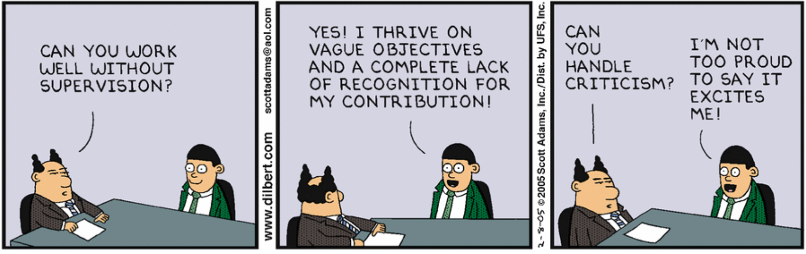

# CLINs, Documentation and More: Contract Strategies for Software-Intensive Programs

## Learning Objectives

By the end of this lesson you will be able to:

* All available payment strategies
* Correctly identify what documentation should be used to state project requirements (i.e. Performance Work Statement (PWS), Statement of Objectives (SOO), etc.)

## Introduction

Remember when we were talking about tech stacks and we showed you the Cloud Native Computing Foundation (CNCF)? You may have thought, “Look at how many options there are to choose from.”

Think of our contract vehicles/types, documentation, etc. in that context - you can use different components to make the most of your program and mission. You have options, and the better we understand the options, the greater the potential for valuable capability! 

## Contract Line Item Number (CLIN) Structures
We discussed commonly-used contract types for both Government- and Contractor-led development in previous lessons- now let’s visit the specifics of CLIN structures.

Keep in mind, these are **examples**. Our goal is to show possibilities for how a contract could be structured, not to provide mandatory requirements.

### Time & Materials / Labor Hour Contracts
Much flexibility exists when crafting CLINs for a T&M or LH contract. However, there are a few applicable constants regardless of your CLIN structure:
* Hourly labor rates are stated, or CLIN references where rates are stated in contract
* Period of performance is defined with a start and end date
* Maximum number of hours or NTE price is defined

As with several other types of T&M or LH contracts, you can group all or most of the work under one CLIN per Period of Performance (POP): 

|Contract Line Item Number|Name|Total Price|
|---|---|---|
|0001|Software Development Services Base Period|$x|
|0002|Software Development Services Option Period 1|$x|
|0003|Software Development Services Option Period 2|$x|

Or, you can group similar tasks together under the same CLIN:

|Contract Line Item Number|Name|Total Price|
|---|---|---|
|0001|Software Development Services, Base Period, Modernization of Legacy Application |$x|
|0002|Software Software Development Services, Base Period, New Application Development |$x|
|0003|Software Development Services, Option Period 1, Modernization of Legacy Application |$x|
|0004|Software Software Development Services, Option Period 1, New Application Development |$x|

In T&M or LH contracts, remember that your CLIN structure can either enable or limit flexibility during execution. If you don’t require separated funding, question the need for additional CLINs to ensure you are not creating unnecessary execution rigidity.

### !challenge

* type: paragraph
* id: b9757f07-652a-4599-bf9e-75791d9c4f80
* title: Other T&M/LH CLIN Structures
<!-- * points: [1] (optional, the number of points for scoring as a checkpoint) -->
<!-- * topics: [python, pandas] (optional the topics for analyzing points) -->

##### !question

What are other ways can you structure T&M or LH CLINs? Keep in mind the goal is flexibility and ability to adapt.

##### !end-question

##### !placeholder

Since we realize we cannot cover all alternatives (and admittedly we do not know all the alternatives) we want to use your expertise to demonstrate additional options. If valuable we could even provide as an additional resource for current and graduated students.

##### !end-placeholder

<!-- other optional sections -->
<!-- !hint - !end-hint (markdown, hidden, students click to view) -->
<!-- !rubric - !end-rubric (markdown, instructors can see while scoring a checkpoint) -->
<!-- !explanation - !end-explanation (markdown, students can see after answering correctly) -->

### !end-challenge

### Fixed Price Contracts
In a FP contract, line items might be structured by iterations (or sprints, depending on the type of Agile process used) with the unit of measure being the iteration (or sprint). Additional line items can be used for additional work outside of the iteration, if necessary.  

|Contract Line Item Number|Name|Quantity|Unit|Unit Price|Total Price|
|---|---|---|---|---|---|
|0001|Baselining Effort|20|day|$x|$x|
|0002|Iterations|50|10 day iteration|$x|$x|

This part is important and worth restating:

> Each iteration cannot possibly be defined ahead of time. However, the contract will include criteria to use for evaluating a software demonstration (i.e. documented, tested, verified, releasable). **“Done” should also include that the application is available to end-users.** The part of “done” that is established post-award is what work will be accomplished in each sprint or iteration.

### !callout-info
## Options
There are many more options! The T[ech FAR Hub’s Handbook](https://techfarhub.cio.gov/handbook/pricing/) contains additional ideas on different ways to structure CLINs for FP contracts.
### !end-callout 

### !challenge

* type: paragraph
* id: 97dd8ef7-42a7-433b-b76e-c6f36cf8f6ec
* title: Other FP Structures
<!-- * points: [1] (optional, the number of points for scoring as a checkpoint) -->
<!-- * topics: [python, pandas] (optional the topics for analyzing points) -->

##### !question

What are other ways can you structure FP CLINs? Keep in mind the goal is flexibility and ability to adapt.

##### !end-question

##### !placeholder

Since we realize we cannot cover all alternatives (and admittedly we do not know all the alternatives) we want to use your expertise to demonstrate additional options. If valuable we could even provide as an additional resource for current and graduated students.

##### !end-placeholder

<!-- other optional sections -->
<!-- !hint - !end-hint (markdown, hidden, students click to view) -->
<!-- !rubric - !end-rubric (markdown, instructors can see while scoring a checkpoint) -->
<!-- !explanation - !end-explanation (markdown, students can see after answering correctly) -->

### !end-challenge

## Requirement Documentation: Contracts
Traditionally, one of the longest and most frustrating parts of the acquisition process is requirements definition.

**NOTE**: We are referencing documentation within individual contracts here.

When supporting Agile software development, the requirements process should inherently be more straightforward, simplistic, and streamlined. Avoid volumes of paperwork - they are often not read in detail, creating issues later on.

In many cases, you may not know exactly what needs to happen at this stage of your project. In fact, you’ll likely only have a product vision. As a result it’s impossible to define all software functionality and features in a SOW or PWS. The point is, you shouldn’t- remember, technology changes. Input from users changes the need. No one can predict the future! 

### !callout-warning
## Note
_In contracts where the contractor is **not** responsible for delivery_, like T&M or LH contracts supporting Government-led development, requirements documents will likely be a Performance Work Statement (PWS) or Statement of Objectives (SOO).

_In contracts where the contractor **is** responsible for delivery_, such as FP contracts supporting Contractor-led development, requirements document will likely be a SOO.

### !end-callout 

Here’s a diagram of the three options: 

Many resources exist on the topic of SOW vs. SOO vs. PWS. Here are some that we found valuable:
* [Seven Steps to Performance-Based Services Acquisition](https://www.dau.edu/cop/pm/DAU%20Sponsored%20Documents/Seven%20Steps%20to%20Performance%20Based%20Acquistion.pdf)
* [Will a SOW, PWS, or SOO Work Best to Achieve Your Objective?](https://blogs.managementconcepts.com/2019/09/25/will-a-sow-pws-or-soo-work-best-to-achieve-your-objective/)

These approaches mean that the requirements document is structured around **the purpose of the work** to be performed with an objective assessment of contractor performance, **instead of prescribing how the work should be performed.**

When contracts are structured to focus on purpose over prescription, what does it look like?
* Contractors have flexibility to meet the Government’s performance objective (the product vision)
* Provides standard of quality that must be achieved
* Payment is only made for services that meet standards 

### !challenge

* type: multiple-choice
* id: c0251db6-6c22-4a94-b670-b5f936c40c96
* title: SOW vs SOO vs PWS
<!-- * points: [1] (optional, the number of points for scoring as a checkpoint) -->
<!-- * topics: [python, pandas] (optional the topics for analyzing points) -->

##### !question

Based on this scenario, select the best strategy for the Government to ensure valuable capability delivery.

This is your first contract incorporating DevSecOps practices into your organization. Your team has varying levels of expertise in modern Agile practices, but the majority of your personnel are new to them. You have even changed up your software practitioner team with matrixed personnel from other organizations to support contract development and evaluate proposals/awards.

Given the factors stated above, what contract requirement document would you select?

##### !end-question

##### !options

* Statement of Objectives
* Statement of Work
* Performance Work Statement

##### !end-options

##### !answer

* Statement of Objectives

##### !end-answer

<!-- other optional sections -->
<!-- !hint - !end-hint (markdown, hidden, students click to view) -->
<!-- !rubric - !end-rubric (markdown, instructors can see while scoring a checkpoint) -->
<!-- !explanation - !end-explanation (markdown, students can see after answering correctly) -->

#### !explanation
Notice the scenario highlights that the Government team is new to incorporating DevSecOps practices. Here the team would likely benefit from a contractor proposing processes and solutions, eliminating the need for the Government to determine best approach.

#### !end-explanation

### !end-challenge

## Government Oversight
Oversight and surveillance of a contractor is necessary to ensure compliance with requirements in the contract. 

### !callout-danger
## COR
The role of the COR **cannot** be understated in this process.
### !end-callout 

The document government personnel uses to assess contractor performance is the **Quality Assurance Surveillance Plan (QASP)**. QASPs are the foundation of service contracts, and should focus on objective criteria able to determine and ensure quality performance. 

### !callout-info
## Contract Review
Would you ever eat at a restaurant that served you food **and also wrote your review of their service?**

Think about it. More than likely, their review of your experience would be positive- but what if you had a horrible experience? Would you share their version with your friends and family? Probably not, right?

Following the same logic, you should not invite the contractor to write the QASP for the contract. **This is a bad idea.**

### !end-callout

Ownership of the QASP and the metrics contained within it ensures quality by the party performing the work. Do not enable that party to define their own measure of success.

The COR ensures the contractor complies with the QASP, either throughout the life of the POP or at the end of every iteration (depending on contract structure). Need ideas to get your creative juices flowing to craft your QASP? The [18F Field Guide](https://derisking-guide.18f.gov/qasp/) provides examples of  QASP language.

### !challenge

* type: checkbox
* id: d90e31b7-df96-49ae-a79a-15724efa3e60
* title: QASP for Contractor-led Development
<!-- * points: [1] (optional, the number of points for scoring as a checkpoint) -->
<!-- * topics: [python, pandas] (optional the topics for analyzing points) -->

##### !question

Which of the following standards would you want to include in a QASP to support contractor-led software development?

##### !end-question

##### !options

* Tested code - a minimum of x% test coverage of all code
* Deployed code - code must successfully build and deploy into staging environment
* User Research - usability testing and other user research methods must be conducted at regular intervals throughout the development process
* Security - code must be free of vulnerabilities, per service/program-specific security guidelines

##### !end-options

##### !answer

* Tested code - a minimum of x% test coverage of all code
* Deployed code - code must successfully build and deploy into staging environment
* User Research - usability testing and other user research methods must be conducted at regular intervals throughout the development process
* Security - code must be free of vulnerabilities, per service/program-specific security guidelines

##### !end-answer

<!-- other optional sections -->
<!-- !hint - !end-hint (markdown, hidden, students click to view) -->
<!-- !rubric - !end-rubric (markdown, instructors can see while scoring a checkpoint) -->
<!-- !explanation - !end-explanation (markdown, students can see after answering correctly) -->

#### !explanation
Notice the scenario highlights that the Government team is new to incorporating DevSecOps practices. Here the team would likely benefit from a contractor proposing processes and solutions, eliminating the need for the Government to determine best approach.

#### !end-explanation

### !end-challenge

### !challenge

* type: paragraph
* id: ec7cbf49-8994-4566-b580-48171ea9ee0b
* title: QASP for Government-led Development
<!-- * points: [1] (optional, the number of points for scoring as a checkpoint) -->
<!-- * topics: [python, pandas] (optional the topics for analyzing points) -->

##### !question

What standards do you think you would want to include in a QASP to support Government-led software development?

**Keep in mind**: In Government-led development, the Government is responsible for ensuring processes are being followed, managing the backlog, and meeting the product vision. The contractor is providing a service typically on a T&M or LH basis.

##### !end-question

##### !placeholder

##### !end-placeholder

<!-- other optional sections -->
<!-- !hint - !end-hint (markdown, hidden, students click to view) -->
<!-- !rubric - !end-rubric (markdown, instructors can see while scoring a checkpoint) -->
<!-- !explanation - !end-explanation (markdown, students can see after answering correctly) -->

### !end-challenge
