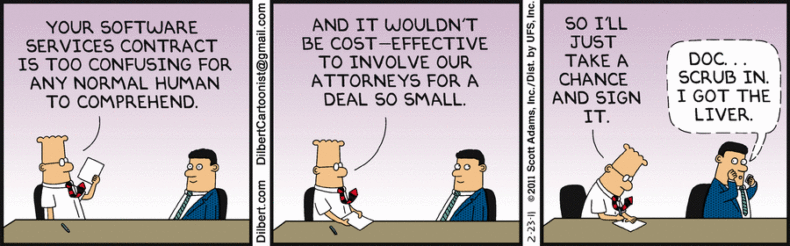

# Evaluation Methods

## Learning Objectives

By the end of this lesson you will be able to:

* Recognize evaluation methods will vary based on contract strategy
* A few tools and techniques used for software development solution evaluation and selection

### !callout-warning

## CAUTION!

Speaking from your instructor’s collective experience, **do not** rely solely on written proposals for your evaluation.   

Written proposals help in downselection before other strategies are implemented, but **should not** be the only or primary way to evaluate.   

**Note**: Set short page limits. Think 5 pages or less- even 2 pages or less! 
### !end-callout

## Introduction
Imagine this: you and your team have successfully navigated the contracting cone, chosen the vehicle, decided on the contract type, and are in the process of writing the contract documentation. Now you’re ready to discuss vendor selection for contract award(s). But what sources will you choose?

**Source selection is critical** for choosing the right vendor/s. You must plan a source selection strategy that is _effective_, _meaningful_, and as _simple as possible_.

Your source selection should enable you to answer the following questions:

* Does the offeror understand and have relevant experience in modern software development and delivery?
  * **Note**: Having only commercial experience is okay- many capable vendors may have never done business with the government.
* Is the offeror’s proposal realistic regarding cost, schedule, and approach for achieving the Product Vision?

## Evaluation Criteria Considerations for Software Solutions

### Cost, or “Price”
The cost, or “price” of any acquisition is always evaluated, but the level of detailed analysis necessary will vary based on what is being acquired and contract type (i.e. firm-fixed-price, time and materials). However, it does **not** have to be the primary evaluation criteria.

### !callout-success
## Our Advice
When seeking technical skills to support or change a software practitioner team, a good rule to help you stay on track is to rate key technical personnel, oral presentations and/or technical demonstrations more highly than their cost/price.
### !end-callout

### Technical
Technical evaluation criteria will depend heavily on what you are acquiring. Factors for evaluating the capabilities of an Agile software development team should focus on understanding the contractor’s skills and experience. If you are evaluating a contractor’s ability to deliver a solution like establishing and managing a CI/CD pipeline, you should focus on their ability to interface with other internal and external systems, as well as skills and experience implementing DevSecOps solutions.

### !callout-warning
## Keep in mind
Since a team’s success depends on its personnel, a contractor’s ability to hire and retain talent should also be considered.
### !end-callout

### Relevant Experience
To allow contractors to demonstrate they are capable of providing solutions that are conceptually similar to the requirement, they must show they have the relevant experience.

One example of how you might do this as an acquisitions professional is asking contractors to provide code repositories from previous projects demonstrating quality code that is similar to the size, scope, and complexity required by the Government.

### !callout-info
## Note
“Previous projects” does not mean only Government projects. Any projects that demonstrate experience should be considered. 
### !end-callout

### Key Personnel Positions
Key Personnel Positions (KPPs) ensures the Government gets the skill sets advertised- lead positions, or other positions critical to success, can be designated as KPPs. If you are utilizing oral presentations (more to come on that in a bit!) you can require the KPP to participate.

After contract award, if KPPs leave the project, the Government can require backfills to meet the same standards. By doing so, contractors must fill roles with the same or similar individuals included as part of the competitive proposal.

### !callout-success
## In Practice: KPPs 
We have seen success with the approach of designating KPP or multiple KPPs.   

This requires the Government to award a contract in a timely manner. **Think _maximum 30 days_ from proposal to submission**. Again, we can’t ask companies to hold these talented individuals on overhead!
### !end-callout

### Security/Cybersecurity
A program’s development environment, operating environment, and respective security/Impact Level (IL) requirements must be addressed. Work with your engineering and support teams to understand what is required. Security requirements greatly impact potential vendors, in that they must have cleared personnel available, or the Government must be prepared to support the significant work and timelines involved with onboarding non-cleared personnel.

For more information on specific [Federal Risk and Authorization Management Program (FedRAMP) compliance.](https://www.fedramp.gov/documents/)

 
  Source: [Dilbert by Scott Adams](https://dilbert.com/strip/2011-02-23) 

### !challenge

* type: checkbox
* id: f2663061-b661-436f-b9e5-7e129cd5fc8b
* title: Evaluation Criteria
<!-- * points: [1] (optional, the number of points for scoring as a checkpoint) -->
<!-- * topics: [python, pandas] (optional the topics for analyzing points) -->

##### !question

Which are examples of criteria that would be helpful to assess if a vendor has relevant modern software development experience?

##### !end-question

##### !options

* Skills and expertise implementing and managing DevSecOps solution
* Skills and expertise with Agile Scrum software development methodology
* Demonstration of skills and expertise through previous Government projects of similar size, scope, and complexity
* Demonstration of skills and expertise through previous commercial projects of similar size, scope, and complexity
* Resumes for individuals who are proposed for key personnel positions.
##### !end-options

##### !answer

* Skills and expertise implementing and managing DevSecOps solution
* Skills and expertise with Agile Scrum software development methodology
* Demonstration of skills and expertise through previous Government projects of similar size, scope, and complexity
* Demonstration of skills and expertise through previous commercial projects of similar size, scope, and complexity
* Resumes for individuals who are proposed for key personnel positions.

##### !end-answer

<!-- other optional sections -->
<!-- !hint - !end-hint (markdown, hidden, students click to view) -->
<!-- !rubric - !end-rubric (markdown, instructors can see while scoring a checkpoint) -->
<!-- !explanation - !end-explanation (markdown, students can see after answering correctly) -->

### !end-challenge

## Evaluation Tools and Techniques
In addition to evaluation criteria customized to software development, using evaluation tools and techniques ensures your evaluation results in an award with the highest chance of successfully meeting your mission requirements.

We have seen success with the strategies outlined below, and are advocates of integrating them into your evaluation criteria. However, keep in mind the time commitment and overall proposal preparation. You may prematurely limit prospective vendors if the time commitment is too great. One creative way to minimize is to use remote communication tools to limit travel commitments, and/or limit the time and/or personnel for both strategies detailed below. 

### Oral Presentations

Oral presentations may be a reasonable substitute for (or addition to) written information. Replacing portions of the proposal with oral presentations can be effective in streamlining the source selection process.

Companies can become skilled at writing proposals stating what the Government wants to hear. In oral presentations, companies have to interact with the Government team and respond on the fly, a difficult accomplishment if the teams are not skilled in software development.

Presentations during oral proposals may include demonstrations, video clips, in-person briefings, and simulations. These are particularly useful for certain acquisitions where showing works better than telling. Furthermore, oral presentations can help to validate skills of Key Personnel Positions (KPPs) mentioned above.

To get a better idea of what oral presentations entail, here is a link to an [oral proposal guide](https://aida.mitre.org/oral-proposal-guide/guidance-governing-oral-proposals/) based on practical experiences.

Here are some do’s and don'ts to consider as part of oral presentations:

|RECOMMENDED|NOT RECOMMENDED|
|---|---|
|**DO** include on-the-spot questions (questions or exercises that offerors won’t see until the oral presentation begins). Isn’t interactive dialogue better than a one-way presentation?|**DON’T** require the offer cover ALL aspects of the requirements document; rather, focus on the most important aspects and go into detail|
|**DO** add a twist - interrupt their pitch with a particular scenario for them to address|**DON’T** leave ambiguity in the solicitation concerning rules or format for oral presentations|
|**DO** consensus evaluation immediately following each offeror’s oral presentation|**DON’T** assume that you must videotape the presentation. We must have a record for the file and FAR 15.102(e) lists several possibilities (including videotaping) for the record. See _If Evaluators Misunderstand Something from an Oral Presentation in this workbook’s GAO guide_|
|**DO** state that a firm may attend only one oral presentation, either for itself as a prime offer or or as a subcontractor for another firm|**DON’T** allow the offeror’s presenters to use electronics or phones for reachback| 
  Source: [DHS Procurement Innovation Lab](https://www.dhs.gov/sites/default/files/publications/pil_boot_camp_workbook_oct_2019.pdf)

### !challenge

* type: multiple-choice
* id: 4547db12-90ea-4d9d-ab92-2cf74db5e706
* title: Oral Presentations
<!-- * points: [1] (optional, the number of points for scoring as a checkpoint) -->
<!-- * topics: [python, pandas] (optional the topics for analyzing points) -->

##### !question

Oral presentations may be a beneficial tool for your acquisition’s evaluation, and can help you select the most qualified vendor for contract award. Which of the following is **not true** of oral presentations?

##### !end-question

##### !options

* Interactive dialogue is better than a one-way presentation or written proposal
* Oral presentations may include demonstrations, video recordings, in-person briefings, and/or simulations
* Oral presentations can be used to augment written proposals, or can be used in place of written proposals
* Oral presentations should ask all the same things that are required to be in the written proposal
* Oral presentations can streamline the Government’s evaluation process.

##### !end-options

##### !answer
* Oral presentations should ask all the same things that are required to be in the written proposal
##### !end-answer

<!-- other optional sections -->
<!-- !hint - !end-hint (markdown, hidden, students click to view) -->
<!-- !rubric - !end-rubric (markdown, instructors can see while scoring a checkpoint) -->
<!-- !explanation - !end-explanation (markdown, students can see after answering correctly) -->

### !end-challenge
There are many things you can require as part of an oral presentation. Technical demonstrations are typically the most common (and the most useful) format for an oral presentation of software development related work. Next, we will dig into some details and examples for how you can adapt them to your own program. 

### Technical Demonstrations
Technical demonstrations provide an opportunity for the Government to see what a contractor does, versus how well they write proposals. An in-person demonstration is a scenario-based, timed coding challenge to evaluate a contractor’s approach to solving problems in real-time. They can also be constructed so vendors complete a challenge as part of their technical proposal submission.

This might be a timed submission (i.e., 48 or 72 hours), or included with the proposal submission. It could include a recorded video submission, or just be the end result based on challenge complexity and what the vendors must submit (i.e., code or a prototype).  Demonstrations should focus on what elements the Government is most interested in understanding.

Adopted from the [DHS Procurement Innovation Lab](https://www.dhs.gov/sites/default/files/publications/pil_boot_camp_workbook_oct_2019.pdf), the purpose of a demonstration is to see and test products or systems before purchasing them. If you were buying a car, would you take it for a test drive, or read a report?

In some cases you might do both, but the test drive is vitally important in the purchase decision.

1. Often called a product or capability demonstration, these reveal companies’ true capabilities!
1. These demos can streamline the selection process, lower bid and proposal cost, etc.
1. Can be a stand-alone factor or an element of the oral presentation.
1. If the product requires testing or inspection, you can do so independently as a separate factor.
1. Ensure end-users are included in the evaluation, their feedback is crucial.
1. We highly recommend pairing technical demonstrations with confidence level ratings. 

**Why are technical demonstrations valuable for evaluating software proposals?**
>“There are numerous attractive features of the use of demonstrations. The most obvious is that the information the government gets from a demonstration can be much more useful than information in a proposal -- as the name indicates, in a demonstration bidders show what they can do rather than just making representations.
>
>The second advantage is that the demonstration dramatically streamlines source selection, saving time both in developing and evaluating proposals. One needn’t be an expert on government contracting to participate in a demonstration – simply an expert on software development. For this reason, demonstrations have been especially attractive to new, nontraditional contractors in the federal marketplace, who don’t know the ins and outs of the traditional system very well.”

   Source: [The Lectern, Steve Kelman](https://fcw.com/blogs/lectern/2019/03/comment-kelman-show-dont-tell.aspx) 

### !challenge

* type: paragraph
* id: 04056c85-0786-4e44-9034-84992087444a
* title: Structure of Oral Presentations
<!-- * points: [1] (optional, the number of points for scoring as a checkpoint) -->
<!-- * topics: [python, pandas] (optional the topics for analyzing points) -->

##### !question

If your highest priority for the technical evaluation is ensuring that the contractor is skilled in your selected type of Agile software development (i.e. extreme programming, Scrum, etc.) how would you structure your oral presentation?

##### !end-question

##### !placeholder
Don't forget to check the top right hand corner of your screen, there will be a red notification on the bell that means the learning guides have commented or have questions on your answers. Don't miss out on opportunities to engage! 
##### !end-placeholder

<!-- other optional sections -->
<!-- !hint - !end-hint (markdown, hidden, students click to view) -->
<!-- !rubric - !end-rubric (markdown, instructors can see while scoring a checkpoint) -->
<!-- !explanation - !end-explanation (markdown, students can see after answering correctly) -->

### !end-challenge

### !callout-success
## KEY TAKEAWAYS: EVALUATION METHODS
* Source selection is critical for choosing the right vendor/s. Ensure the source selection strategy is **effective, meaningful,** and as **simple as possible.**
* A good rule, and a proven practice, to support success outcomes is to rate: key technical personnel (Key Personnel Positions (KPPs)), oral presentations and/or technical demonstrations ***more highly than the cost/price.*** 
* Consider the use of evaluation tools such as oral presentations, coding challenges, technical demonstrations, and the like to customize your evaluation for your unique requirements and priorities 
### !end-callout

## Resources:
* **Websites:**
  * [DHS Procurement Innovation Lab](https://www.dhs.gov/sites/default/files/publications/pil_boot_camp_workbook_oct_2019.pdf)
  * [Federal Risk and Authorization Management Program (FedRAMP) compliance.](https://www.fedramp.gov/documents/)
  * [The Lectern, Steve Kelman](https://fcw.com/blogs/lectern/2019/03/comment-kelman-show-dont-tell.aspx)
  * [Oral proposal guide](https://aida.mitre.org/oral-proposal-guide/guidance-governing-oral-proposals/) 
